# GCC Web Application User Flows

## Overview
This document contains Mermaid diagrams that illustrate the user flows for different user roles in the GCC (Green Certification Center) Web Application.

## Authentication Flow

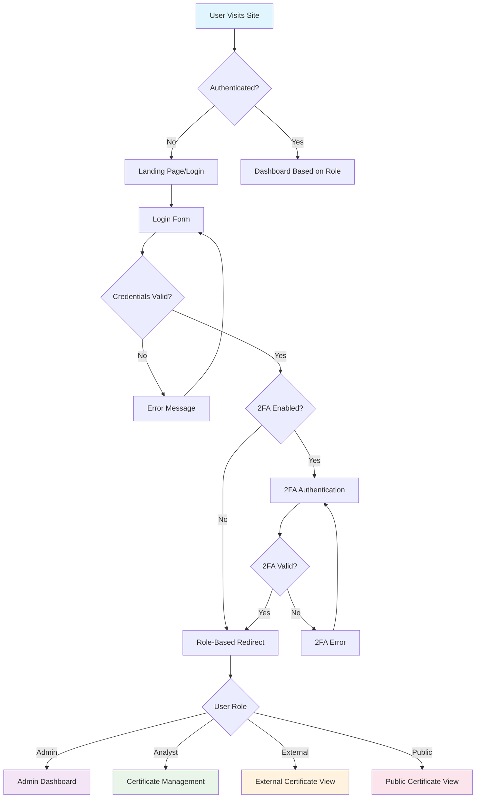
```mermaid
flowchart TD
    A[User Visits Site] --> B{Authenticated?}
    B -->|No| C[Landing Page/Login]
    B -->|Yes| D[Dashboard Based on Role]
    
    C --> E[Login Form]
    E --> F{Credentials Valid?}
    F -->|No| G[Error Message]
    G --> E
    F -->|Yes| H{2FA Enabled?}
    H -->|Yes| I[2FA Authentication]
    H -->|No| J[Role-Based Redirect]
    I --> K{2FA Valid?}
    K -->|No| L[2FA Error]
    L --> I
    K -->|Yes| J
    
    J --> M{User Role}
    M -->|Admin| N[Admin Dashboard]
    M -->|Analyst| O[Certificate Management]
    M -->|External| P[External Certificate View]
    M -->|Public| Q[Public Certificate View]
    
    style A fill:#e1f5fe
    style N fill:#f3e5f5
    style O fill:#e8f5e8
    style P fill:#fff3e0
    style Q fill:#fce4ec
```

## Admin User Flow

```mermaid
flowchart TD
    A[Admin Login] --> B[Admin Dashboard]
    B --> C{Admin Actions}
    
    C --> D[User Management]
    C --> E[Role Management]
    C --> F[Certificate Management]
    C --> G[Product Management]
    C --> H[Company Management]
    C --> I[System Settings]
    
    D --> D1[View Users]
    D --> D2[Create User]
    D --> D3[Edit User]
    D --> D4[Delete User]
    D --> D5[Assign Roles]
    
    E --> E1[View Roles]
    E --> E2[Create Role]
    E --> E3[Edit Role]
    E --> E4[Assign Permissions]
    
    F --> F1[View All Certificates]
    F --> F2[Create Certificate]
    F --> F3[Edit Certificate]
    F --> F4[Delete Certificate]
    F --> F5[Import Certificates]
    
    G --> G1[View Products]
    G --> G2[Create Product]
    G --> G3[Edit Product]
    G --> G4[Manage Product Types]
    
    H --> H1[View Companies]
    H --> H2[Create Company]
    H --> H3[Edit Company]
    H --> H4[Company Management]
    
    I --> I1[Certificate Fields]
    I --> I2[Product Types]
    I --> I3[Google Analytics]
    I --> I4[GCC API Settings]
    
    style A fill:#f3e5f5
    style B fill:#f3e5f5
    style C fill:#f3e5f5
```

## Analyst User Flow

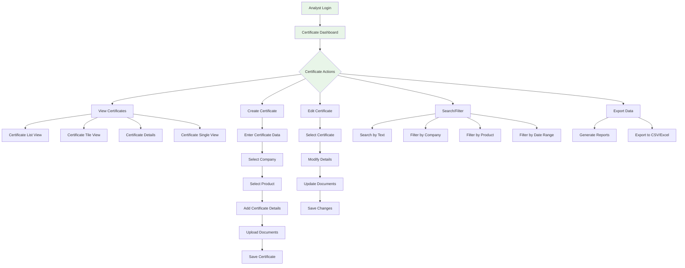
```mermaid
flowchart TD
    A[Analyst Login] --> B[Certificate Dashboard]
    B --> C{Certificate Actions}
    
    C --> D[View Certificates]
    C --> E[Create Certificate]
    C --> F[Edit Certificate]
    C --> G[Search/Filter]
    C --> H[Export Data]
    
    D --> D1[Certificate List View]
    D --> D2[Certificate Tile View]
    D --> D3[Certificate Details]
    D --> D4[Certificate Single View]
    
    E --> E1[Enter Certificate Data]
    E1 --> E2[Select Company]
    E2 --> E3[Select Product]
    E3 --> E4[Add Certificate Details]
    E4 --> E5[Upload Documents]
    E5 --> E6[Save Certificate]
    
    F --> F1[Select Certificate]
    F1 --> F2[Modify Details]
    F2 --> F3[Update Documents]
    F3 --> F4[Save Changes]
    
    G --> G1[Search by Text]
    G --> G2[Filter by Company]
    G --> G3[Filter by Product]
    G --> G4[Filter by Date Range]
    
    H --> H1[Generate Reports]
    H --> H2[Export to CSV/Excel]
    
    style A fill:#e8f5e8
    style B fill:#e8f5e8
    style C fill:#e8f5e8
```

## External User Flow

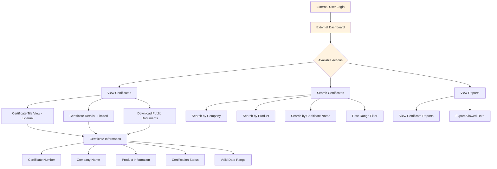
```mermaid
flowchart TD
    A[External User Login] --> B[External Dashboard]
    B --> C{Available Actions}
    
    C --> D[View Certificates]
    C --> E[Search Certificates]
    C --> F[View Reports]
    
    D --> D1[Certificate Tile View - External]
    D --> D2[Certificate Details - Limited]
    D --> D3[Download Public Documents]
    
    E --> E1[Search by Company]
    E --> E2[Search by Product]
    E --> E3[Search by Certificate Name]
    E --> E4[Date Range Filter]
    
    F --> F1[View Certificate Reports]
    F --> F2[Export Allowed Data]
    
    D1 --> G[Certificate Information]
    D2 --> G
    D3 --> G
    G --> G1[Certificate Number]
    G --> G2[Company Name]
    G --> G3[Product Information]
    G --> G4[Certification Status]
    G --> G5[Valid Date Range]
    
    style A fill:#fff3e0
    style B fill:#fff3e0
    style C fill:#fff3e0
```

## Public User Flow

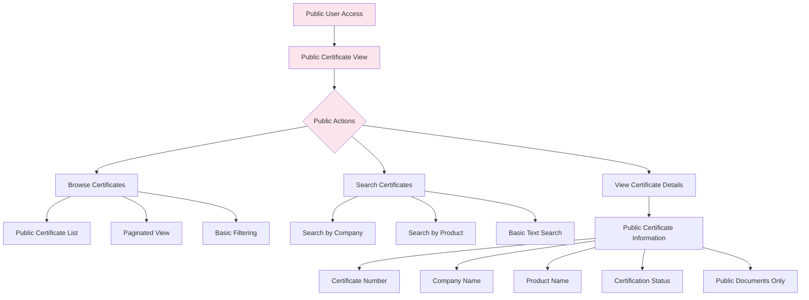
```mermaid
flowchart TD
    A[Public User Access] --> B[Public Certificate View]
    B --> C{Public Actions}
    
    C --> D[Browse Certificates]
    C --> E[Search Certificates]
    C --> F[View Certificate Details]
    
    D --> D1[Public Certificate List]
    D --> D2[Paginated View]
    D --> D3[Basic Filtering]
    
    E --> E1[Search by Company]
    E --> E2[Search by Product]
    E --> E3[Basic Text Search]
    
    F --> F1[Public Certificate Information]
    F1 --> F2[Certificate Number]
    F1 --> F3[Company Name]
    F1 --> F4[Product Name]
    F1 --> F5[Certification Status]
    F1 --> F6[Public Documents Only]
    
    style A fill:#fce4ec
    style B fill:#fce4ec
    style C fill:#fce4ec
```

## Certificate Management Workflow

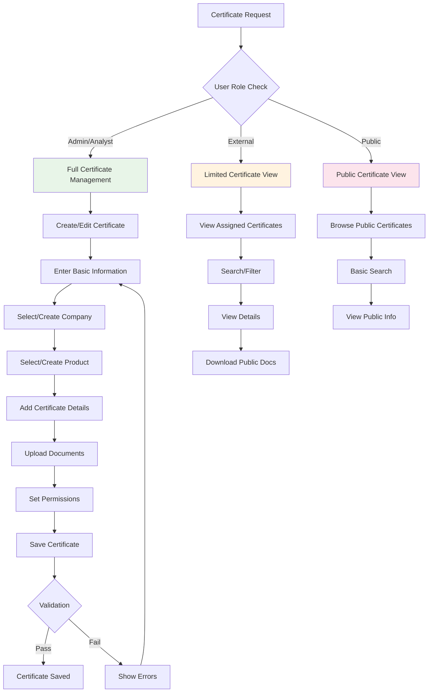
```mermaid
flowchart TD
    A[Certificate Request] --> B{User Role Check}
    
    B -->|Admin/Analyst| C[Full Certificate Management]
    B -->|External| D[Limited Certificate View]
    B -->|Public| E[Public Certificate View]
    
    C --> F[Create/Edit Certificate]
    F --> G[Enter Basic Information]
    G --> H[Select/Create Company]
    H --> I[Select/Create Product]
    I --> J[Add Certificate Details]
    J --> K[Upload Documents]
    K --> L[Set Permissions]
    L --> M[Save Certificate]
    
    M --> N{Validation}
    N -->|Pass| O[Certificate Saved]
    N -->|Fail| P[Show Errors]
    P --> G
    
    D --> Q[View Assigned Certificates]
    Q --> R[Search/Filter]
    R --> S[View Details]
    S --> T[Download Public Docs]
    
    E --> U[Browse Public Certificates]
    U --> V[Basic Search]
    V --> W[View Public Info]
    
    style C fill:#e8f5e8
    style D fill:#fff3e0
    style E fill:#fce4ec
```

## Company and Product Management

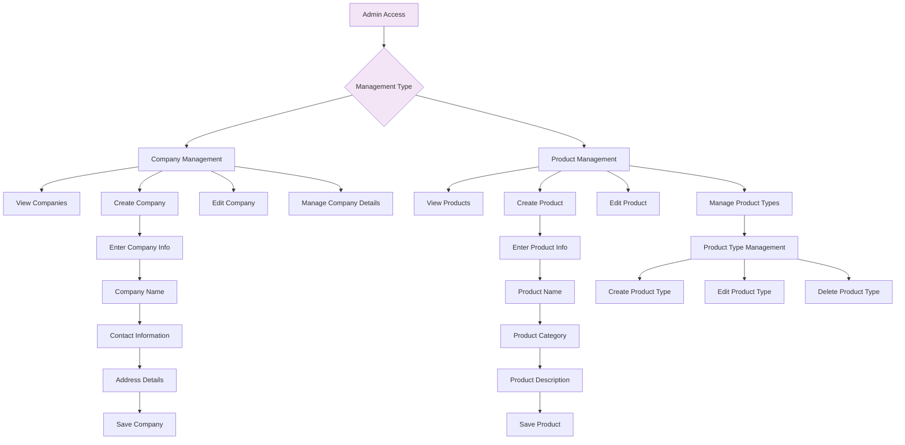
```mermaid
flowchart TD
    A[Admin Access] --> B{Management Type}
    
    B --> C[Company Management]
    B --> D[Product Management]
    
    C --> C1[View Companies]
    C --> C2[Create Company]
    C --> C3[Edit Company]
    C --> C4[Manage Company Details]
    
    C2 --> C5[Enter Company Info]
    C5 --> C6[Company Name]
    C6 --> C7[Contact Information]
    C7 --> C8[Address Details]
    C8 --> C9[Save Company]
    
    D --> D1[View Products]
    D --> D2[Create Product]
    D --> D3[Edit Product]
    D --> D4[Manage Product Types]
    
    D2 --> D5[Enter Product Info]
    D5 --> D6[Product Name]
    D6 --> D7[Product Category]
    D7 --> D8[Product Description]
    D8 --> D9[Save Product]
    
    D4 --> D10[Product Type Management]
    D10 --> D11[Create Product Type]
    D10 --> D12[Edit Product Type]
    D10 --> D13[Delete Product Type]
    
    style A fill:#f3e5f5
    style B fill:#f3e5f5
```

## Error Handling and Security Flow

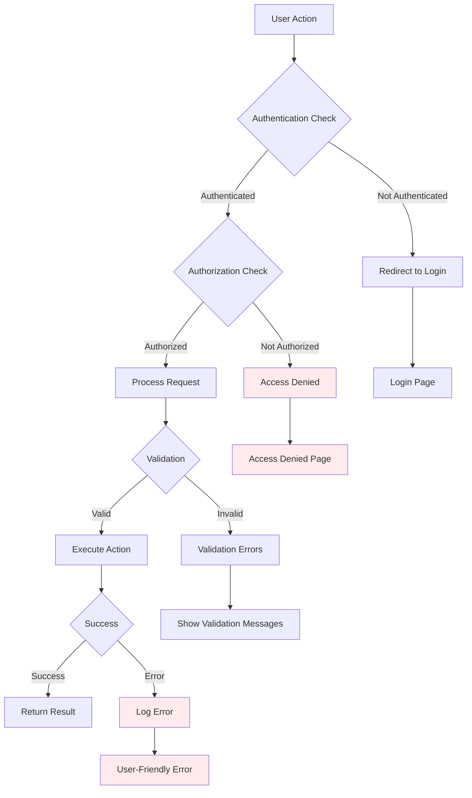
```mermaid
flowchart TD
    A[User Action] --> B{Authentication Check}
    
    B -->|Not Authenticated| C[Redirect to Login]
    B -->|Authenticated| D{Authorization Check}
    
    D -->|Authorized| E[Process Request]
    D -->|Not Authorized| F[Access Denied]
    
    E --> G{Validation}
    G -->|Valid| H[Execute Action]
    G -->|Invalid| I[Validation Errors]
    
    H --> J{Success}
    J -->|Success| K[Return Result]
    J -->|Error| L[Log Error]
    
    L --> M[User-Friendly Error]
    F --> N[Access Denied Page]
    I --> O[Show Validation Messages]
    C --> P[Login Page]
    
    style F fill:#ffebee
    style L fill:#ffebee
    style M fill:#ffebee
    style N fill:#ffebee
```

## System Architecture User Interaction

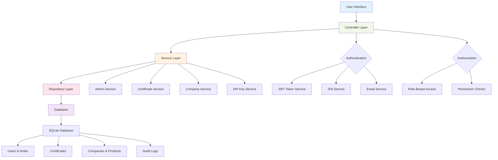
```mermaid
flowchart TD
    A[User Interface] --> B[Controller Layer]
    B --> C[Service Layer]
    C --> D[Repository Layer]
    D --> E[Database]
    
    B --> F{Authentication}
    F --> G[JWT Token Service]
    F --> H[2FA Service]
    F --> I[Email Service]
    
    C --> J[Admin Service]
    C --> K[Certificate Service]
    C --> L[Company Service]
    C --> M[API Key Service]
    
    B --> N{Authorization}
    N --> O[Role-Based Access]
    N --> P[Permission Checks]
    
    E --> Q[SQLite Database]
    Q --> R[Users & Roles]
    Q --> S[Certificates]
    Q --> T[Companies & Products]
    Q --> U[Audit Logs]
    
    style A fill:#e3f2fd
    style B fill:#f1f8e9
    style C fill:#fff3e0
    style D fill:#fce4ec
    style E fill:#f3e5f5
```

## Notes

### User Roles:
- **Admin**: Full system access including user management, role management, and all certificate operations
- **Analyst**: Certificate management access with create, read, update permissions (no delete)
- **External**: Limited certificate viewing and reporting access
- **Public**: Read-only access to public certificate information

### Key Features:
- Role-based access control
- Two-factor authentication
- Certificate CRUD operations
- Company and product management
- Search and filtering capabilities
- Document upload and management
- Audit logging
- API access control

### Security Considerations:
- All actions require proper authentication
- Role-based authorization for all operations
- Input validation and sanitization
- Secure document handling
- Audit trail for all modifications

## API Flow

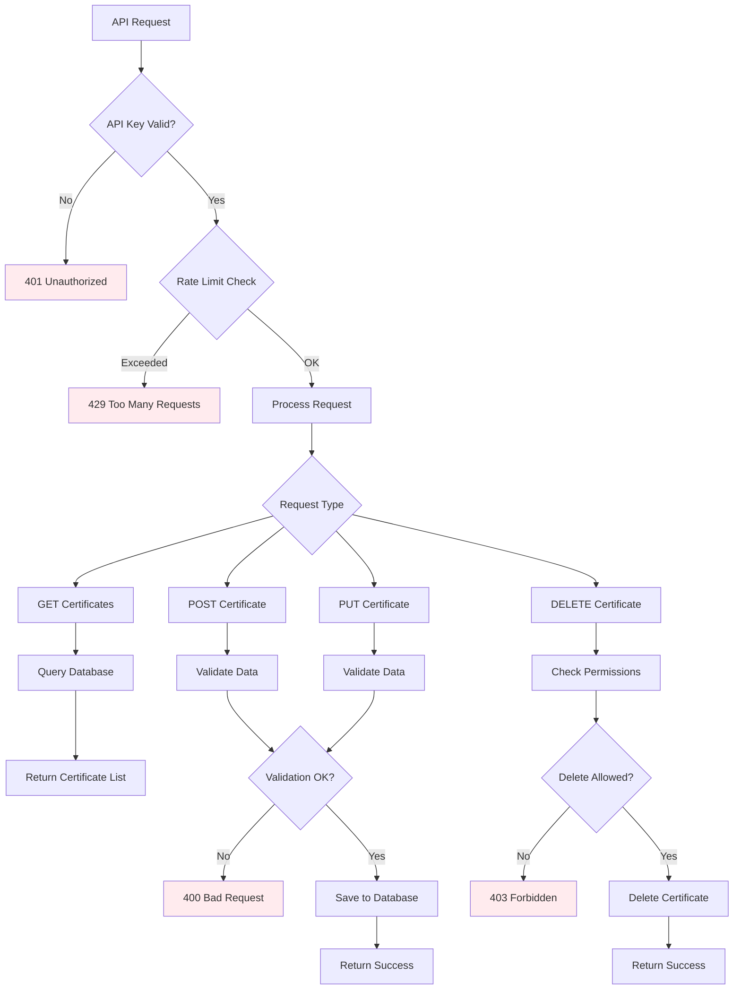
```mermaid
flowchart TD
    A[API Request] --> B{API Key Valid?}
    B -->|No| C[401 Unauthorized]
    B -->|Yes| D{Rate Limit Check}
    D -->|Exceeded| E[429 Too Many Requests]
    D -->|OK| F[Process Request]
    
    F --> G{Request Type}
    G --> H[GET Certificates]
    G --> I[POST Certificate]
    G --> J[PUT Certificate]
    G --> K[DELETE Certificate]
    
    H --> L[Query Database]
    I --> M[Validate Data]
    J --> N[Validate Data]
    K --> O[Check Permissions]
    
    L --> P[Return Certificate List]
    M --> Q{Validation OK?}
    N --> Q
    O --> R{Delete Allowed?}
    
    Q -->|No| S[400 Bad Request]
    Q -->|Yes| T[Save to Database]
    R -->|No| U[403 Forbidden]
    R -->|Yes| V[Delete Certificate]
    
    T --> W[Return Success]
    V --> X[Return Success]
    
    style C fill:#ffebee
    style E fill:#ffebee
    style S fill:#ffebee
    style U fill:#ffebee
```

## Data Import/Export Flow

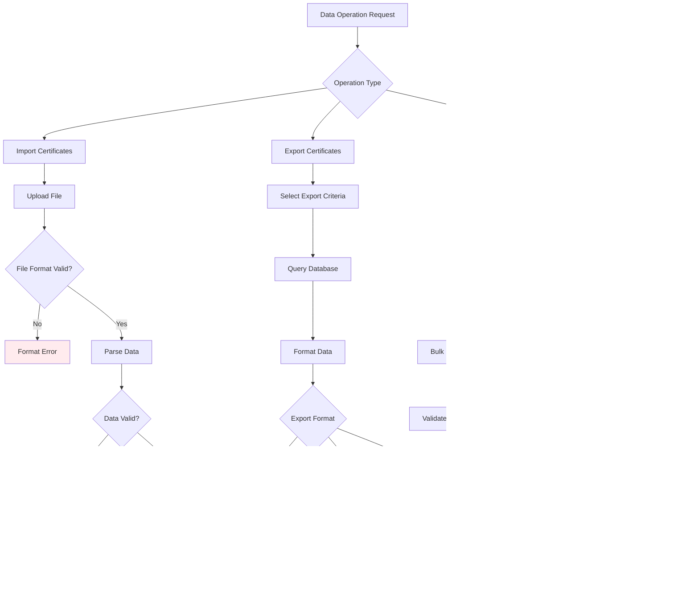
```mermaid
flowchart TD
    A[Data Operation Request] --> B{Operation Type}
    
    B --> C[Import Certificates]
    B --> D[Export Certificates]
    B --> E[Bulk Operations]
    
    C --> C1[Upload File]
    C1 --> C2{File Format Valid?}
    C2 -->|No| C3[Format Error]
    C2 -->|Yes| C4[Parse Data]
    C4 --> C5{Data Valid?}
    C5 -->|No| C6[Validation Errors]
    C5 -->|Yes| C7[Process Records]
    C7 --> C8[Save to Database]
    C8 --> C9[Import Summary]
    
    D --> D1[Select Export Criteria]
    D1 --> D2[Query Database]
    D2 --> D3[Format Data]
    D3 --> D4{Export Format}
    D4 --> D5[CSV Export]
    D4 --> D6[Excel Export]
    D4 --> D7[PDF Report]
    D5 --> D8[Download File]
    D6 --> D8
    D7 --> D8
    
    E --> E1[Select Records]
    E1 --> E2{Bulk Operation}
    E2 --> E3[Bulk Update]
    E2 --> E4[Bulk Delete]
    E2 --> E5[Bulk Status Change]
    E3 --> E6[Validate Changes]
    E4 --> E7[Confirm Deletion]
    E5 --> E8[Update Status]
    E6 --> E9[Apply Changes]
    E7 --> E9
    E8 --> E9
    E9 --> E10[Operation Summary]
    
    style C3 fill:#ffebee
    style C6 fill:#ffebee
```

## Document Management Flow

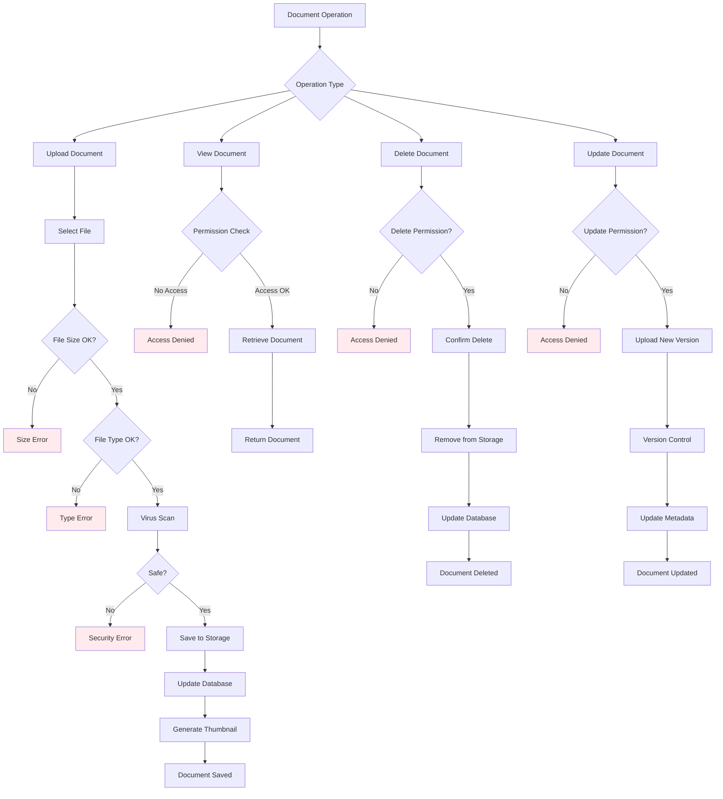
```mermaid
flowchart TD
    A[Document Operation] --> B{Operation Type}
    
    B --> C[Upload Document]
    B --> D[View Document]
    B --> E[Delete Document]
    B --> F[Update Document]
    
    C --> C1[Select File]
    C1 --> C2{File Size OK?}
    C2 -->|No| C3[Size Error]
    C2 -->|Yes| C4{File Type OK?}
    C4 -->|No| C5[Type Error]
    C4 -->|Yes| C6[Virus Scan]
    C6 --> C7{Safe?}
    C7 -->|No| C8[Security Error]
    C7 -->|Yes| C9[Save to Storage]
    C9 --> C10[Update Database]
    C10 --> C11[Generate Thumbnail]
    C11 --> C12[Document Saved]
    
    D --> D1{Permission Check}
    D1 -->|No Access| D2[Access Denied]
    D1 -->|Access OK| D3[Retrieve Document]
    D3 --> D4[Return Document]
    
    E --> E1{Delete Permission?}
    E1 -->|No| E2[Access Denied]
    E1 -->|Yes| E3[Confirm Delete]
    E3 --> E4[Remove from Storage]
    E4 --> E5[Update Database]
    E5 --> E6[Document Deleted]
    
    F --> F1{Update Permission?}
    F1 -->|No| F2[Access Denied]
    F1 -->|Yes| F3[Upload New Version]
    F3 --> F4[Version Control]
    F4 --> F5[Update Metadata]
    F5 --> F6[Document Updated]
    
    style C3 fill:#ffebee
    style C5 fill:#ffebee
    style C8 fill:#ffebee
    style D2 fill:#ffebee
    style E2 fill:#ffebee
    style F2 fill:#ffebee
```

## Notification Flow

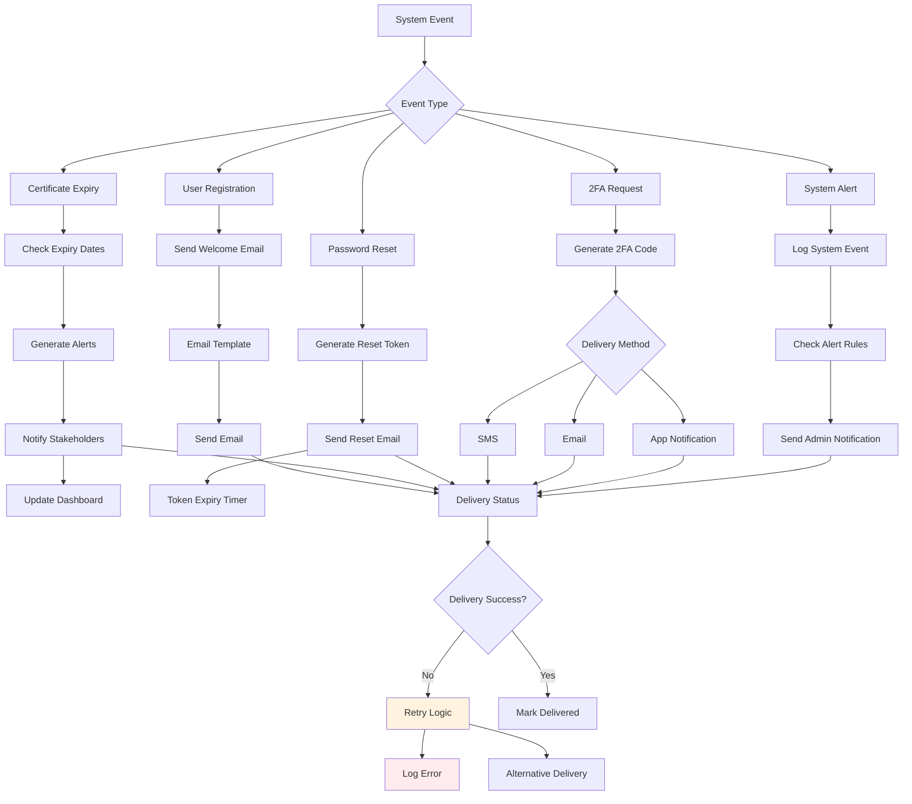
```mermaid
flowchart TD
    A[System Event] --> B{Event Type}
    
    B --> C[User Registration]
    B --> D[Certificate Expiry]
    B --> E[Password Reset]
    B --> F[2FA Request]
    B --> G[System Alert]
    
    C --> C1[Send Welcome Email]
    C1 --> C2[Email Template]
    C2 --> C3[Send Email]
    
    D --> D1[Check Expiry Dates]
    D1 --> D2[Generate Alerts]
    D2 --> D3[Notify Stakeholders]
    D3 --> D4[Update Dashboard]
    
    E --> E1[Generate Reset Token]
    E1 --> E2[Send Reset Email]
    E2 --> E3[Token Expiry Timer]
    
    F --> F1[Generate 2FA Code]
    F1 --> F2{Delivery Method}
    F2 --> F3[SMS]
    F2 --> F4[Email]
    F2 --> F5[App Notification]
    
    G --> G1[Log System Event]
    G1 --> G2[Check Alert Rules]
    G2 --> G3[Send Admin Notification]
    
    C3 --> H[Delivery Status]
    D3 --> H
    E2 --> H
    F3 --> H
    F4 --> H
    F5 --> H
    G3 --> H
    
    H --> I{Delivery Success?}
    I -->|No| J[Retry Logic]
    I -->|Yes| K[Mark Delivered]
    J --> L[Log Error]
    J --> M[Alternative Delivery]
    
    style J fill:#fff3e0
    style L fill:#ffebee
```

## Reporting and Analytics Flow

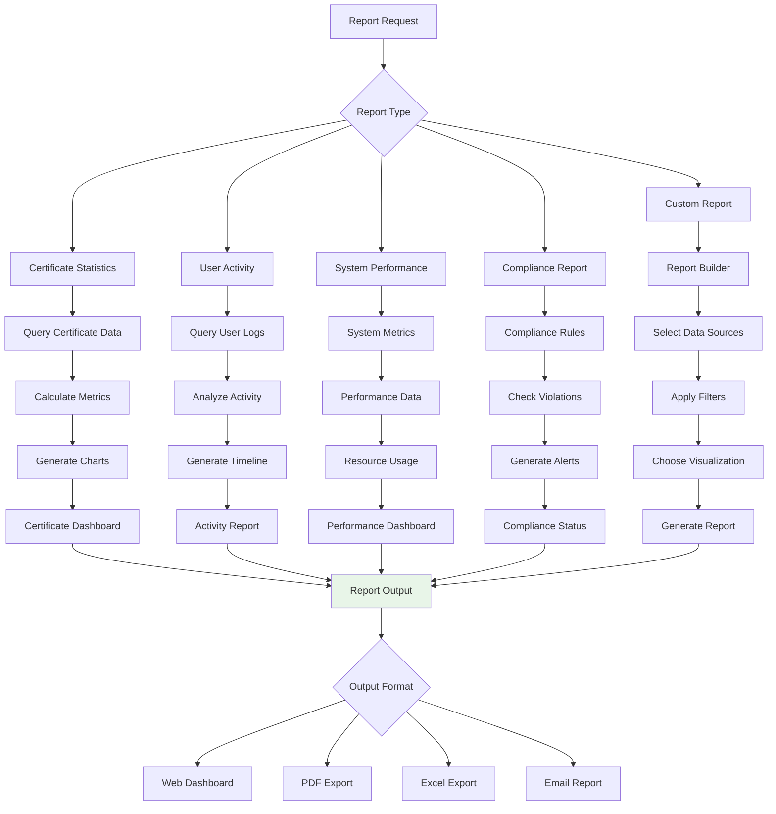
```mermaid
flowchart TD
    A[Report Request] --> B{Report Type}
    
    B --> C[Certificate Statistics]
    B --> D[User Activity]
    B --> E[System Performance]
    B --> F[Compliance Report]
    B --> G[Custom Report]
    
    C --> C1[Query Certificate Data]
    C1 --> C2[Calculate Metrics]
    C2 --> C3[Generate Charts]
    C3 --> C4[Certificate Dashboard]
    
    D --> D1[Query User Logs]
    D1 --> D2[Analyze Activity]
    D2 --> D3[Generate Timeline]
    D3 --> D4[Activity Report]
    
    E --> E1[System Metrics]
    E1 --> E2[Performance Data]
    E2 --> E3[Resource Usage]
    E3 --> E4[Performance Dashboard]
    
    F --> F1[Compliance Rules]
    F1 --> F2[Check Violations]
    F2 --> F3[Generate Alerts]
    F3 --> F4[Compliance Status]
    
    G --> G1[Report Builder]
    G1 --> G2[Select Data Sources]
    G2 --> G3[Apply Filters]
    G3 --> G4[Choose Visualization]
    G4 --> G5[Generate Report]
    
    C4 --> H[Report Output]
    D4 --> H
    E4 --> H
    F4 --> H
    G5 --> H
    
    H --> I{Output Format}
    I --> J[Web Dashboard]
    I --> K[PDF Export]
    I --> L[Excel Export]
    I --> M[Email Report]
    
    style H fill:#e8f5e8
```

## Backup and Recovery Flow

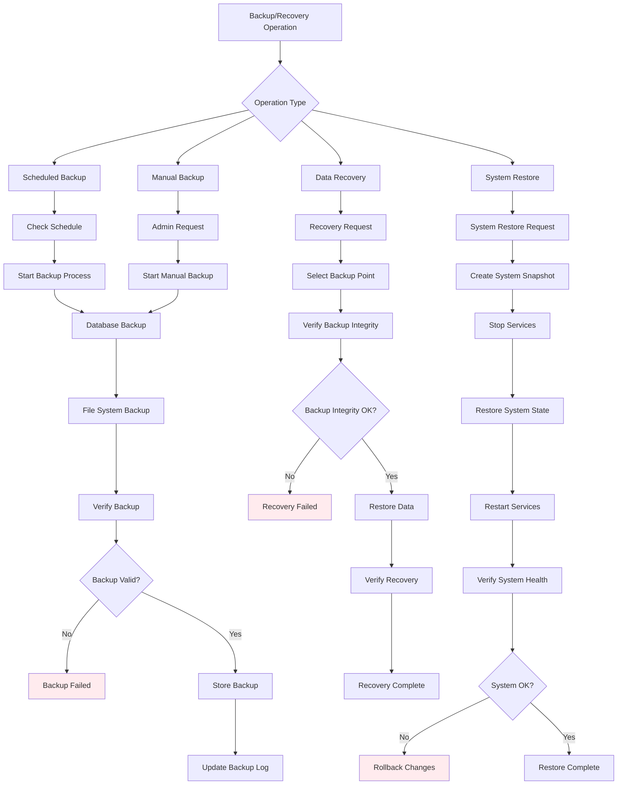
```mermaid
flowchart TD
    A[Backup/Recovery Operation] --> B{Operation Type}
    
    B --> C[Scheduled Backup]
    B --> D[Manual Backup]
    B --> E[Data Recovery]
    B --> F[System Restore]
    
    C --> C1[Check Schedule]
    C1 --> C2[Start Backup Process]
    C2 --> C3[Database Backup]
    C3 --> C4[File System Backup]
    C4 --> C5[Verify Backup]
    C5 --> C6{Backup Valid?}
    C6 -->|No| C7[Backup Failed]
    C6 -->|Yes| C8[Store Backup]
    C8 --> C9[Update Backup Log]
    
    D --> D1[Admin Request]
    D1 --> D2[Start Manual Backup]
    D2 --> C3
    
    E --> E1[Recovery Request]
    E1 --> E2[Select Backup Point]
    E2 --> E3[Verify Backup Integrity]
    E3 --> E4{Backup Integrity OK?}
    E4 -->|No| E5[Recovery Failed]
    E4 -->|Yes| E6[Restore Data]
    E6 --> E7[Verify Recovery]
    E7 --> E8[Recovery Complete]
    
    F --> F1[System Restore Request]
    F1 --> F2[Create System Snapshot]
    F2 --> F3[Stop Services]
    F3 --> F4[Restore System State]
    F4 --> F5[Restart Services]
    F5 --> F6[Verify System Health]
    F6 --> F7{System OK?}
    F7 -->|No| F8[Rollback Changes]
    F7 -->|Yes| F9[Restore Complete]
    
    style C7 fill:#ffebee
    style E5 fill:#ffebee
    style F8 fill:#ffebee
```

## Integration Flow

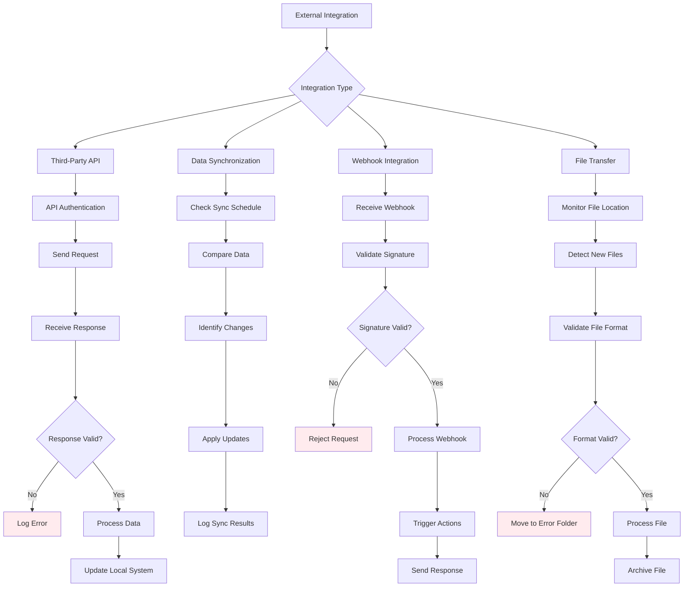
```mermaid
flowchart TD
    A[External Integration] --> B{Integration Type}
    
    B --> C[Third-Party API]
    B --> D[Data Synchronization]
    B --> E[Webhook Integration]
    B --> F[File Transfer]
    
    C --> C1[API Authentication]
    C1 --> C2[Send Request]
    C2 --> C3[Receive Response]
    C3 --> C4{Response Valid?}
    C4 -->|No| C5[Log Error]
    C4 -->|Yes| C6[Process Data]
    C6 --> C7[Update Local System]
    
    D --> D1[Check Sync Schedule]
    D1 --> D2[Compare Data]
    D2 --> D3[Identify Changes]
    D3 --> D4[Apply Updates]
    D4 --> D5[Log Sync Results]
    
    E --> E1[Receive Webhook]
    E1 --> E2[Validate Signature]
    E2 --> E3{Signature Valid?}
    E3 -->|No| E4[Reject Request]
    E3 -->|Yes| E5[Process Webhook]
    E5 --> E6[Trigger Actions]
    E6 --> E7[Send Response]
    
    F --> F1[Monitor File Location]
    F1 --> F2[Detect New Files]
    F2 --> F3[Validate File Format]
    F3 --> F4{Format Valid?}
    F4 -->|No| F5[Move to Error Folder]
    F4 -->|Yes| F6[Process File]
    F6 --> F7[Archive File]
    
    style C5 fill:#ffebee
    style E4 fill:#ffebee
    style F5 fill:#ffebee
```

## Deployment Flow

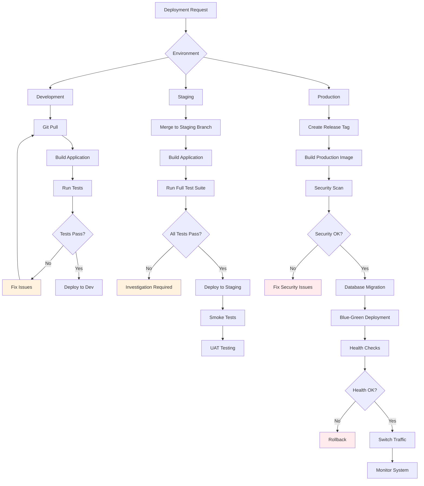
```mermaid
flowchart TD
    A[Deployment Request] --> B{Environment}
    
    B --> C[Development]
    B --> D[Staging]
    B --> E[Production]
    
    C --> C1[Git Pull]
    C1 --> C2[Build Application]
    C2 --> C3[Run Tests]
    C3 --> C4{Tests Pass?}
    C4 -->|No| C5[Fix Issues]
    C4 -->|Yes| C6[Deploy to Dev]
    C5 --> C1
    
    D --> D1[Merge to Staging Branch]
    D1 --> D2[Build Application]
    D2 --> D3[Run Full Test Suite]
    D3 --> D4{All Tests Pass?}
    D4 -->|No| D5[Investigation Required]
    D4 -->|Yes| D6[Deploy to Staging]
    D6 --> D7[Smoke Tests]
    D7 --> D8[UAT Testing]
    
    E --> E1[Create Release Tag]
    E1 --> E2[Build Production Image]
    E2 --> E3[Security Scan]
    E3 --> E4{Security OK?}
    E4 -->|No| E5[Fix Security Issues]
    E4 -->|Yes| E6[Database Migration]
    E6 --> E7[Blue-Green Deployment]
    E7 --> E8[Health Checks]
    E8 --> E9{Health OK?}
    E9 -->|No| E10[Rollback]
    E9 -->|Yes| E11[Switch Traffic]
    E11 --> E12[Monitor System]
    
    style C5 fill:#fff3e0
    style D5 fill:#fff3e0
    style E5 fill:#ffebee
    style E10 fill:#ffebee
```

## Security Flow

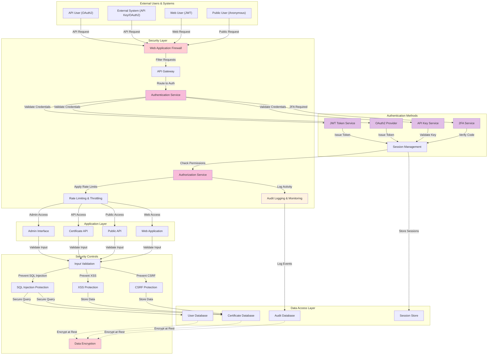
```mermaid
flowchart TD
    %% External Users & Systems
    subgraph "External Users & Systems"
        APIUser["API User (OAuth2)"]
        ExternalSystem["External System (API Key/OAuth2)"]
        WebUser["Web User (JWT)"]
        PublicUser["Public User (Anonymous)"]
    end

    %% Security Layer
    subgraph "Security Layer"
        WAF["Web Application Firewall"]
        APIGateway["API Gateway"]
        Auth["Authentication Service"]
        AuthZ["Authorization Service"]
        RateLimit["Rate Limiting & Throttling"]
        Audit["Audit Logging & Monitoring"]
    end

    %% Authentication Methods
    subgraph "Authentication Methods"
        JWT["JWT Token Service"]
        OAuth2["OAuth2 Provider"]
        APIKey["API Key Service"]
        TwoFA["2FA Service"]
        SessionMgmt["Session Management"]
    end

    %% Application Layer
    subgraph "Application Layer"
        AdminUI["Admin Interface"]
        CertAPI["Certificate API"]
        PublicAPI["Public API"]
        WebApp["Web Application"]
    end

    %% Data Access Layer
    subgraph "Data Access Layer"
        AuthDB["User Database"]
        CertDB["Certificate Database"]
        AuditDB["Audit Database"]
        SessionStore["Session Store"]
    end

    %% Security Controls
    subgraph "Security Controls"
        InputVal["Input Validation"]
        SQLInject["SQL Injection Protection"]
        XSSProtect["XSS Protection"]
        CSRFProtect["CSRF Protection"]
        Encryption["Data Encryption"]
    end

    %% External User Flow
    APIUser -->|API Request| WAF
    ExternalSystem -->|API Request| WAF
    WebUser -->|Web Request| WAF
    PublicUser -->|Public Request| WAF

    %% Security Processing
    WAF -->|Filter Requests| APIGateway
    APIGateway -->|Route to Auth| Auth
    Auth -->|Validate Credentials| JWT
    Auth -->|Validate Credentials| OAuth2
    Auth -->|Validate Credentials| APIKey
    Auth -->|2FA Required| TwoFA

    %% Token/Session Management
    JWT -->|Issue Token| SessionMgmt
    OAuth2 -->|Issue Token| SessionMgmt
    APIKey -->|Validate Key| SessionMgmt
    TwoFA -->|Verify Code| SessionMgmt

    %% Authorization
    SessionMgmt -->|Check Permissions| AuthZ
    AuthZ -->|Apply Rate Limits| RateLimit
    AuthZ -->|Log Activity| Audit

    %% Application Access
    RateLimit -->|Admin Access| AdminUI
    RateLimit -->|API Access| CertAPI
    RateLimit -->|Public Access| PublicAPI
    RateLimit -->|Web Access| WebApp

    %% Security Controls Application
    AdminUI -->|Validate Input| InputVal
    CertAPI -->|Validate Input| InputVal
    PublicAPI -->|Validate Input| InputVal
    WebApp -->|Validate Input| InputVal

    InputVal -->|Prevent SQL Injection| SQLInject
    InputVal -->|Prevent XSS| XSSProtect
    InputVal -->|Prevent CSRF| CSRFProtect

    %% Data Access
    SQLInject -->|Secure Query| AuthDB
    SQLInject -->|Secure Query| CertDB
    XSSProtect -->|Store Data| CertDB
    CSRFProtect -->|Store Data| CertDB
    Audit -->|Log Events| AuditDB
    SessionMgmt -->|Store Sessions| SessionStore

    %% Encryption
    AuthDB -.->|Encrypt at Rest| Encryption
    CertDB -.->|Encrypt at Rest| Encryption
    AuditDB -.->|Encrypt at Rest| Encryption

    %% Styling
    style WAF fill:#ffcdd2
    style Auth fill:#f8bbd9
    style AuthZ fill:#f8bbd9
    style JWT fill:#e1bee7
    style OAuth2 fill:#e1bee7
    style APIKey fill:#e1bee7
    style TwoFA fill:#e1bee7
    style Encryption fill:#ffcdd2
    style Audit fill:#fff3e0
```

## Security Authentication Flow

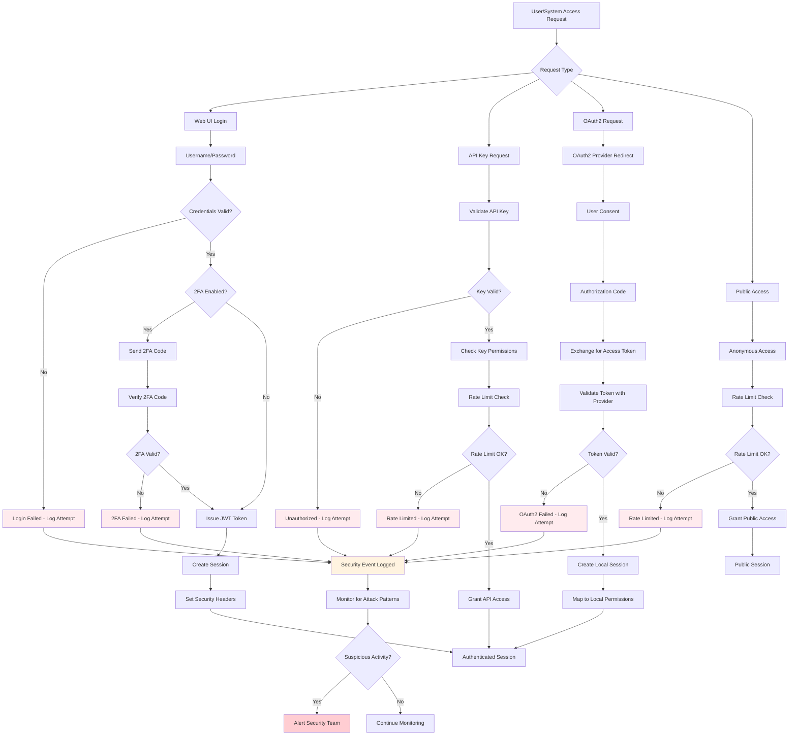
```mermaid
flowchart TD
    A[User/System Access Request] --> B{Request Type}
    
    B --> C[Web UI Login]
    B --> D[API Key Request]
    B --> E[OAuth2 Request]
    B --> F[Public Access]
    
    %% Web UI Authentication
    C --> C1[Username/Password]
    C1 --> C2{Credentials Valid?}
    C2 -->|No| C3[Login Failed - Log Attempt]
    C2 -->|Yes| C4{2FA Enabled?}
    C4 -->|Yes| C5[Send 2FA Code]
    C5 --> C6[Verify 2FA Code]
    C6 --> C7{2FA Valid?}
    C7 -->|No| C8[2FA Failed - Log Attempt]
    C7 -->|Yes| C9[Issue JWT Token]
    C4 -->|No| C9
    C9 --> C10[Create Session]
    C10 --> C11[Set Security Headers]
    
    %% API Key Authentication
    D --> D1[Validate API Key]
    D1 --> D2{Key Valid?}
    D2 -->|No| D3[Unauthorized - Log Attempt]
    D2 -->|Yes| D4[Check Key Permissions]
    D4 --> D5[Rate Limit Check]
    D5 --> D6{Rate Limit OK?}
    D6 -->|No| D7[Rate Limited - Log Attempt]
    D6 -->|Yes| D8[Grant API Access]
    
    %% OAuth2 Authentication
    E --> E1[OAuth2 Provider Redirect]
    E1 --> E2[User Consent]
    E2 --> E3[Authorization Code]
    E3 --> E4[Exchange for Access Token]
    E4 --> E5[Validate Token with Provider]
    E5 --> E6{Token Valid?}
    E6 -->|No| E7[OAuth2 Failed - Log Attempt]
    E6 -->|Yes| E8[Create Local Session]
    E8 --> E9[Map to Local Permissions]
    
    %% Public Access
    F --> F1[Anonymous Access]
    F1 --> F2[Rate Limit Check]
    F2 --> F3{Rate Limit OK?}
    F3 -->|No| F4[Rate Limited - Log Attempt]
    F3 -->|Yes| F5[Grant Public Access]
    
    %% Success Paths
    C11 --> G[Authenticated Session]
    D8 --> G
    E9 --> G
    F5 --> H[Public Session]
    
    %% Error Paths
    C3 --> I[Security Event Logged]
    C8 --> I
    D3 --> I
    D7 --> I
    E7 --> I
    F4 --> I
    
    I --> J[Monitor for Attack Patterns]
    J --> K{Suspicious Activity?}
    K -->|Yes| L[Alert Security Team]
    K -->|No| M[Continue Monitoring]
    
    style C3 fill:#ffebee
    style C8 fill:#ffebee
    style D3 fill:#ffebee
    style D7 fill:#ffebee
    style E7 fill:#ffebee
    style F4 fill:#ffebee
    style I fill:#fff3e0
    style L fill:#ffcdd2
```

## Role-Based Access Control (RBAC) Flow

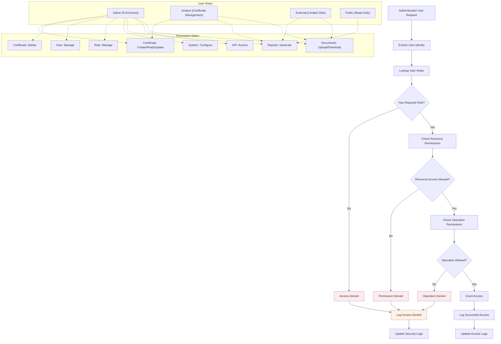
```mermaid
flowchart TD
    A[Authenticated User Request] --> B[Extract User Identity]
    B --> C[Lookup User Roles]
    C --> D{Has Required Role?}
    
    D -->|No| E[Access Denied]
    D -->|Yes| F[Check Resource Permissions]
    
    F --> G{Resource Access Allowed?}
    G -->|No| H[Permission Denied]
    G -->|Yes| I[Check Operation Permissions]
    
    I --> J{Operation Allowed?}
    J -->|No| K[Operation Denied]
    J -->|Yes| L[Grant Access]
    
    %% Role Definitions
    subgraph "User Roles"
        Admin["Admin (Full Access)"]
        Analyst["Analyst (Certificate Management)"]
        External["External (Limited View)"]
        Public["Public (Read-Only)"]
    end
    
    %% Permission Matrix
    subgraph "Permission Matrix"
        P1["Certificate: Create/Read/Update"]
        P2["Certificate: Delete"]
        P3["User: Manage"]
        P4["Role: Manage"]
        P5["System: Configure"]
        P6["Reports: Generate"]
        P7["API: Access"]
        P8["Documents: Upload/Download"]
    end
    
    %% Role-Permission Mapping
    Admin -.-> P1
    Admin -.-> P2
    Admin -.-> P3
    Admin -.-> P4
    Admin -.-> P5
    Admin -.-> P6
    Admin -.-> P7
    Admin -.-> P8
    
    Analyst -.-> P1
    Analyst -.-> P6
    Analyst -.-> P8
    
    External -.-> P6
    External -.-> P8
    
    Public -.-> P6
    
    %% Audit Trail
    L --> M[Log Successful Access]
    E --> N[Log Access Denied]
    H --> N
    K --> N
    
    M --> O[Update Access Logs]
    N --> P[Update Security Logs]
    
    style E fill:#ffebee
    style H fill:#ffebee
    style K fill:#ffebee
    style N fill:#fff3e0
```

## Data Security & Encryption Flow

```mermaid
flowchart TD
    A[Data Operation Request] --> B{Data Type}
    
    B --> C[User Credentials]
    B --> D[Certificate Data]
    B --> E[Document Files]
    B --> F[Session Data]
    B --> G[API Keys]
    B --> H[Audit Logs]
    
    %% User Credentials Security
    C --> C1[Password Hashing]
    C1 --> C2[Salt Generation]
    C2 --> C3[BCrypt/Argon2]
    C3 --> C4[Store Hashed Password]
    
    %% Certificate Data Security
    D --> D1[Sensitive Field Identification]
    D1 --> D2[Field-Level Encryption]
    D2 --> D3[AES-256 Encryption]
    D3 --> D4[Store Encrypted Data]
    
    %% Document Security
    E --> E1[File Type Validation]
    E1 --> E2[Virus Scanning]
    E2 --> E3{File Safe?}
    E3 -->|No| E4[Quarantine File]
    E3 -->|Yes| E5[Encrypt File Content]
    E5 --> E6[Generate Access Token]
    E6 --> E7[Store Secure Reference]
    
    %% Session Security
    F --> F1[Session Token Generation]
    F1 --> F2[Secure Random Generator]
    F2 --> F3[Token Encryption]
    F3 --> F4[Secure Cookie Settings]
    F4 --> F5[HttpOnly/Secure Flags]
    
    %% API Key Security
    G --> G1[Key Generation]
    G1 --> G2[Cryptographic Random]
    G2 --> G3[Hash API Key]
    G3 --> G4[Store Key Hash]
    G4 --> G5[Set Expiration]
    
    %% Audit Log Security
    H --> H1[Log Data Sanitization]
    H1 --> H2[Remove PII]
    H2 --> H3[Structured Logging]
    H3 --> H4[Tamper-Proof Storage]
    H4 --> H5[Log Integrity Hash]
    
    %% Database Security
    subgraph "Database Security"
        TDE["Transparent Data Encryption"]
        BackupEnc["Backup Encryption"]
        ConnEnc["Connection Encryption (TLS)"]
    end
    
    C4 --> TDE
    D4 --> TDE
    E7 --> TDE
    F5 --> TDE
    G4 --> TDE
    H5 --> TDE
    
    TDE --> BackupEnc
    TDE --> ConnEnc
    
    %% Key Management
    subgraph "Key Management"
        KeyVault["Key Vault/HSM"]
        KeyRotation["Key Rotation Policy"]
        KeyBackup["Key Backup & Recovery"]
    end
    
    D3 -.-> KeyVault
    E5 -.-> KeyVault
    F3 -.-> KeyVault
    TDE -.-> KeyVault
    
    KeyVault --> KeyRotation
    KeyVault --> KeyBackup
    
    style E4 fill:#ffebee
    style KeyVault fill:#e8f5e8
    style TDE fill:#e8f5e8
```

## Security Monitoring & Incident Response Flow

```mermaid
flowchart TD
    A[Security Event] --> B[Event Detection]
    B --> C{Event Severity}
    
    C --> D[Low Severity]
    C --> E[Medium Severity]
    C --> F[High Severity]
    C --> G[Critical Severity]
    
    %% Low Severity
    D --> D1[Log Event]
    D1 --> D2[Daily Report]
    
    %% Medium Severity
    E --> E1[Alert Security Team]
    E1 --> E2[Investigate Event]
    E2 --> E3[Document Findings]
    
    %% High Severity
    F --> F1[Immediate Alert]
    F1 --> F2[Escalate to Manager]
    F2 --> F3[Begin Investigation]
    F3 --> F4[Implement Containment]
    
    %% Critical Severity
    G --> G1[Emergency Alert]
    G1 --> G2[Activate Incident Response]
    G2 --> G3[Emergency Containment]
    G3 --> G4[Notify Stakeholders]
    
    %% Event Types
    subgraph "Security Events"
        SE1["Failed Login Attempts"]
        SE2["Unusual API Usage"]
        SE3["Privilege Escalation"]
        SE4["Data Breach Attempt"]
        SE5["Malware Detection"]
        SE6["SQL Injection Attempt"]
        SE7["System Intrusion"]
    end
    
    %% Monitoring Tools
    subgraph "Monitoring Tools"
        SIEM["SIEM System"]
        IDS["Intrusion Detection"]
        WAFMon["WAF Monitoring"]
        LogAnalysis["Log Analysis"]
        AnomalyDet["Anomaly Detection"]
    end
    
    %% Response Actions
    subgraph "Response Actions"
        R1["Block IP Address"]
        R2["Disable User Account"]
        R3["Isolate System"]
        R4["Patch Vulnerability"]
        R5["Update Security Rules"]
        R6["Forensic Analysis"]
    end
    
    %% Event to Tool Mapping
    SE1 --> SIEM
    SE2 --> LogAnalysis
    SE3 --> AnomalyDet
    SE4 --> IDS
    SE5 --> IDS
    SE6 --> WAFMon
    SE7 --> IDS
    
    %% Response Mapping
    F4 --> R1
    F4 --> R2
    G3 --> R3
    G3 --> R4
    E3 --> R5
    F3 --> R6
    
    %% Recovery Process
    F4 --> H[Damage Assessment]
    G3 --> H
    H --> I[Recovery Planning]
    I --> J[System Restoration]
    J --> K[Security Validation]
    K --> L[Post-Incident Review]
    L --> M[Update Security Policies]
    
    style G fill:#ffcdd2
    style G1 fill:#ffcdd2
    style G2 fill:#ffcdd2
    style G3 fill:#ffcdd2
    style R3 fill:#ffcdd2
```