# 🔄 Technical Flows and System Diagrams

**Version:** 1.0.0  
**Last Updated:** August 21, 2025  
**System:** GCC Database Application

---

## 📋 Table of Contents

1. [System Context Diagram](#system-context-diagram)
2. [Authentication & Authorization Flows](#authentication--authorization-flows)
3. [Data Processing Flows](#data-processing-flows)
4. [Certificate Management Workflow](#certificate-management-workflow)
5. [Search and Filter Architecture](#search-and-filter-architecture)
6. [File Upload/Download Flow](#file-uploaddownload-flow)
7. [API Request Processing](#api-request-processing)
8. [Caching Strategy](#caching-strategy)
9. [Error Handling & Logging](#error-handling--logging)
10. [Database Transaction Flows](#database-transaction-flows)

---

## 🌐 System Context Diagram

### High-Level System Overview

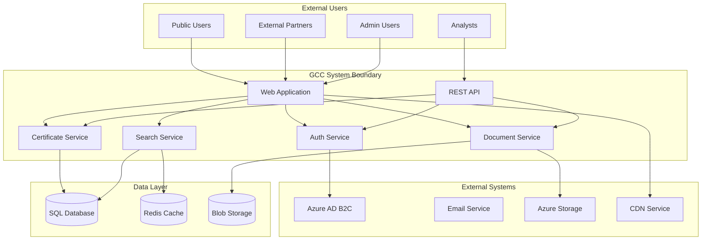
```mermaid
graph TB
    subgraph "External Users"
        PU[Public Users]
        EU[External Partners]
        AU[Admin Users]
        AN[Analysts]
    end
    
    subgraph "GCC System Boundary"
        WEB[Web Application]
        API[REST API]
        AUTH[Auth Service]
        CERT[Certificate Service]
        DOC[Document Service]
        SEARCH[Search Service]
    end
    
    subgraph "External Systems"
        AAD[Azure AD B2C]
        EMAIL[Email Service]
        STORAGE[Azure Storage]
        CDN[CDN Service]
    end
    
    subgraph "Data Layer"
        SQL[(SQL Database)]
        CACHE[(Redis Cache)]
        BLOB[(Blob Storage)]
    end
    
    PU --> WEB
    EU --> WEB
    AU --> WEB
    AN --> API
    
    WEB --> AUTH
    WEB --> CERT
    WEB --> DOC
    WEB --> SEARCH
    
    API --> AUTH
    API --> CERT
    API --> DOC
    
    AUTH --> AAD
    CERT --> SQL
    DOC --> STORAGE
    DOC --> BLOB
    SEARCH --> CACHE
    SEARCH --> SQL
    
    WEB --> CDN
```

---

## 🔐 Authentication & Authorization Flows

### Azure AD B2C Authentication Flow

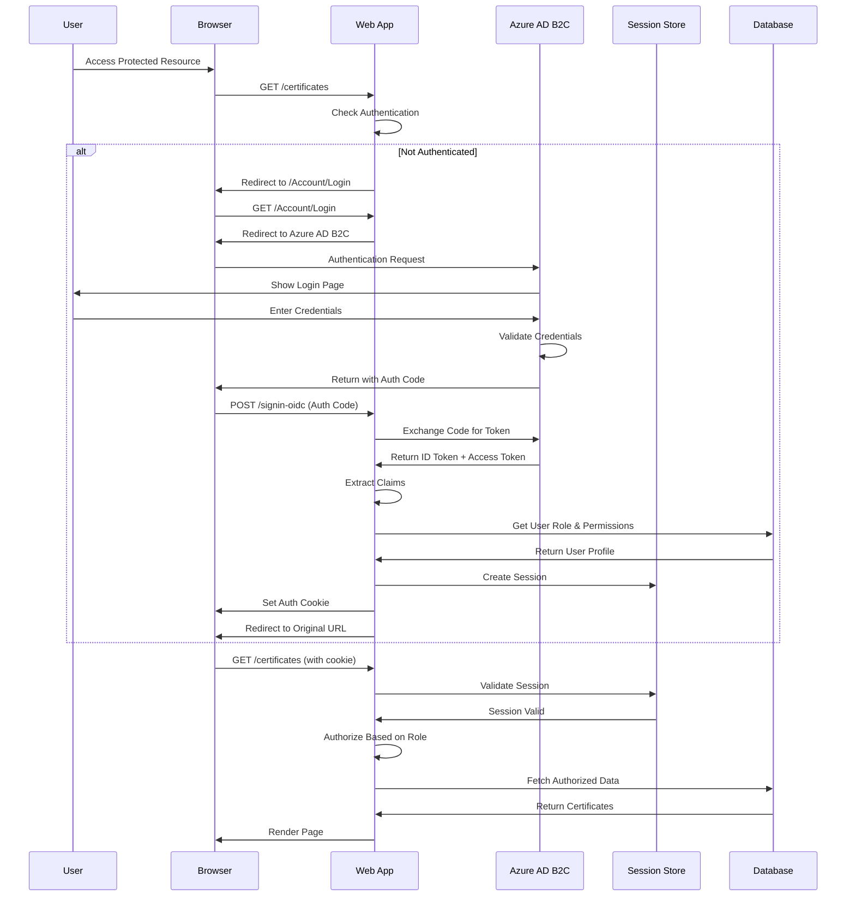
```mermaid
sequenceDiagram
    participant U as User
    participant B as Browser
    participant W as Web App
    participant A as Azure AD B2C
    participant S as Session Store
    participant D as Database
    
    U->>B: Access Protected Resource
    B->>W: GET /certificates
    W->>W: Check Authentication
    
    alt Not Authenticated
        W->>B: Redirect to /Account/Login
        B->>W: GET /Account/Login
        W->>B: Redirect to Azure AD B2C
        B->>A: Authentication Request
        A->>U: Show Login Page
        U->>A: Enter Credentials
        A->>A: Validate Credentials
        A->>B: Return with Auth Code
        B->>W: POST /signin-oidc (Auth Code)
        W->>A: Exchange Code for Token
        A->>W: Return ID Token + Access Token
        W->>W: Extract Claims
        W->>D: Get User Role & Permissions
        D->>W: Return User Profile
        W->>S: Create Session
        W->>B: Set Auth Cookie
        W->>B: Redirect to Original URL
    end
    
    B->>W: GET /certificates (with cookie)
    W->>S: Validate Session
    S->>W: Session Valid
    W->>W: Authorize Based on Role
    W->>D: Fetch Authorized Data
    D->>W: Return Certificates
    W->>B: Render Page
```

### Cookie Authentication Fallback Flow

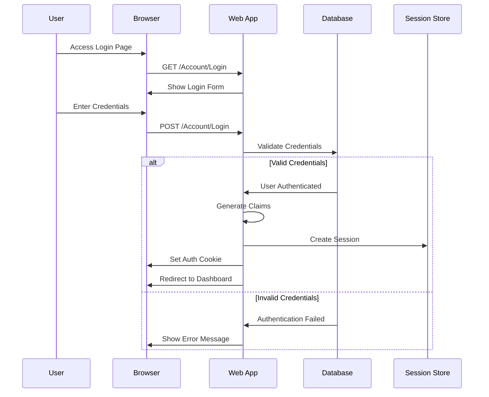
```mermaid
sequenceDiagram
    participant U as User
    participant B as Browser
    participant W as Web App
    participant D as Database
    participant S as Session Store
    
    U->>B: Access Login Page
    B->>W: GET /Account/Login
    W->>B: Show Login Form
    U->>B: Enter Credentials
    B->>W: POST /Account/Login
    W->>D: Validate Credentials
    
    alt Valid Credentials
        D->>W: User Authenticated
        W->>W: Generate Claims
        W->>S: Create Session
        W->>B: Set Auth Cookie
        W->>B: Redirect to Dashboard
    else Invalid Credentials
        D->>W: Authentication Failed
        W->>B: Show Error Message
    end
```

### Role-Based Authorization Flow

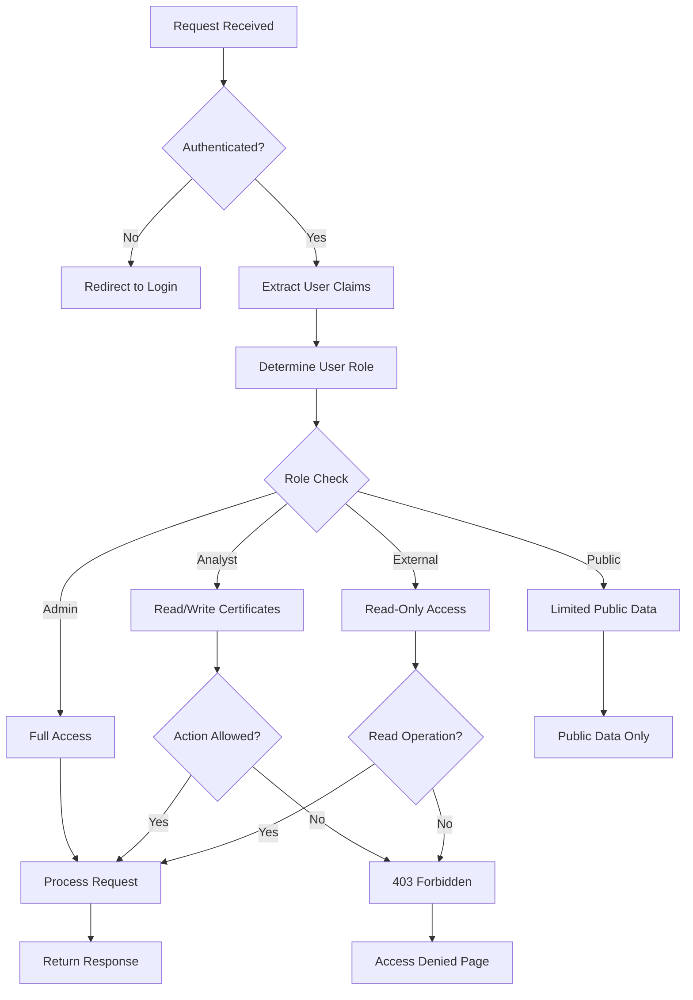
```mermaid
flowchart TD
    A[Request Received] --> B{Authenticated?}
    B -->|No| C[Redirect to Login]
    B -->|Yes| D[Extract User Claims]
    D --> E[Determine User Role]
    
    E --> F{Role Check}
    F -->|Admin| G[Full Access]
    F -->|Analyst| H[Read/Write Certificates]
    F -->|External| I[Read-Only Access]
    F -->|Public| J[Limited Public Data]
    
    G --> K[Process Request]
    H --> L{Action Allowed?}
    I --> M{Read Operation?}
    J --> N[Public Data Only]
    
    L -->|Yes| K
    L -->|No| O[403 Forbidden]
    M -->|Yes| K
    M -->|No| O
    
    K --> P[Return Response]
    O --> Q[Access Denied Page]
```

---

## 📊 Data Processing Flows

### Certificate Creation Workflow

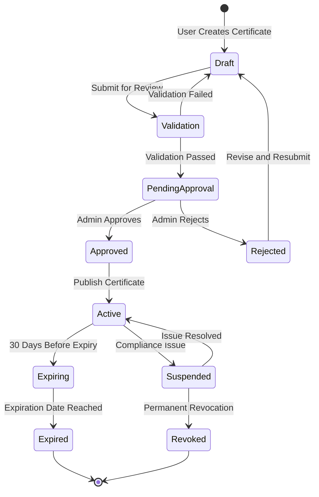
```mermaid
stateDiagram-v2
    [*] --> Draft: User Creates Certificate
    Draft --> Validation: Submit for Review
    
    Validation --> Draft: Validation Failed
    Validation --> PendingApproval: Validation Passed
    
    PendingApproval --> Approved: Admin Approves
    PendingApproval --> Rejected: Admin Rejects
    
    Rejected --> Draft: Revise and Resubmit
    Approved --> Active: Publish Certificate
    
    Active --> Expiring: 30 Days Before Expiry
    Expiring --> Expired: Expiration Date Reached
    Active --> Suspended: Compliance Issue
    Suspended --> Active: Issue Resolved
    Suspended --> Revoked: Permanent Revocation
    
    Expired --> [*]
    Revoked --> [*]
```

### Data Validation Pipeline

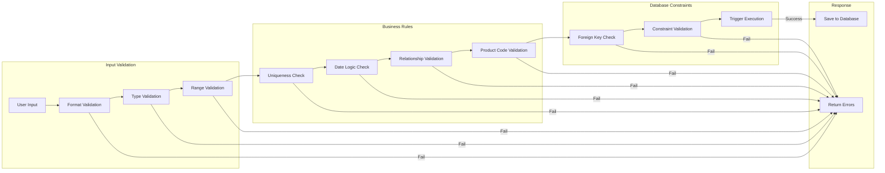
```mermaid
flowchart LR
    subgraph "Input Validation"
        I1[User Input] --> V1[Format Validation]
        V1 --> V2[Type Validation]
        V2 --> V3[Range Validation]
    end
    
    subgraph "Business Rules"
        V3 --> B1[Uniqueness Check]
        B1 --> B2[Date Logic Check]
        B2 --> B3[Relationship Validation]
        B3 --> B4[Product Code Validation]
    end
    
    subgraph "Database Constraints"
        B4 --> D1[Foreign Key Check]
        D1 --> D2[Constraint Validation]
        D2 --> D3[Trigger Execution]
    end
    
    subgraph "Response"
        D3 -->|Success| S[Save to Database]
        V1 -->|Fail| E[Return Errors]
        V2 -->|Fail| E
        V3 -->|Fail| E
        B1 -->|Fail| E
        B2 -->|Fail| E
        B3 -->|Fail| E
        B4 -->|Fail| E
        D1 -->|Fail| E
        D2 -->|Fail| E
    end
```

---

## 📜 Certificate Management Workflow

### Certificate Lifecycle Management

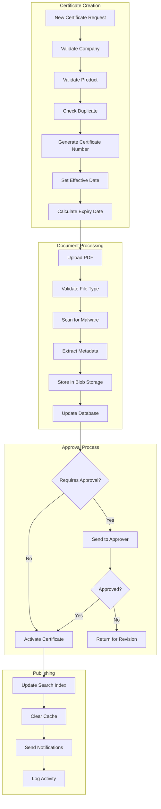
```mermaid
graph TB
    subgraph "Certificate Creation"
        CR1[New Certificate Request] --> CR2[Validate Company]
        CR2 --> CR3[Validate Product]
        CR3 --> CR4[Check Duplicate]
        CR4 --> CR5[Generate Certificate Number]
        CR5 --> CR6[Set Effective Date]
        CR6 --> CR7[Calculate Expiry Date]
    end
    
    subgraph "Document Processing"
        CR7 --> DP1[Upload PDF]
        DP1 --> DP2[Validate File Type]
        DP2 --> DP3[Scan for Malware]
        DP3 --> DP4[Extract Metadata]
        DP4 --> DP5[Store in Blob Storage]
        DP5 --> DP6[Update Database]
    end
    
    subgraph "Approval Process"
        DP6 --> AP1{Requires Approval?}
        AP1 -->|Yes| AP2[Send to Approver]
        AP2 --> AP3{Approved?}
        AP3 -->|Yes| AP4[Activate Certificate]
        AP3 -->|No| AP5[Return for Revision]
        AP1 -->|No| AP4
    end
    
    subgraph "Publishing"
        AP4 --> PB1[Update Search Index]
        PB1 --> PB2[Clear Cache]
        PB2 --> PB3[Send Notifications]
        PB3 --> PB4[Log Activity]
    end
```

### Certificate Renewal Process

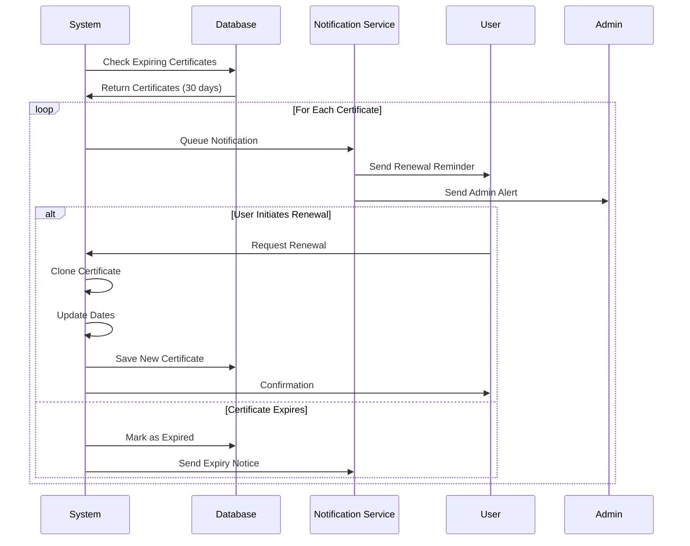
```mermaid
sequenceDiagram
    participant S as System
    participant D as Database
    participant N as Notification Service
    participant U as User
    participant A as Admin
    
    S->>D: Check Expiring Certificates
    D->>S: Return Certificates (30 days)
    
    loop For Each Certificate
        S->>N: Queue Notification
        N->>U: Send Renewal Reminder
        N->>A: Send Admin Alert
        
        alt User Initiates Renewal
            U->>S: Request Renewal
            S->>S: Clone Certificate
            S->>S: Update Dates
            S->>D: Save New Certificate
            S->>U: Confirmation
        else Certificate Expires
            S->>D: Mark as Expired
            S->>N: Send Expiry Notice
        end
    end
```

---

## 🔍 Search and Filter Architecture

### Search Request Processing

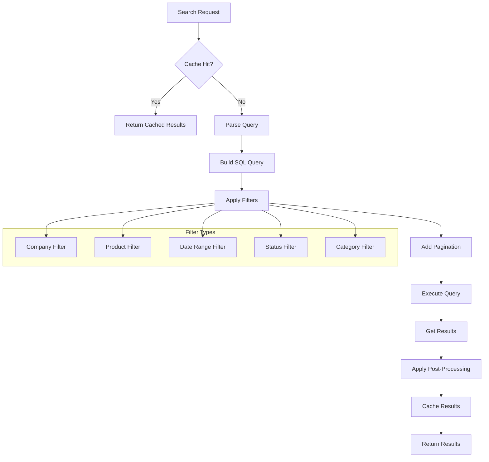
```mermaid
flowchart TD
    A[Search Request] --> B{Cache Hit?}
    B -->|Yes| C[Return Cached Results]
    B -->|No| D[Parse Query]
    
    D --> E[Build SQL Query]
    E --> F[Apply Filters]
    F --> G[Add Pagination]
    G --> H[Execute Query]
    
    H --> I[Get Results]
    I --> J[Apply Post-Processing]
    J --> K[Cache Results]
    K --> L[Return Results]
    
    subgraph "Filter Types"
        F1[Company Filter]
        F2[Product Filter]
        F3[Date Range Filter]
        F4[Status Filter]
        F5[Category Filter]
    end
    
    F --> F1
    F --> F2
    F --> F3
    F --> F4
    F --> F5
```

### Advanced Search Implementation

```mermaid
graph LR
    subgraph "Search Input"
        Q[Query String] --> P[Parser]
        P --> T[Tokenizer]
        T --> A[Analyzer]
    end
    
    subgraph "Search Processing"
        A --> I[Index Lookup]
        I --> R[Ranking Algorithm]
        R --> S[Score Calculation]
    end
    
    subgraph "Result Assembly"
        S --> F[Filter Results]
        F --> SO[Sort Results]
        SO --> PA[Paginate]
        PA --> HI[Highlight Matches]
    end
    
    subgraph "Response"
        HI --> CA[Cache Results]
        CA --> RE[Return JSON]
    end
```

---

## 📁 File Upload/Download Flow

### Secure File Upload Process

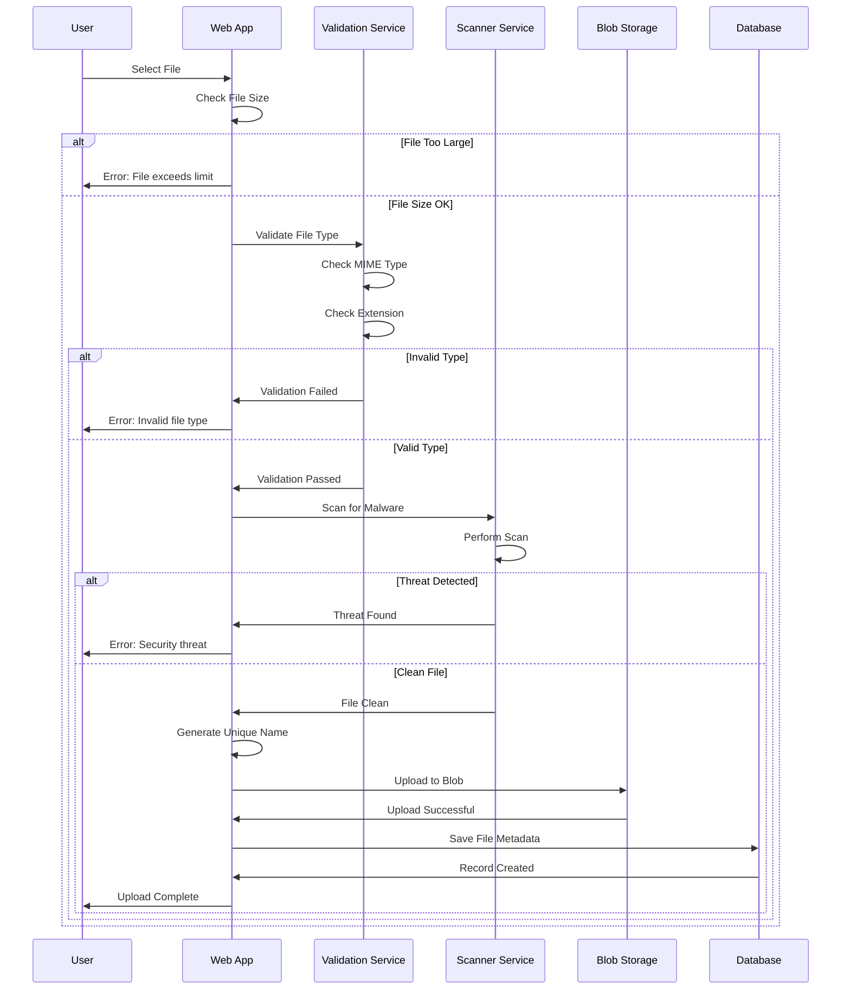
```mermaid
sequenceDiagram
    participant U as User
    participant W as Web App
    participant V as Validation Service
    participant S as Scanner Service
    participant B as Blob Storage
    participant D as Database
    
    U->>W: Select File
    W->>W: Check File Size
    
    alt File Too Large
        W->>U: Error: File exceeds limit
    else File Size OK
        W->>V: Validate File Type
        V->>V: Check MIME Type
        V->>V: Check Extension
        
        alt Invalid Type
            V->>W: Validation Failed
            W->>U: Error: Invalid file type
        else Valid Type
            V->>W: Validation Passed
            W->>S: Scan for Malware
            S->>S: Perform Scan
            
            alt Threat Detected
                S->>W: Threat Found
                W->>U: Error: Security threat
            else Clean File
                S->>W: File Clean
                W->>W: Generate Unique Name
                W->>B: Upload to Blob
                B->>W: Upload Successful
                W->>D: Save File Metadata
                D->>W: Record Created
                W->>U: Upload Complete
            end
        end
    end
```

### File Download Authorization

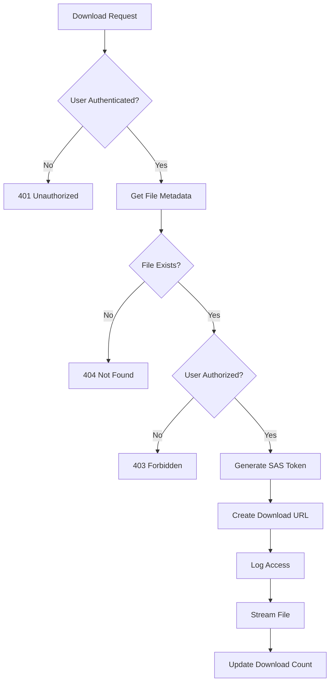
```mermaid
flowchart TD
    A[Download Request] --> B{User Authenticated?}
    B -->|No| C[401 Unauthorized]
    B -->|Yes| D[Get File Metadata]
    
    D --> E{File Exists?}
    E -->|No| F[404 Not Found]
    E -->|Yes| G{User Authorized?}
    
    G -->|No| H[403 Forbidden]
    G -->|Yes| I[Generate SAS Token]
    
    I --> J[Create Download URL]
    J --> K[Log Access]
    K --> L[Stream File]
    L --> M[Update Download Count]
```

---

## 🔌 API Request Processing

### RESTful API Request Flow

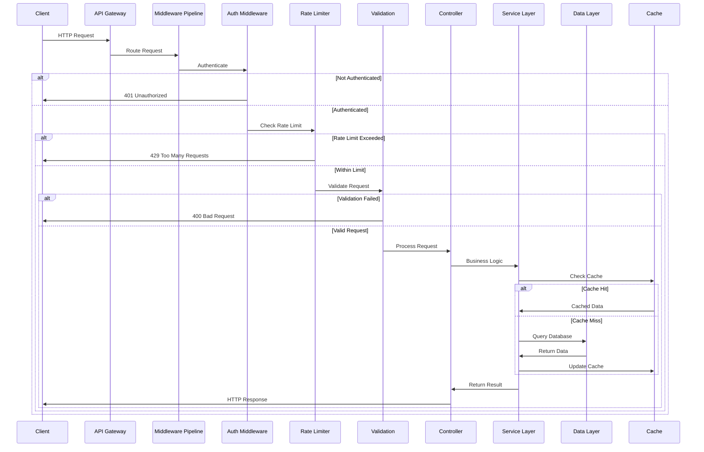
```mermaid
sequenceDiagram
    participant C as Client
    participant G as API Gateway
    participant M as Middleware Pipeline
    participant A as Auth Middleware
    participant R as Rate Limiter
    participant V as Validation
    participant Co as Controller
    participant S as Service Layer
    participant D as Data Layer
    participant Ca as Cache
    
    C->>G: HTTP Request
    G->>M: Route Request
    M->>A: Authenticate
    
    alt Not Authenticated
        A->>C: 401 Unauthorized
    else Authenticated
        A->>R: Check Rate Limit
        
        alt Rate Limit Exceeded
            R->>C: 429 Too Many Requests
        else Within Limit
            R->>V: Validate Request
            
            alt Validation Failed
                V->>C: 400 Bad Request
            else Valid Request
                V->>Co: Process Request
                Co->>S: Business Logic
                
                S->>Ca: Check Cache
                alt Cache Hit
                    Ca->>S: Cached Data
                else Cache Miss
                    S->>D: Query Database
                    D->>S: Return Data
                    S->>Ca: Update Cache
                end
                
                S->>Co: Return Result
                Co->>C: HTTP Response
            end
        end
    end
```

### API Versioning Strategy

```mermaid
graph TB
    subgraph "API Versions"
        V1[/api/v1/certificates]
        V2[/api/v2/certificates]
        V3[/api/v3/certificates]
    end
    
    subgraph "Version Selection"
        H[Header: api-version] --> VS[Version Selector]
        U[URL Path] --> VS
        Q[Query String] --> VS
    end
    
    VS --> VM{Version Mapping}
    VM -->|v1| V1
    VM -->|v2| V2
    VM -->|v3| V3
    VM -->|default| V3
    
    V1 --> C1[v1 Controller]
    V2 --> C2[v2 Controller]
    V3 --> C3[v3 Controller]
```

---

## 💾 Caching Strategy

### Multi-Layer Cache Architecture

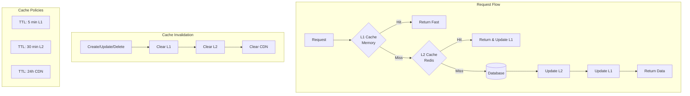
```mermaid
graph TD
    subgraph "Request Flow"
        R[Request] --> L1{L1 Cache<br/>Memory}
        L1 -->|Hit| R1[Return Fast]
        L1 -->|Miss| L2{L2 Cache<br/>Redis}
        L2 -->|Hit| R2[Return & Update L1]
        L2 -->|Miss| DB[(Database)]
        DB --> U1[Update L2]
        U1 --> U2[Update L1]
        U2 --> R3[Return Data]
    end
    
    subgraph "Cache Invalidation"
        CUD[Create/Update/Delete] --> I1[Clear L1]
        I1 --> I2[Clear L2]
        I2 --> I3[Clear CDN]
    end
    
    subgraph "Cache Policies"
        P1[TTL: 5 min L1]
        P2[TTL: 30 min L2]
        P3[TTL: 24h CDN]
    end
```

### Cache Key Strategy

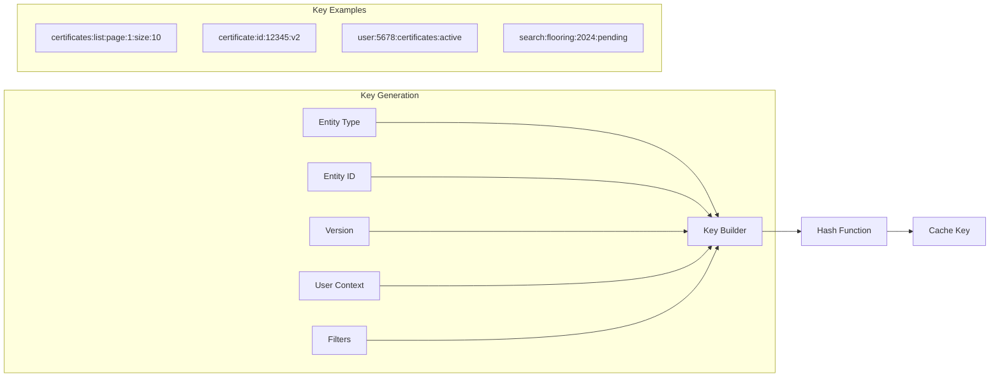
```mermaid
graph LR
    subgraph "Key Generation"
        E[Entity Type] --> K[Key Builder]
        I[Entity ID] --> K
        V[Version] --> K
        U[User Context] --> K
        F[Filters] --> K
    end
    
    K --> H[Hash Function]
    H --> CK[Cache Key]
    
    subgraph "Key Examples"
        K1[certificates:list:page:1:size:10]
        K2[certificate:id:12345:v2]
        K3[user:5678:certificates:active]
        K4[search:flooring:2024:pending]
    end
```

---

## 🚨 Error Handling & Logging

### Error Processing Pipeline

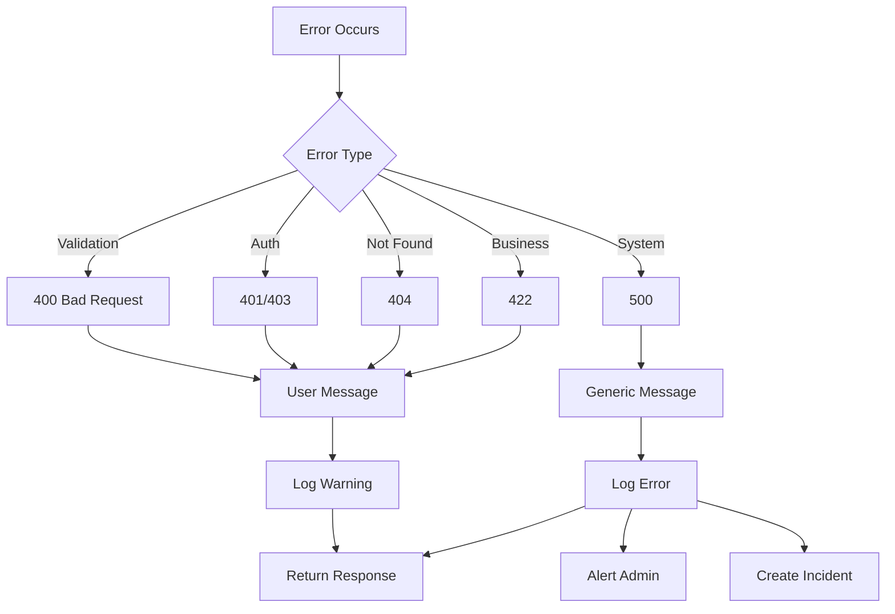
```mermaid
flowchart TD
    A[Error Occurs] --> B{Error Type}
    
    B -->|Validation| C[400 Bad Request]
    B -->|Auth| D[401/403]
    B -->|Not Found| E[404]
    B -->|Business| F[422]
    B -->|System| G[500]
    
    C --> H[User Message]
    D --> H
    E --> H
    F --> H
    G --> I[Generic Message]
    
    H --> J[Log Warning]
    I --> K[Log Error]
    
    J --> L[Return Response]
    K --> L
    
    K --> M[Alert Admin]
    K --> N[Create Incident]
```

### Logging Architecture

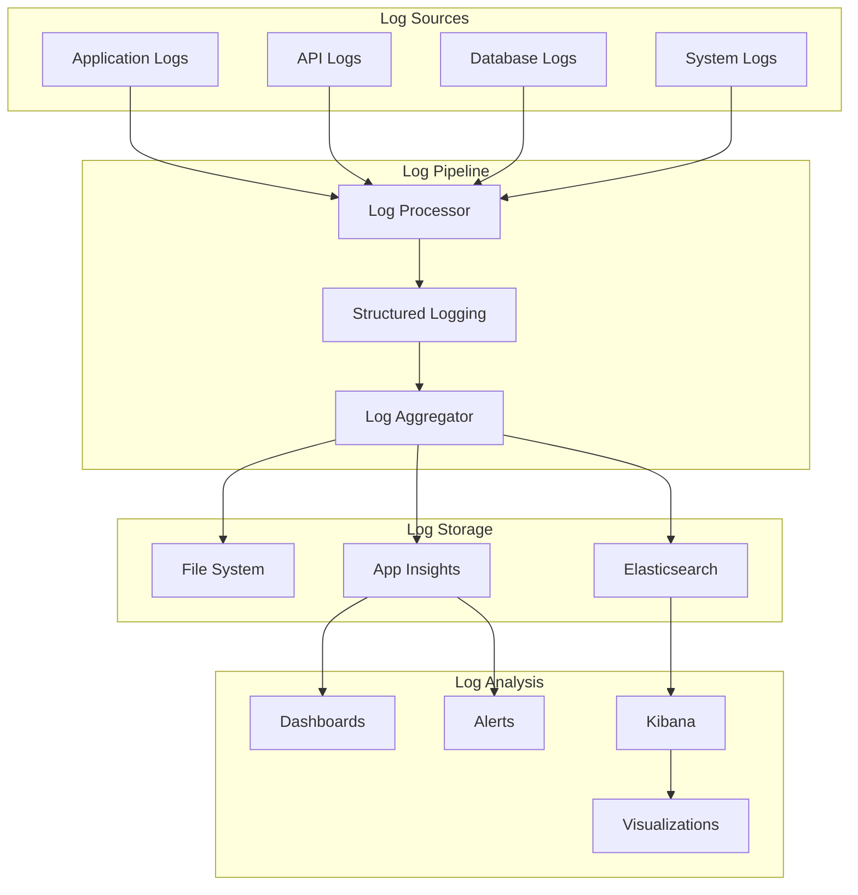
```mermaid
graph TB
    subgraph "Log Sources"
        A1[Application Logs]
        A2[API Logs]
        A3[Database Logs]
        A4[System Logs]
    end
    
    subgraph "Log Pipeline"
        A1 --> LP[Log Processor]
        A2 --> LP
        A3 --> LP
        A4 --> LP
        
        LP --> LS[Structured Logging]
        LS --> LA[Log Aggregator]
    end
    
    subgraph "Log Storage"
        LA --> F[File System]
        LA --> AI[App Insights]
        LA --> ES[Elasticsearch]
    end
    
    subgraph "Log Analysis"
        AI --> D[Dashboards]
        AI --> AL[Alerts]
        ES --> K[Kibana]
        K --> V[Visualizations]
    end
```

---

## 🗄️ Database Transaction Flows

### Transaction Management Pattern

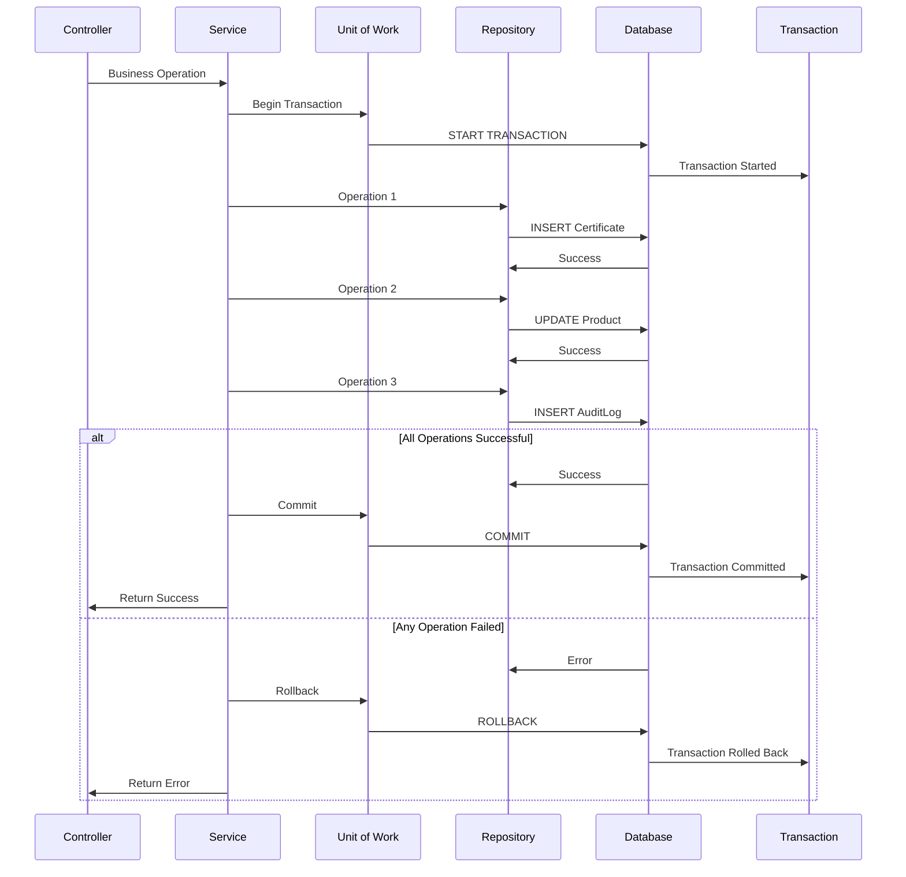
```mermaid
sequenceDiagram
    participant C as Controller
    participant S as Service
    participant U as Unit of Work
    participant R as Repository
    participant D as Database
    participant T as Transaction
    
    C->>S: Business Operation
    S->>U: Begin Transaction
    U->>D: START TRANSACTION
    D->>T: Transaction Started
    
    S->>R: Operation 1
    R->>D: INSERT Certificate
    D->>R: Success
    
    S->>R: Operation 2
    R->>D: UPDATE Product
    D->>R: Success
    
    S->>R: Operation 3
    R->>D: INSERT AuditLog
    
    alt All Operations Successful
        D->>R: Success
        S->>U: Commit
        U->>D: COMMIT
        D->>T: Transaction Committed
        S->>C: Return Success
    else Any Operation Failed
        D->>R: Error
        S->>U: Rollback
        U->>D: ROLLBACK
        D->>T: Transaction Rolled Back
        S->>C: Return Error
    end
```

### Database Connection Pooling

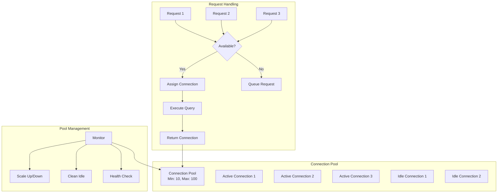
```mermaid
graph TD
    subgraph "Connection Pool"
        CP[Connection Pool<br/>Min: 10, Max: 100]
        C1[Active Connection 1]
        C2[Active Connection 2]
        C3[Active Connection 3]
        I1[Idle Connection 1]
        I2[Idle Connection 2]
    end
    
    subgraph "Request Handling"
        R1[Request 1] --> A{Available?}
        R2[Request 2] --> A
        R3[Request 3] --> A
        
        A -->|Yes| AC[Assign Connection]
        A -->|No| Q[Queue Request]
        
        AC --> E[Execute Query]
        E --> RC[Return Connection]
        RC --> CP
    end
    
    subgraph "Pool Management"
        M[Monitor] --> CP
        M --> S[Scale Up/Down]
        M --> C[Clean Idle]
        M --> H[Health Check]
    end
```

---

## 📈 Performance Optimization Flows

### Query Optimization Strategy

```mermaid
flowchart LR
    subgraph "Query Analysis"
        Q[Query] --> A[Analyze Execution Plan]
        A --> I{Index Available?}
        I -->|No| CI[Create Index]
        I -->|Yes| UI{Index Used?}
        UI -->|No| RI[Rebuild Index]
        UI -->|Yes| ST[Check Statistics]
    end
    
    subgraph "Optimization"
        ST --> O1[Rewrite Query]
        O1 --> O2[Add Query Hints]
        O2 --> O3[Partition Tables]
        O3 --> O4[Use Stored Procs]
    end
    
    subgraph "Caching"
        O4 --> C1[Result Caching]
        C1 --> C2[Query Plan Cache]
        C2 --> C3[Compiled Queries]
    end
```

---

## 🔄 Data Synchronization Flows

### Real-time Data Sync

```mermaid
sequenceDiagram
    participant P as Primary DB
    participant R as Read Replica
    participant C as Cache
    participant S as Search Index
    participant E as Event Bus
    
    P->>P: Data Change
    P->>E: Publish Event
    
    par Sync to Replica
        E->>R: Update Replica
        R->>R: Apply Change
    and Update Cache
        E->>C: Invalidate Cache
        C->>C: Clear Entry
    and Update Search
        E->>S: Update Index
        S->>S: Reindex Document
    end
    
    Note over R,S: All systems synchronized
```

---

## 📊 Monitoring & Observability

### System Health Monitoring

```mermaid
graph TB
    subgraph "Health Checks"
        H1[App Health] --> HC[Health Controller]
        H2[Database Health] --> HC
        H3[Cache Health] --> HC
        H4[Storage Health] --> HC
        H5[External API Health] --> HC
    end
    
    HC --> HA[Health Aggregator]
    
    HA --> S{Status}
    S -->|Healthy| G[Green Status]
    S -->|Degraded| Y[Yellow Status]
    S -->|Unhealthy| R[Red Status]
    
    R --> A[Send Alerts]
    Y --> L[Log Warning]
    
    subgraph "Metrics"
        M1[Response Time]
        M2[Error Rate]
        M3[Throughput]
        M4[CPU Usage]
        M5[Memory Usage]
    end
    
    M1 --> D[Dashboard]
    M2 --> D
    M3 --> D
    M4 --> D
    M5 --> D
```

---

*This technical flow documentation is maintained by the Architecture team and updated with system changes.*