# System Interaction Flows - GCC Database System

## Overview
This document details how different components of the GCC Database System interact with each other and with external systems. It shows data flow, API calls, database operations, and integration points.

---

## System Architecture Overview

### Core Components
1. **Web Application (Frontend)**
   - ASP.NET Core MVC
   - Razor Pages
   - JavaScript/jQuery
   - Bootstrap CSS Framework

2. **API Layer**
   - RESTful Web API
   - Authentication/Authorization
   - Rate Limiting
   - Request/Response Validation

3. **Business Logic Layer**
   - Service Classes
   - Data Validation
   - Business Rules Engine
   - Workflow Management

4. **Data Access Layer**
   - Entity Framework Core
   - Repository Pattern
   - Database Context
   - Migration Management

5. **Database Layer**
   - SQL Server Database
   - Stored Procedures
   - Indexes and Constraints
   - Backup and Recovery

6. **External Integrations**
   - Azure AD B2C
   - Email Service (SMTP)
   - File Storage System
   - Third-party APIs

---

## Interaction Flow 1: User Authentication Process

### Components Involved
- Web Browser → Web Application → Authentication Service → Azure AD B2C → Database

### Detailed Flow

#### Standard Login Process
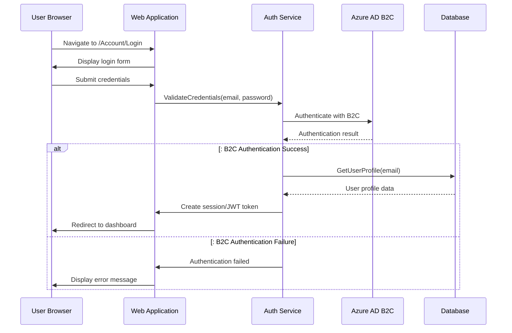
```mermaid
sequenceDiagram
    participant User as User Browser
    participant WebApp as Web Application
    participant Auth as Auth Service
    participant B2C as Azure AD B2C
    participant DB as Database
    
    User->>WebApp: Navigate to /Account/Login
    WebApp->>User: Display login form
    User->>WebApp: Submit credentials
    WebApp->>Auth: ValidateCredentials(email, password)
    Auth->>B2C: Authenticate with B2C
    B2C-->>Auth: Authentication result
    Alt: B2C Authentication Success
        Auth->>DB: GetUserProfile(email)
        DB-->>Auth: User profile data
        Auth->>WebApp: Create session/JWT token
        WebApp->>User: Redirect to dashboard
    Else: B2C Authentication Failure
        Auth->>WebApp: Authentication failed
        WebApp->>User: Display error message
    End
```

#### Two-Factor Authentication Flow
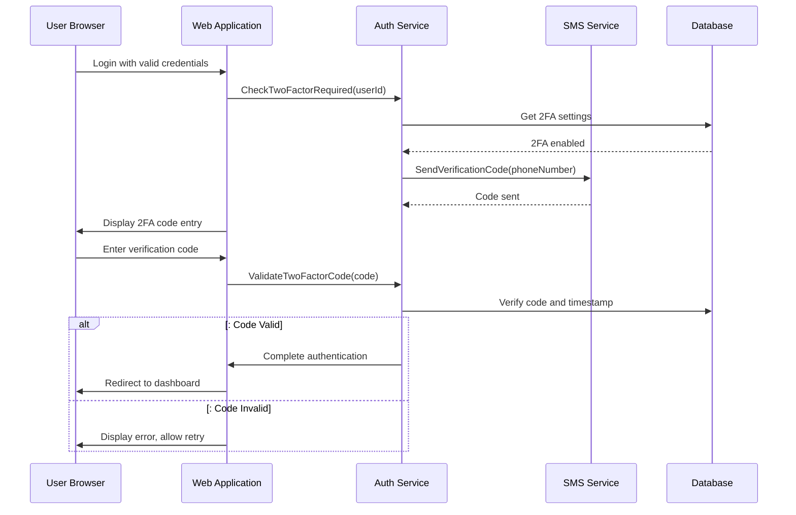
```mermaid
sequenceDiagram
    participant User as User Browser
    participant WebApp as Web Application
    participant Auth as Auth Service
    participant SMS as SMS Service
    participant DB as Database
    
    User->>WebApp: Login with valid credentials
    WebApp->>Auth: CheckTwoFactorRequired(userId)
    Auth->>DB: Get 2FA settings
    DB-->>Auth: 2FA enabled
    Auth->>SMS: SendVerificationCode(phoneNumber)
    SMS-->>Auth: Code sent
    WebApp->>User: Display 2FA code entry
    User->>WebApp: Enter verification code
    WebApp->>Auth: ValidateTwoFactorCode(code)
    Auth->>DB: Verify code and timestamp
    Alt: Code Valid
        Auth->>WebApp: Complete authentication
        WebApp->>User: Redirect to dashboard
    Else: Code Invalid
        WebApp->>User: Display error, allow retry
    End
```

---

## Interaction Flow 2: Certificate Management Operations

### Components Involved
- Web Browser → Web Application → Certificate Service → Database → File Storage

### Create Certificate Flow
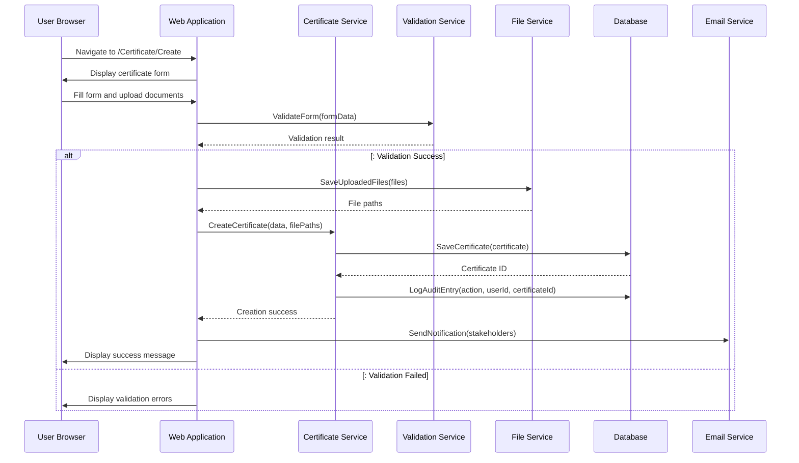
```mermaid
sequenceDiagram
    participant User as User Browser
    participant WebApp as Web Application
    participant CertService as Certificate Service
    participant ValidService as Validation Service
    participant FileService as File Service
    participant DB as Database
    participant Email as Email Service
    
    User->>WebApp: Navigate to /Certificate/Create
    WebApp->>User: Display certificate form
    User->>WebApp: Fill form and upload documents
    WebApp->>ValidService: ValidateForm(formData)
    ValidService-->>WebApp: Validation result
    
    Alt: Validation Success
        WebApp->>FileService: SaveUploadedFiles(files)
        FileService-->>WebApp: File paths
        WebApp->>CertService: CreateCertificate(data, filePaths)
        CertService->>DB: SaveCertificate(certificate)
        DB-->>CertService: Certificate ID
        CertService->>DB: LogAuditEntry(action, userId, certificateId)
        CertService-->>WebApp: Creation success
        WebApp->>Email: SendNotification(stakeholders)
        WebApp->>User: Display success message
    Else: Validation Failed
        WebApp->>User: Display validation errors
    End
```

### Certificate Search Flow
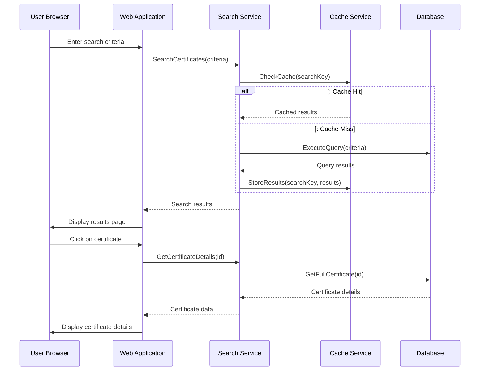
```mermaid
sequenceDiagram
    participant User as User Browser
    participant WebApp as Web Application
    participant SearchService as Search Service
    participant CacheService as Cache Service
    participant DB as Database
    
    User->>WebApp: Enter search criteria
    WebApp->>SearchService: SearchCertificates(criteria)
    SearchService->>CacheService: CheckCache(searchKey)
    
    Alt: Cache Hit
        CacheService-->>SearchService: Cached results
    Else: Cache Miss
        SearchService->>DB: ExecuteQuery(criteria)
        DB-->>SearchService: Query results
        SearchService->>CacheService: StoreResults(searchKey, results)
    End
    
    SearchService-->>WebApp: Search results
    WebApp->>User: Display results page
    
    User->>WebApp: Click on certificate
    WebApp->>SearchService: GetCertificateDetails(id)
    SearchService->>DB: GetFullCertificate(id)
    DB-->>SearchService: Certificate details
    SearchService-->>WebApp: Certificate data
    WebApp->>User: Display certificate details
```

---

## Interaction Flow 3: Admin Panel Operations

### Components Involved
- Admin Browser → Admin Controller → Admin Service → Database → Audit Service

### User Management Flow
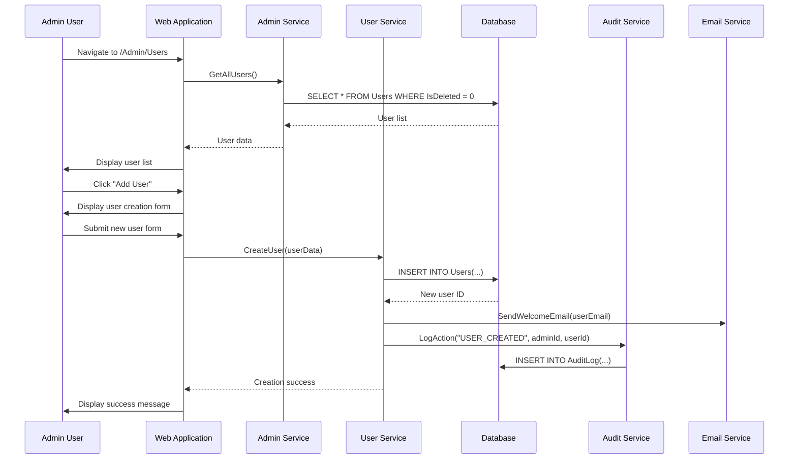
```mermaid
sequenceDiagram
    participant Admin as Admin User
    participant WebApp as Web Application
    participant AdminService as Admin Service
    participant UserService as User Service
    participant DB as Database
    participant AuditService as Audit Service
    participant Email as Email Service
    
    Admin->>WebApp: Navigate to /Admin/Users
    WebApp->>AdminService: GetAllUsers()
    AdminService->>DB: SELECT * FROM Users WHERE IsDeleted = 0
    DB-->>AdminService: User list
    AdminService-->>WebApp: User data
    WebApp->>Admin: Display user list
    
    Admin->>WebApp: Click "Add User"
    WebApp->>Admin: Display user creation form
    Admin->>WebApp: Submit new user form
    WebApp->>UserService: CreateUser(userData)
    UserService->>DB: INSERT INTO Users(...)
    DB-->>UserService: New user ID
    UserService->>Email: SendWelcomeEmail(userEmail)
    UserService->>AuditService: LogAction("USER_CREATED", adminId, userId)
    AuditService->>DB: INSERT INTO AuditLog(...)
    UserService-->>WebApp: Creation success
    WebApp->>Admin: Display success message
```

### System Settings Management
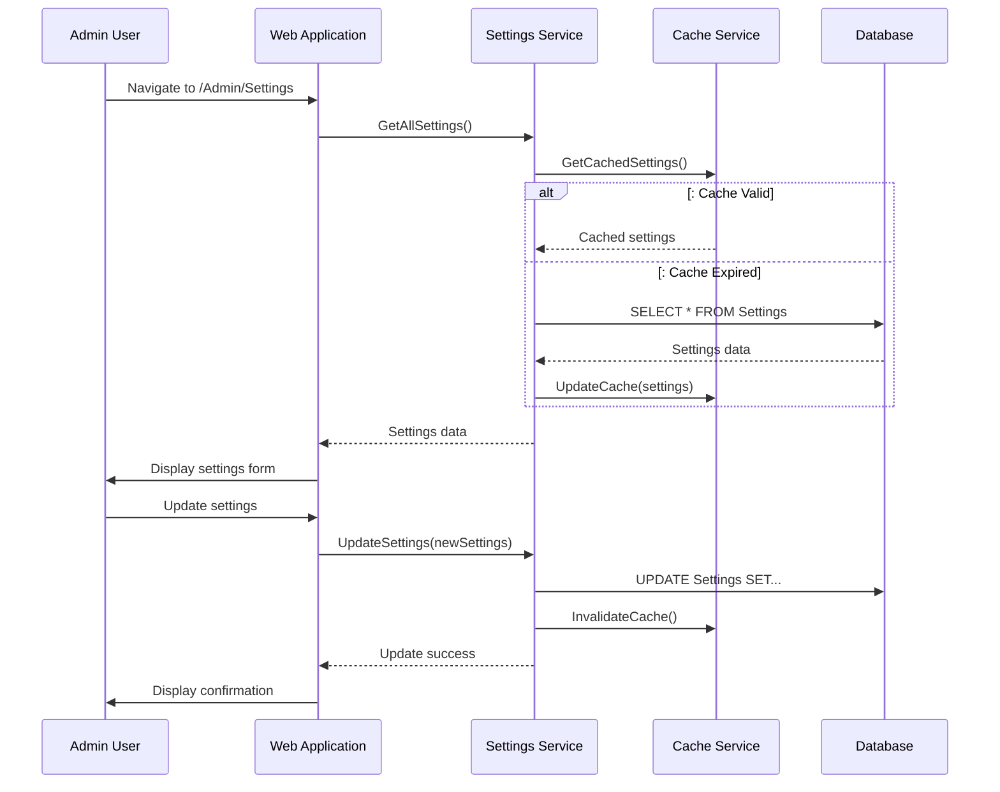
```mermaid
sequenceDiagram
    participant Admin as Admin User
    participant WebApp as Web Application
    participant SettingsService as Settings Service
    participant CacheService as Cache Service
    participant DB as Database
    
    Admin->>WebApp: Navigate to /Admin/Settings
    WebApp->>SettingsService: GetAllSettings()
    SettingsService->>CacheService: GetCachedSettings()
    
    Alt: Cache Valid
        CacheService-->>SettingsService: Cached settings
    Else: Cache Expired
        SettingsService->>DB: SELECT * FROM Settings
        DB-->>SettingsService: Settings data
        SettingsService->>CacheService: UpdateCache(settings)
    End
    
    SettingsService-->>WebApp: Settings data
    WebApp->>Admin: Display settings form
    
    Admin->>WebApp: Update settings
    WebApp->>SettingsService: UpdateSettings(newSettings)
    SettingsService->>DB: UPDATE Settings SET...
    SettingsService->>CacheService: InvalidateCache()
    SettingsService-->>WebApp: Update success
    WebApp->>Admin: Display confirmation
```

---

## Interaction Flow 4: API Integration Patterns

### External API Access
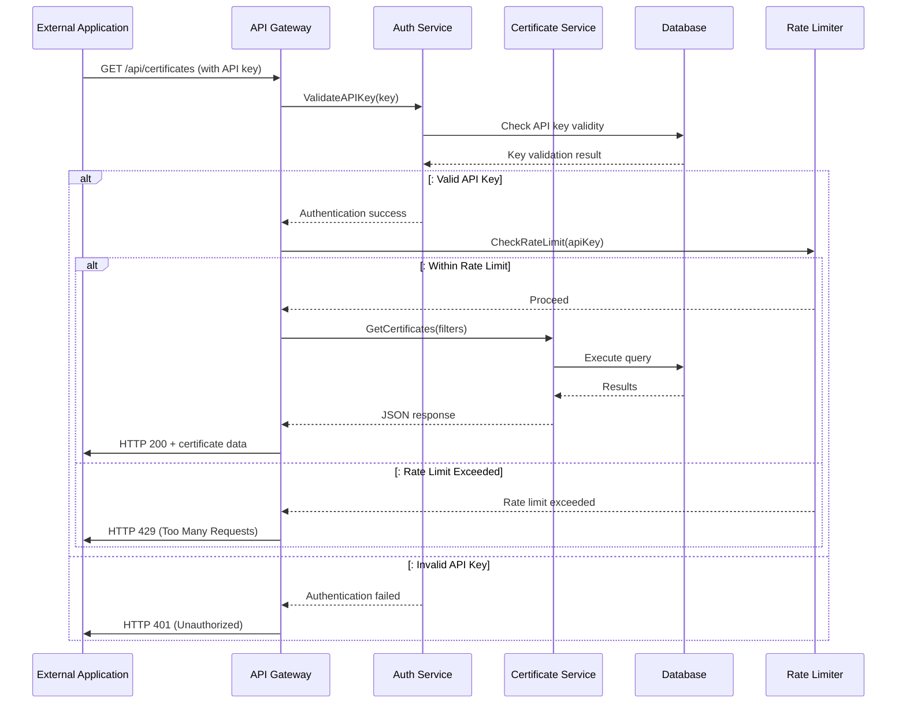
```mermaid
sequenceDiagram
    participant ExtApp as External Application
    participant APIGateway as API Gateway
    participant AuthService as Auth Service
    participant CertService as Certificate Service
    participant DB as Database
    participant RateLimit as Rate Limiter
    
    ExtApp->>APIGateway: GET /api/certificates (with API key)
    APIGateway->>AuthService: ValidateAPIKey(key)
    AuthService->>DB: Check API key validity
    DB-->>AuthService: Key validation result
    
    Alt: Valid API Key
        AuthService-->>APIGateway: Authentication success
        APIGateway->>RateLimit: CheckRateLimit(apiKey)
        
        Alt: Within Rate Limit
            RateLimit-->>APIGateway: Proceed
            APIGateway->>CertService: GetCertificates(filters)
            CertService->>DB: Execute query
            DB-->>CertService: Results
            CertService-->>APIGateway: JSON response
            APIGateway->>ExtApp: HTTP 200 + certificate data
        Else: Rate Limit Exceeded
            RateLimit-->>APIGateway: Rate limit exceeded
            APIGateway->>ExtApp: HTTP 429 (Too Many Requests)
        End
    Else: Invalid API Key
        AuthService-->>APIGateway: Authentication failed
        APIGateway->>ExtApp: HTTP 401 (Unauthorized)
    End
```

---

## Interaction Flow 5: Background Processing & Notifications

### Certificate Expiration Monitoring
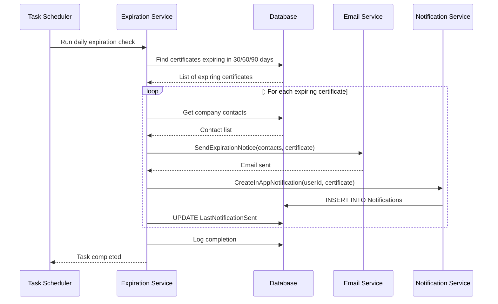
```mermaid
sequenceDiagram
    participant Scheduler as Task Scheduler
    participant ExpirationService as Expiration Service
    participant DB as Database
    participant EmailService as Email Service
    participant NotificationService as Notification Service
    
    Scheduler->>ExpirationService: Run daily expiration check
    ExpirationService->>DB: Find certificates expiring in 30/60/90 days
    DB-->>ExpirationService: List of expiring certificates
    
    Loop: For each expiring certificate
        ExpirationService->>DB: Get company contacts
        DB-->>ExpirationService: Contact list
        ExpirationService->>EmailService: SendExpirationNotice(contacts, certificate)
        EmailService-->>ExpirationService: Email sent
        ExpirationService->>NotificationService: CreateInAppNotification(userId, certificate)
        NotificationService->>DB: INSERT INTO Notifications
        ExpirationService->>DB: UPDATE LastNotificationSent
    End
    
    ExpirationService->>DB: Log completion
    ExpirationService-->>Scheduler: Task completed
```

### File Processing Pipeline
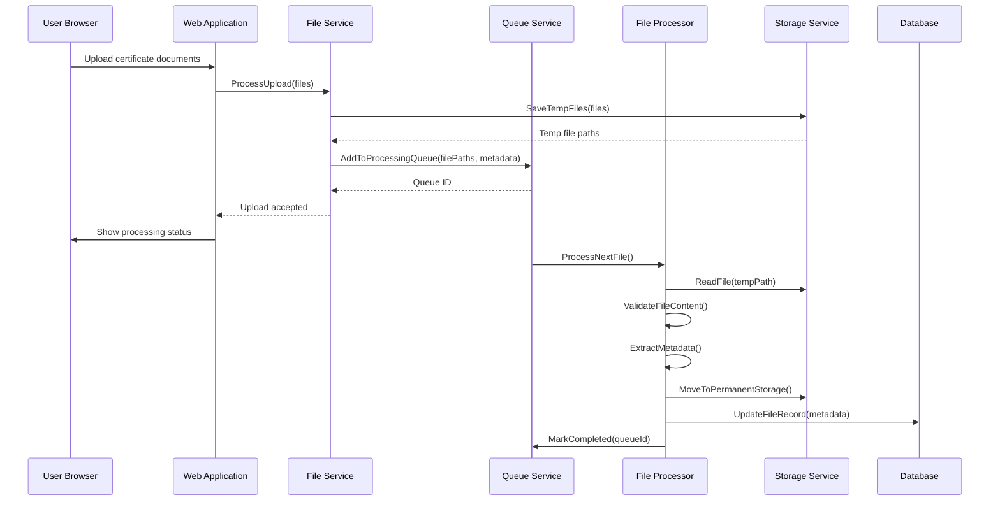
```mermaid
sequenceDiagram
    participant User as User Browser
    participant WebApp as Web Application
    participant FileService as File Service
    participant QueueService as Queue Service
    participant ProcessorService as File Processor
    participant StorageService as Storage Service
    participant DB as Database
    
    User->>WebApp: Upload certificate documents
    WebApp->>FileService: ProcessUpload(files)
    FileService->>StorageService: SaveTempFiles(files)
    StorageService-->>FileService: Temp file paths
    FileService->>QueueService: AddToProcessingQueue(filePaths, metadata)
    QueueService-->>FileService: Queue ID
    FileService-->>WebApp: Upload accepted
    WebApp->>User: Show processing status
    
    QueueService->>ProcessorService: ProcessNextFile()
    ProcessorService->>StorageService: ReadFile(tempPath)
    ProcessorService->>ProcessorService: ValidateFileContent()
    ProcessorService->>ProcessorService: ExtractMetadata()
    ProcessorService->>StorageService: MoveToPermanentStorage()
    ProcessorService->>DB: UpdateFileRecord(metadata)
    ProcessorService->>QueueService: MarkCompleted(queueId)
```

---

## Interaction Flow 6: Data Export & Reporting

### Report Generation Process
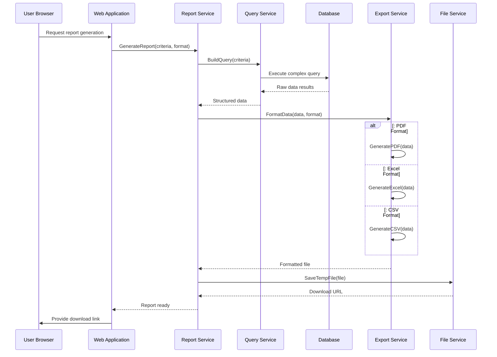
```mermaid
sequenceDiagram
    participant User as User Browser
    participant WebApp as Web Application
    participant ReportService as Report Service
    participant QueryService as Query Service
    participant DB as Database
    participant ExportService as Export Service
    participant FileService as File Service
    
    User->>WebApp: Request report generation
    WebApp->>ReportService: GenerateReport(criteria, format)
    ReportService->>QueryService: BuildQuery(criteria)
    QueryService->>DB: Execute complex query
    DB-->>QueryService: Raw data results
    QueryService-->>ReportService: Structured data
    
    ReportService->>ExportService: FormatData(data, format)
    
    Alt: PDF Format
        ExportService->>ExportService: GeneratePDF(data)
    Else: Excel Format
        ExportService->>ExportService: GenerateExcel(data)
    Else: CSV Format
        ExportService->>ExportService: GenerateCSV(data)
    End
    
    ExportService-->>ReportService: Formatted file
    ReportService->>FileService: SaveTempFile(file)
    FileService-->>ReportService: Download URL
    ReportService-->>WebApp: Report ready
    WebApp->>User: Provide download link
```

---

## Error Handling & Resilience Patterns

### Circuit Breaker Pattern (External Services)
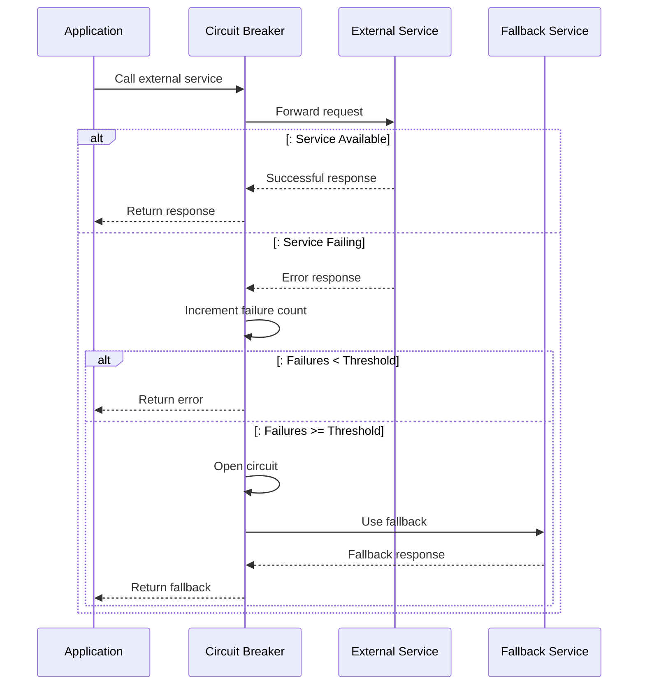
```mermaid
sequenceDiagram
    participant App as Application
    participant CB as Circuit Breaker
    participant ExtService as External Service
    participant FallbackService as Fallback Service
    
    App->>CB: Call external service
    CB->>ExtService: Forward request
    
    Alt: Service Available
        ExtService-->>CB: Successful response
        CB-->>App: Return response
    Else: Service Failing
        ExtService-->>CB: Error response
        CB->>CB: Increment failure count
        
        Alt: Failures < Threshold
            CB-->>App: Return error
        Else: Failures >= Threshold
            CB->>CB: Open circuit
            CB->>FallbackService: Use fallback
            FallbackService-->>CB: Fallback response
            CB-->>App: Return fallback
        End
    End
```

### Retry Pattern with Exponential Backoff
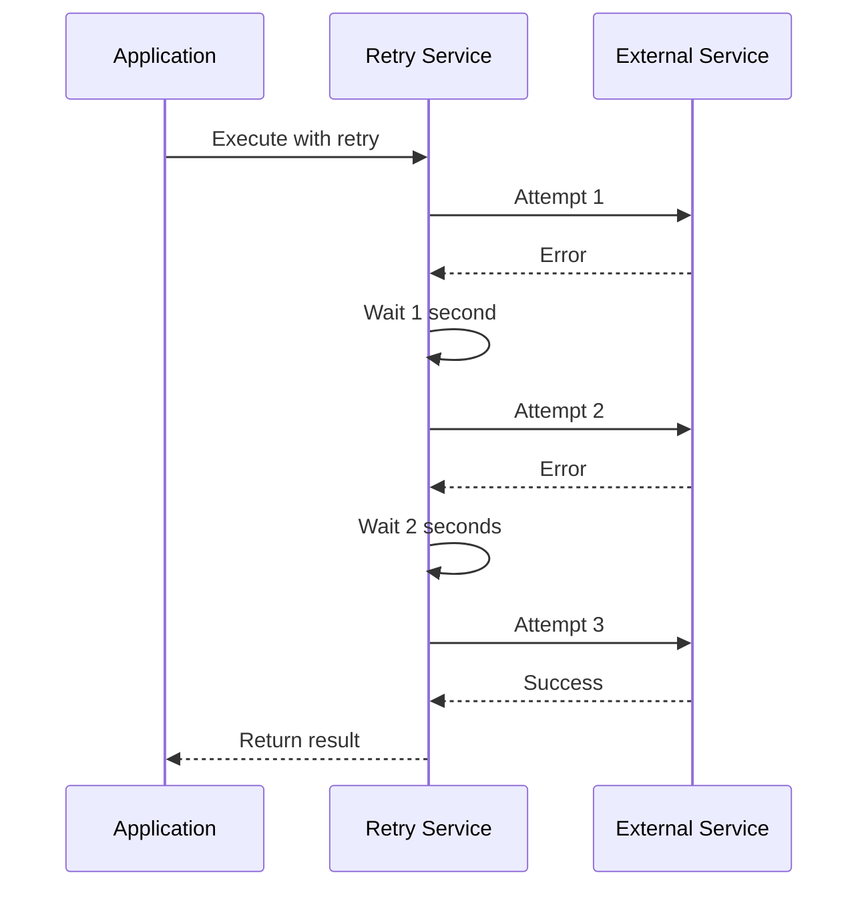
```mermaid
sequenceDiagram
    participant App as Application
    participant RetryService as Retry Service
    participant ExtService as External Service
    
    App->>RetryService: Execute with retry
    RetryService->>ExtService: Attempt 1
    ExtService-->>RetryService: Error
    
    RetryService->>RetryService: Wait 1 second
    RetryService->>ExtService: Attempt 2
    ExtService-->>RetryService: Error
    
    RetryService->>RetryService: Wait 2 seconds
    RetryService->>ExtService: Attempt 3
    ExtService-->>RetryService: Success
    
    RetryService-->>App: Return result
```

---

## Performance Optimization Patterns

### Caching Strategy
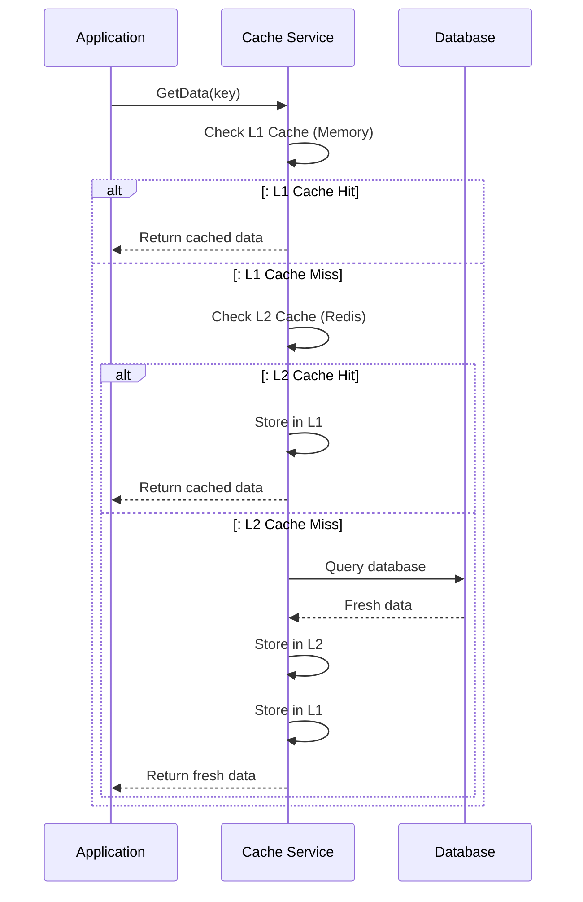
```mermaid
sequenceDiagram
    participant App as Application
    participant CacheService as Cache Service
    participant DB as Database
    
    App->>CacheService: GetData(key)
    CacheService->>CacheService: Check L1 Cache (Memory)
    
    Alt: L1 Cache Hit
        CacheService-->>App: Return cached data
    Else: L1 Cache Miss
        CacheService->>CacheService: Check L2 Cache (Redis)
        
        Alt: L2 Cache Hit
            CacheService->>CacheService: Store in L1
            CacheService-->>App: Return cached data
        Else: L2 Cache Miss
            CacheService->>DB: Query database
            DB-->>CacheService: Fresh data
            CacheService->>CacheService: Store in L2
            CacheService->>CacheService: Store in L1
            CacheService-->>App: Return fresh data
        End
    End
```

### Database Connection Pooling
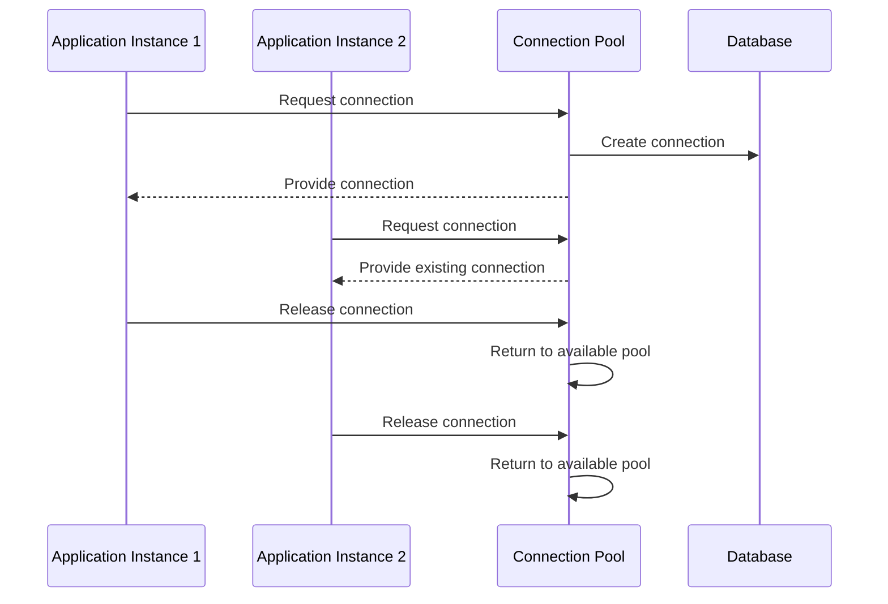
```mermaid
sequenceDiagram
    participant App1 as Application Instance 1
    participant App2 as Application Instance 2
    participant Pool as Connection Pool
    participant DB as Database
    
    App1->>Pool: Request connection
    Pool->>DB: Create connection
    Pool-->>App1: Provide connection
    
    App2->>Pool: Request connection
    Pool-->>App2: Provide existing connection
    
    App1->>Pool: Release connection
    Pool->>Pool: Return to available pool
    
    App2->>Pool: Release connection
    Pool->>Pool: Return to available pool
```

---

## Security Interaction Patterns

### JWT Token Validation
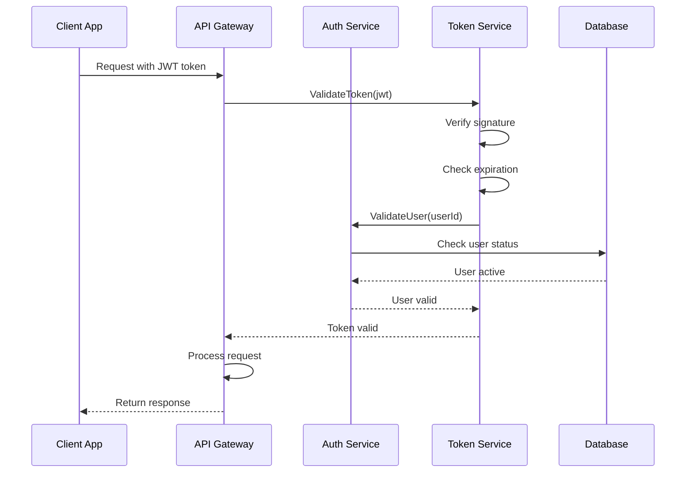
```mermaid
sequenceDiagram
    participant Client as Client App
    participant API as API Gateway
    participant AuthService as Auth Service
    participant TokenService as Token Service
    participant DB as Database
    
    Client->>API: Request with JWT token
    API->>TokenService: ValidateToken(jwt)
    TokenService->>TokenService: Verify signature
    TokenService->>TokenService: Check expiration
    TokenService->>AuthService: ValidateUser(userId)
    AuthService->>DB: Check user status
    DB-->>AuthService: User active
    AuthService-->>TokenService: User valid
    TokenService-->>API: Token valid
    API->>API: Process request
    API-->>Client: Return response
```

### Role-Based Authorization
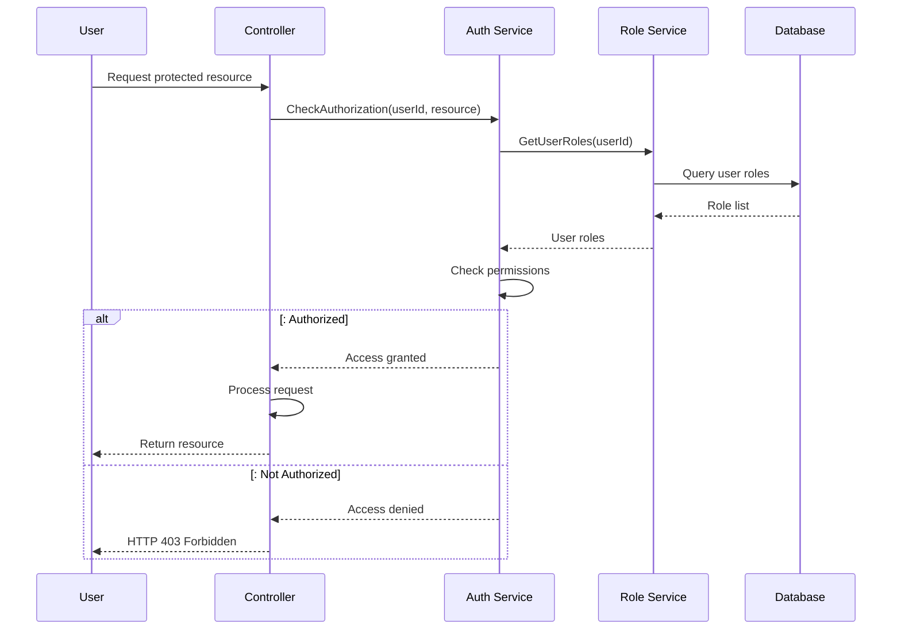
```mermaid
sequenceDiagram
    participant User as User
    participant Controller as Controller
    participant AuthService as Auth Service
    participant RoleService as Role Service
    participant DB as Database
    
    User->>Controller: Request protected resource
    Controller->>AuthService: CheckAuthorization(userId, resource)
    AuthService->>RoleService: GetUserRoles(userId)
    RoleService->>DB: Query user roles
    DB-->>RoleService: Role list
    RoleService-->>AuthService: User roles
    AuthService->>AuthService: Check permissions
    
    Alt: Authorized
        AuthService-->>Controller: Access granted
        Controller->>Controller: Process request
        Controller-->>User: Return resource
    Else: Not Authorized
        AuthService-->>Controller: Access denied
        Controller-->>User: HTTP 403 Forbidden
    End
```

---

## Integration Testing Flow

### API Integration Test
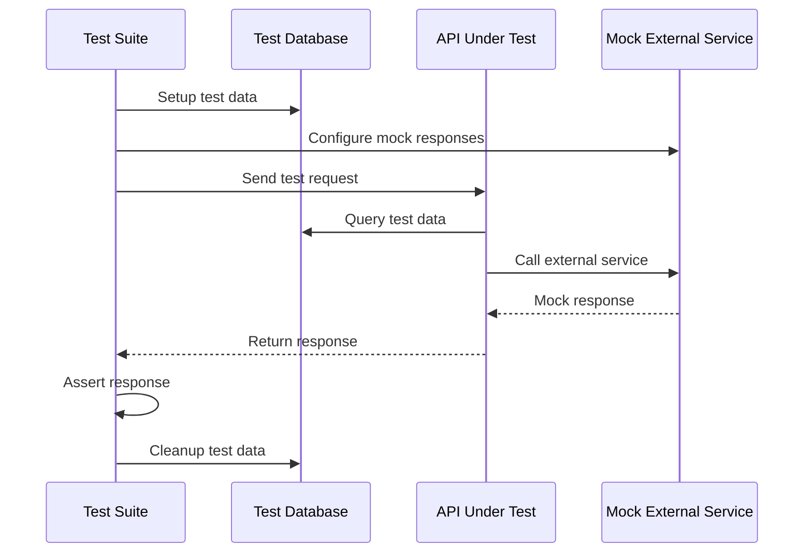
```mermaid
sequenceDiagram
    participant TestSuite as Test Suite
    participant TestDB as Test Database
    participant API as API Under Test
    participant MockService as Mock External Service
    
    TestSuite->>TestDB: Setup test data
    TestSuite->>MockService: Configure mock responses
    TestSuite->>API: Send test request
    API->>TestDB: Query test data
    API->>MockService: Call external service
    MockService-->>API: Mock response
    API-->>TestSuite: Return response
    TestSuite->>TestSuite: Assert response
    TestSuite->>TestDB: Cleanup test data
```

## Client Review Questions

### System Architecture
1. Do these interaction patterns align with your system architecture expectations?
2. Are there specific external systems that need integration consideration?
3. Do the security patterns meet your compliance requirements?
4. Are there performance requirements we should emphasize?

### Technical Implementation
1. Are there preferred technology stacks or frameworks for integrations?
2. Do you have existing API standards we should follow?
3. Are there specific monitoring or logging requirements?
4. What are your disaster recovery expectations for these interactions?