# GCC Web Application - Requirements & User Story Based Diagrams

This document contains comprehensive Mermaid diagrams based on the actual project requirements, user stories, business requirements, and documented user journeys for the GCC (Global Certificate Compliance) Web Application.

## Table of Contents

1. [Requirement-Based Flowcharts](#requirement-based-flowcharts)
2. [User Story Sequence Diagrams](#user-story-sequence-diagrams)
3. [Business Process Diagrams](#business-process-diagrams)
4. [User Role State Diagrams](#user-role-state-diagrams)
5. [Business Entity Relationships](#business-entity-relationships)
6. [Project Roadmap Gantt](#project-roadmap-gantt)
7. [Business Metrics Pie Charts](#business-metrics-pie-charts)
8. [Feature Development Git Flow](#feature-development-git-flow)
9. [Business Capability Mind Map](#business-capability-mind-map)
10. [Implementation Timeline](#implementation-timeline)
11. [Functional Requirement Diagrams](#functional-requirement-diagrams)
12. [Business Value Quadrants](#business-value-quadrants)
13. [User Persona Journeys](#user-persona-journeys)

---

## Requirement-Based Flowcharts

### User Authentication Flow (FR-001, FR-002, FR-003)
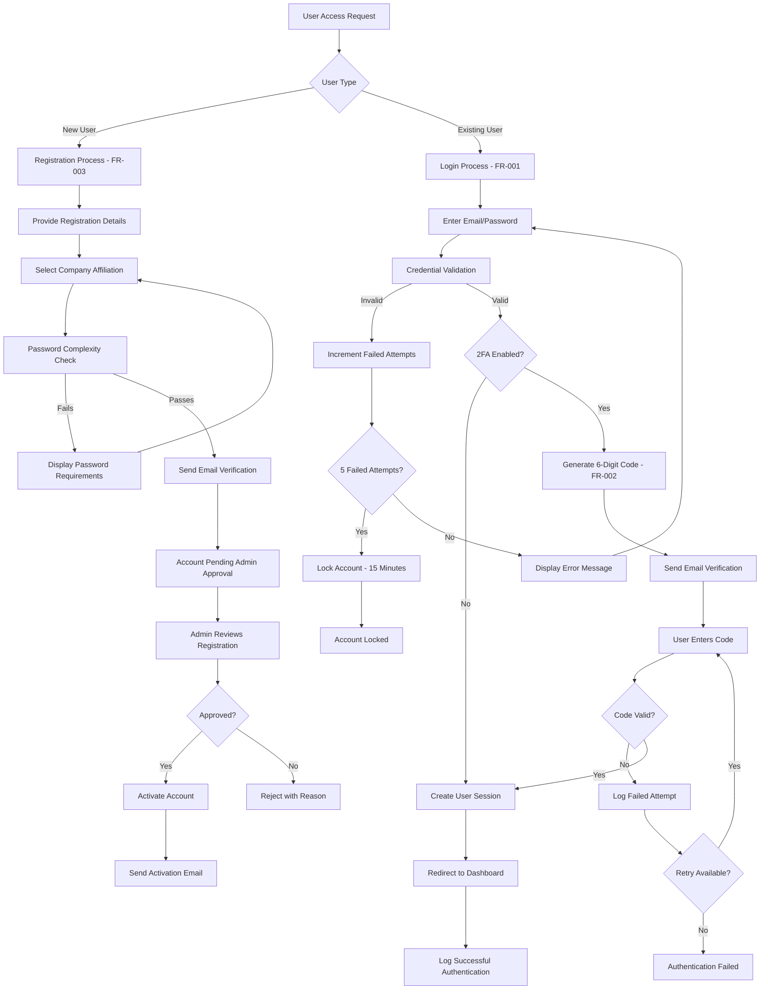
```mermaid
flowchart TD
    A[User Access Request] --> B{User Type}
    B -->|New User| C[Registration Process - FR-003]
    B -->|Existing User| D[Login Process - FR-001]
    
    C --> E[Provide Registration Details]
    E --> F[Select Company Affiliation]
    F --> G[Password Complexity Check]
    G -->|Fails| H[Display Password Requirements]
    H --> F
    G -->|Passes| I[Send Email Verification]
    I --> J[Account Pending Admin Approval]
    
    D --> K[Enter Email/Password]
    K --> L[Credential Validation]
    L -->|Invalid| M[Increment Failed Attempts]
    L -->|Valid| N{2FA Enabled?}
    
    M --> O{5 Failed Attempts?}
    O -->|Yes| P[Lock Account - 15 Minutes]
    O -->|No| Q[Display Error Message]
    Q --> K
    P --> R[Account Locked]
    
    N -->|No| S[Create User Session]
    N -->|Yes| T[Generate 6-Digit Code - FR-002]
    T --> U[Send Email Verification]
    U --> V[User Enters Code]
    V --> W{Code Valid?}
    W -->|No| X[Log Failed Attempt]
    W -->|Yes| S
    X --> Y{Retry Available?}
    Y -->|Yes| V
    Y -->|No| Z[Authentication Failed]
    
    S --> AA[Redirect to Dashboard]
    AA --> BB[Log Successful Authentication]
    
    J --> CC[Admin Reviews Registration]
    CC --> DD{Approved?}
    DD -->|Yes| EE[Activate Account]
    DD -->|No| FF[Reject with Reason]
    EE --> GG[Send Activation Email]
```

### Certificate Management Process Flow (FR-004 to FR-008)
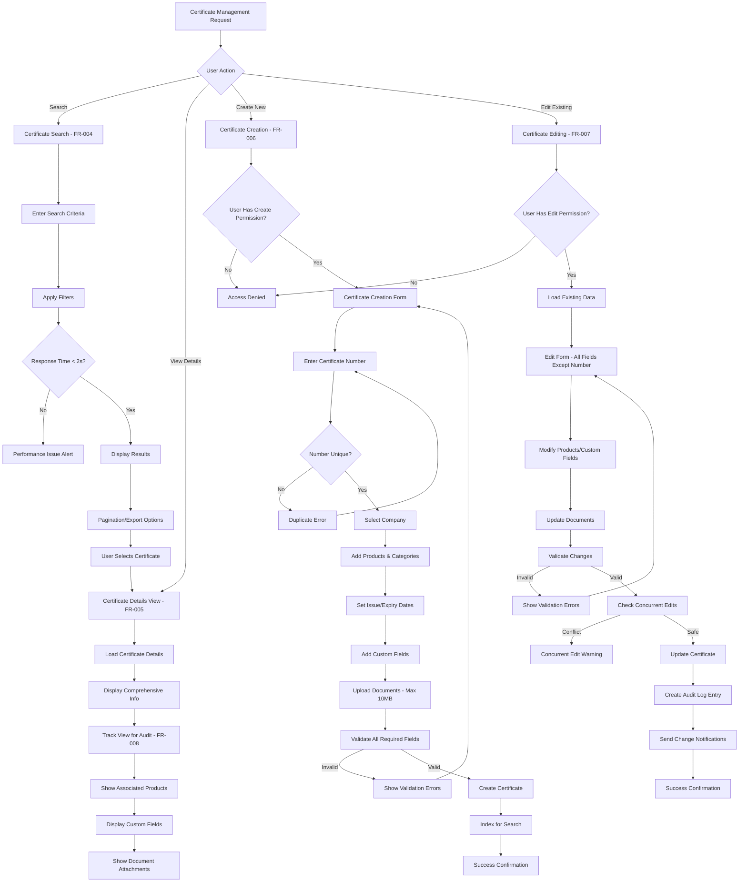
```mermaid
flowchart TD
    A[Certificate Management Request] --> B{User Action}
    B -->|Search| C[Certificate Search - FR-004]
    B -->|View Details| D[Certificate Details View - FR-005]
    B -->|Create New| E[Certificate Creation - FR-006]
    B -->|Edit Existing| F[Certificate Editing - FR-007]
    
    C --> G[Enter Search Criteria]
    G --> H[Apply Filters]
    H --> I{Response Time < 2s?}
    I -->|No| J[Performance Issue Alert]
    I -->|Yes| K[Display Results]
    K --> L[Pagination/Export Options]
    L --> M[User Selects Certificate]
    M --> D
    
    D --> N[Load Certificate Details]
    N --> O[Display Comprehensive Info]
    O --> P[Track View for Audit - FR-008]
    P --> Q[Show Associated Products]
    Q --> R[Display Custom Fields]
    R --> S[Show Document Attachments]
    
    E --> T{User Has Create Permission?}
    T -->|No| U[Access Denied]
    T -->|Yes| V[Certificate Creation Form]
    V --> W[Enter Certificate Number]
    W --> X{Number Unique?}
    X -->|No| Y[Duplicate Error]
    Y --> W
    X -->|Yes| Z[Select Company]
    Z --> AA[Add Products & Categories]
    AA --> BB[Set Issue/Expiry Dates]
    BB --> CC[Add Custom Fields]
    CC --> DD[Upload Documents - Max 10MB]
    DD --> EE[Validate All Required Fields]
    EE -->|Invalid| FF[Show Validation Errors]
    FF --> V
    EE -->|Valid| GG[Create Certificate]
    GG --> HH[Index for Search]
    HH --> II[Success Confirmation]
    
    F --> JJ{User Has Edit Permission?}
    JJ -->|No| U
    JJ -->|Yes| KK[Load Existing Data]
    KK --> LL[Edit Form - All Fields Except Number]
    LL --> MM[Modify Products/Custom Fields]
    MM --> NN[Update Documents]
    NN --> OO[Validate Changes]
    OO -->|Invalid| PP[Show Validation Errors]
    PP --> LL
    OO -->|Valid| QQ[Check Concurrent Edits]
    QQ -->|Conflict| RR[Concurrent Edit Warning]
    QQ -->|Safe| SS[Update Certificate]
    SS --> TT[Create Audit Log Entry]
    TT --> UU[Send Change Notifications]
    UU --> VV[Success Confirmation]
```

### Partner Access Control Flow (FR-038, FR-039, FR-040)
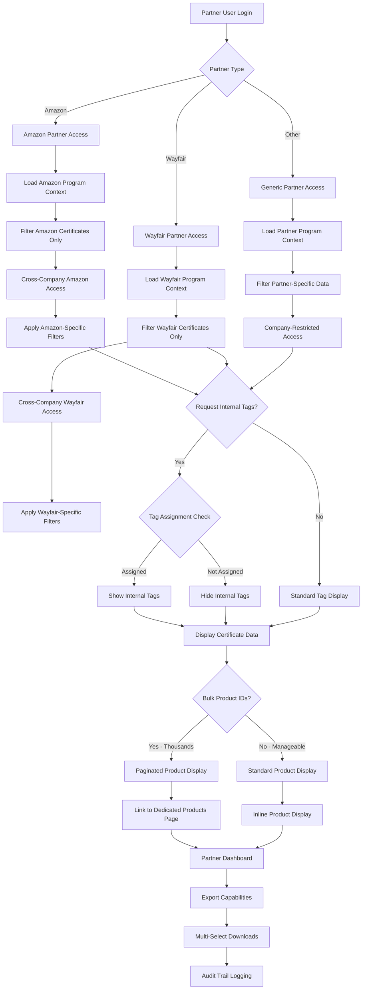
```mermaid
flowchart TD
    A[Partner User Login] --> B{Partner Type}
    B -->|Amazon| C[Amazon Partner Access]
    B -->|Wayfair| D[Wayfair Partner Access]
    B -->|Other| E[Generic Partner Access]
    
    C --> F[Load Amazon Program Context]
    F --> G[Filter Amazon Certificates Only]
    G --> H[Cross-Company Amazon Access]
    H --> I[Apply Amazon-Specific Filters]
    
    D --> J[Load Wayfair Program Context]
    J --> K[Filter Wayfair Certificates Only]
    K --> L[Cross-Company Wayfair Access]
    L --> M[Apply Wayfair-Specific Filters]
    
    E --> N[Load Partner Program Context]
    N --> O[Filter Partner-Specific Data]
    O --> P[Company-Restricted Access]
    
    I --> Q{Request Internal Tags?}
    K --> Q
    P --> Q
    Q -->|Yes| R{Tag Assignment Check}
    R -->|Assigned| S[Show Internal Tags]
    R -->|Not Assigned| T[Hide Internal Tags]
    Q -->|No| U[Standard Tag Display]
    
    S --> V[Display Certificate Data]
    T --> V
    U --> V
    
    V --> W{Bulk Product IDs?}
    W -->|Yes - Thousands| X[Paginated Product Display]
    W -->|No - Manageable| Y[Standard Product Display]
    
    X --> Z[Link to Dedicated Products Page]
    Y --> AA[Inline Product Display]
    
    Z --> BB[Partner Dashboard]
    AA --> BB
    
    BB --> CC[Export Capabilities]
    CC --> DD[Multi-Select Downloads]
    DD --> EE[Audit Trail Logging]
```

---

## User Story Sequence Diagrams

### Public User Certificate Verification Sequence
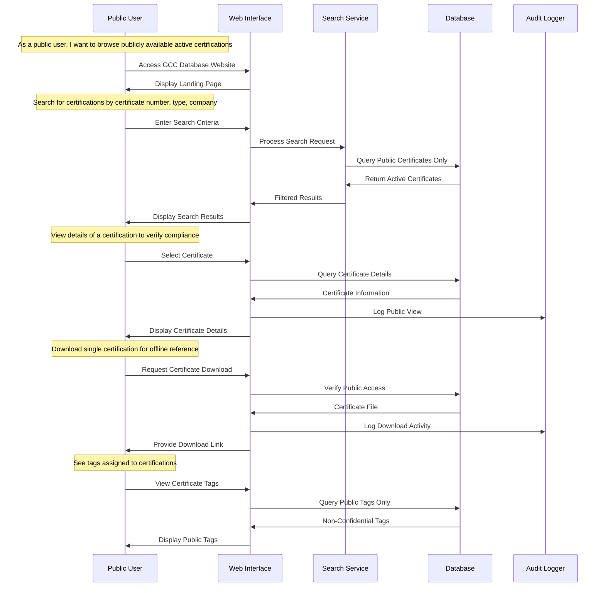
```mermaid
sequenceDiagram
    participant PU as Public User
    participant Web as Web Interface
    participant Search as Search Service
    participant DB as Database
    participant Audit as Audit Logger

    Note over PU: As a public user, I want to browse publicly available active certifications
    PU->>Web: Access GCC Database Website
    Web->>PU: Display Landing Page
    
    Note over PU: Search for certifications by certificate number, type, company
    PU->>Web: Enter Search Criteria
    Web->>Search: Process Search Request
    Search->>DB: Query Public Certificates Only
    DB->>Search: Return Active Certificates
    Search->>Web: Filtered Results
    Web->>PU: Display Search Results
    
    Note over PU: View details of a certification to verify compliance
    PU->>Web: Select Certificate
    Web->>DB: Query Certificate Details
    DB->>Web: Certificate Information
    Web->>Audit: Log Public View
    Web->>PU: Display Certificate Details
    
    Note over PU: Download single certification for offline reference
    PU->>Web: Request Certificate Download
    Web->>DB: Verify Public Access
    DB->>Web: Certificate File
    Web->>Audit: Log Download Activity
    Web->>PU: Provide Download Link
    
    Note over PU: See tags assigned to certifications
    PU->>Web: View Certificate Tags
    Web->>DB: Query Public Tags Only
    DB->>Web: Non-Confidential Tags
    Web->>PU: Display Public Tags
```

### External User Certificate Management Sequence
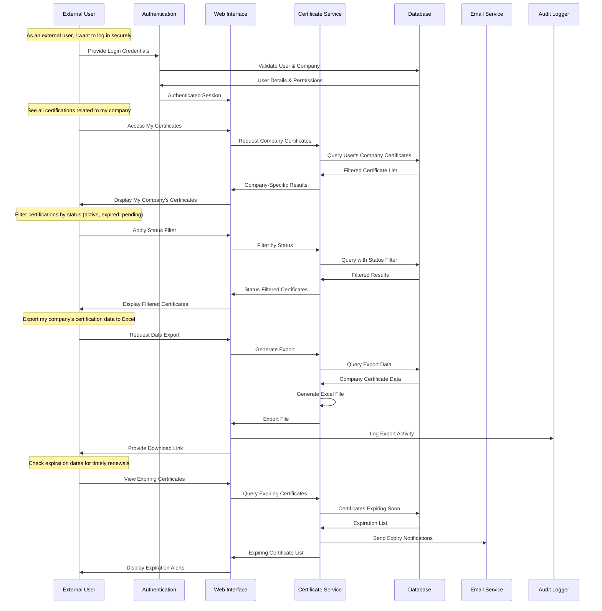
```mermaid
sequenceDiagram
    participant EU as External User
    participant Auth as Authentication
    participant Web as Web Interface
    participant Service as Certificate Service
    participant DB as Database
    participant Email as Email Service
    participant Audit as Audit Logger

    Note over EU: As an external user, I want to log in securely
    EU->>Auth: Provide Login Credentials
    Auth->>DB: Validate User & Company
    DB->>Auth: User Details & Permissions
    Auth->>Web: Authenticated Session
    
    Note over EU: See all certifications related to my company
    EU->>Web: Access My Certificates
    Web->>Service: Request Company Certificates
    Service->>DB: Query User's Company Certificates
    DB->>Service: Filtered Certificate List
    Service->>Web: Company-Specific Results
    Web->>EU: Display My Company's Certificates
    
    Note over EU: Filter certifications by status (active, expired, pending)
    EU->>Web: Apply Status Filter
    Web->>Service: Filter by Status
    Service->>DB: Query with Status Filter
    DB->>Service: Filtered Results
    Service->>Web: Status-Filtered Certificates
    Web->>EU: Display Filtered Certificates
    
    Note over EU: Export my company's certification data to Excel
    EU->>Web: Request Data Export
    Web->>Service: Generate Export
    Service->>DB: Query Export Data
    DB->>Service: Company Certificate Data
    Service->>Service: Generate Excel File
    Service->>Web: Export File
    Web->>Audit: Log Export Activity
    Web->>EU: Provide Download Link
    
    Note over EU: Check expiration dates for timely renewals
    EU->>Web: View Expiring Certificates
    Web->>Service: Query Expiring Certificates
    Service->>DB: Certificates Expiring Soon
    DB->>Service: Expiration List
    Service->>Email: Send Expiry Notifications
    Service->>Web: Expiring Certificate List
    Web->>EU: Display Expiration Alerts
```

### Admin User Management Sequence
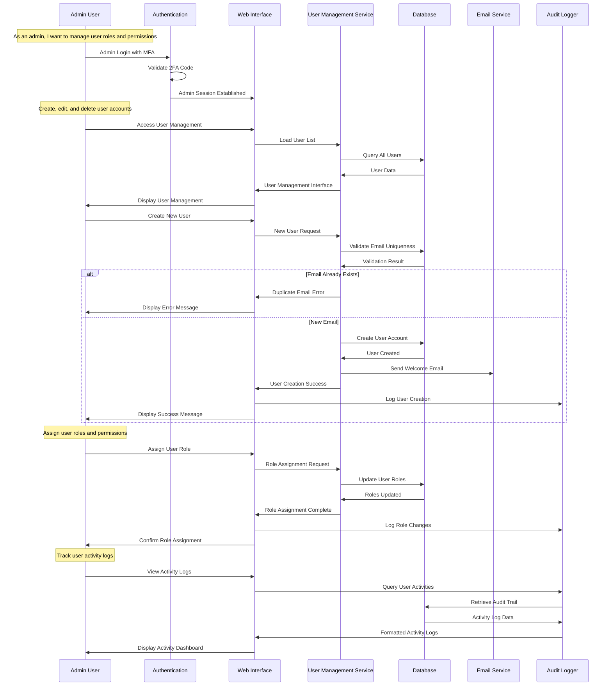
```mermaid
sequenceDiagram
    participant Admin as Admin User
    participant Auth as Authentication
    participant Web as Web Interface
    participant UserService as User Management Service
    participant DB as Database
    participant Email as Email Service
    participant Audit as Audit Logger

    Note over Admin: As an admin, I want to manage user roles and permissions
    Admin->>Auth: Admin Login with MFA
    Auth->>Auth: Validate 2FA Code
    Auth->>Web: Admin Session Established
    
    Note over Admin: Create, edit, and delete user accounts
    Admin->>Web: Access User Management
    Web->>UserService: Load User List
    UserService->>DB: Query All Users
    DB->>UserService: User Data
    UserService->>Web: User Management Interface
    Web->>Admin: Display User Management
    
    Admin->>Web: Create New User
    Web->>UserService: New User Request
    UserService->>DB: Validate Email Uniqueness
    DB->>UserService: Validation Result
    alt Email Already Exists
        UserService->>Web: Duplicate Email Error
        Web->>Admin: Display Error Message
    else New Email
        UserService->>DB: Create User Account
        DB->>UserService: User Created
        UserService->>Email: Send Welcome Email
        UserService->>Web: User Creation Success
        Web->>Audit: Log User Creation
        Web->>Admin: Display Success Message
    end
    
    Note over Admin: Assign user roles and permissions
    Admin->>Web: Assign User Role
    Web->>UserService: Role Assignment Request
    UserService->>DB: Update User Roles
    DB->>UserService: Roles Updated
    UserService->>Web: Role Assignment Complete
    Web->>Audit: Log Role Changes
    Web->>Admin: Confirm Role Assignment
    
    Note over Admin: Track user activity logs
    Admin->>Web: View Activity Logs
    Web->>Audit: Query User Activities
    Audit->>DB: Retrieve Audit Trail
    DB->>Audit: Activity Log Data
    Audit->>Web: Formatted Activity Logs
    Web->>Admin: Display Activity Dashboard
```

---

## Business Process Diagrams

### Certificate Lifecycle Business Process
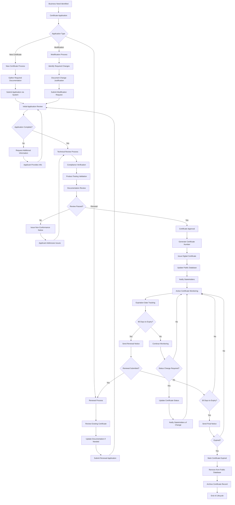
```mermaid
flowchart TD
    A[Business Need Identified] --> B[Certificate Application]
    B --> C{Application Type}
    C -->|New Certificate| D[New Certificate Process]
    C -->|Renewal| E[Renewal Process]
    C -->|Modification| F[Modification Process]
    
    D --> G[Gather Required Documentation]
    G --> H[Submit Application via System]
    H --> I[Initial Application Review]
    
    E --> J[Review Existing Certificate]
    J --> K[Update Documentation if Needed]
    K --> L[Submit Renewal Application]
    L --> I
    
    F --> M[Identify Required Changes]
    M --> N[Document Change Justification]
    N --> O[Submit Modification Request]
    O --> I
    
    I --> P{Application Complete?}
    P -->|No| Q[Request Additional Information]
    Q --> R[Applicant Provides Info]
    R --> I
    P -->|Yes| S[Technical Review Process]
    
    S --> T[Compliance Verification]
    T --> U[Product Testing Validation]
    U --> V[Documentation Review]
    V --> W{Review Passed?}
    
    W -->|No| X[Issue Non-Conformance Notice]
    X --> Y[Applicant Addresses Issues]
    Y --> S
    W -->|Yes| Z[Certificate Approval]
    
    Z --> AA[Generate Certificate Number]
    AA --> BB[Issue Digital Certificate]
    BB --> CC[Update Public Database]
    CC --> DD[Notify Stakeholders]
    
    DD --> EE[Active Certificate Monitoring]
    EE --> FF[Expiration Date Tracking]
    FF --> GG{90 Days to Expiry?}
    GG -->|Yes| HH[Send Renewal Notice]
    GG -->|No| II[Continue Monitoring]
    HH --> JJ{Renewal Submitted?}
    JJ -->|Yes| E
    JJ -->|No| KK{30 Days to Expiry?}
    KK -->|Yes| LL[Send Final Notice]
    KK -->|No| EE
    LL --> MM{Expired?}
    MM -->|Yes| NN[Mark Certificate Expired]
    MM -->|No| EE
    
    NN --> OO[Remove from Public Database]
    OO --> PP[Archive Certificate Record]
    PP --> QQ[End of Lifecycle]
    
    II --> RR{Status Change Required?}
    RR -->|Yes| SS[Update Certificate Status]
    RR -->|No| EE
    SS --> TT[Notify Stakeholders of Change]
    TT --> EE
```

### Partner Program Integration Process
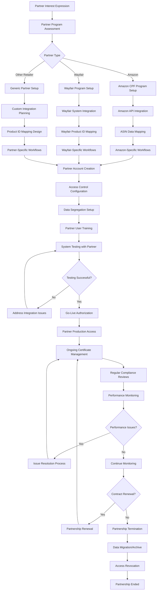
```mermaid
flowchart TD
    A[Partner Interest Expression] --> B[Partner Program Assessment]
    B --> C{Partner Type}
    C -->|Amazon| D[Amazon CPF Program Setup]
    C -->|Wayfair| E[Wayfair Program Setup]
    C -->|Other Retailer| F[Generic Partner Setup]
    
    D --> G[Amazon API Integration]
    G --> H[ASIN Data Mapping]
    H --> I[Amazon-Specific Workflows]
    
    E --> J[Wayfair System Integration]
    J --> K[Wayfair Product ID Mapping]
    K --> L[Wayfair-Specific Workflows]
    
    F --> M[Custom Integration Planning]
    M --> N[Product ID Mapping Design]
    N --> O[Partner-Specific Workflows]
    
    I --> P[Partner Account Creation]
    L --> P
    O --> P
    
    P --> Q[Access Control Configuration]
    Q --> R[Data Segregation Setup]
    R --> S[Partner User Training]
    S --> T[System Testing with Partner]
    
    T --> U{Testing Successful?}
    U -->|No| V[Address Integration Issues]
    V --> T
    U -->|Yes| W[Go-Live Authorization]
    
    W --> X[Partner Production Access]
    X --> Y[Ongoing Certificate Management]
    Y --> Z[Regular Compliance Reviews]
    Z --> AA[Performance Monitoring]
    
    AA --> BB{Performance Issues?}
    BB -->|Yes| CC[Issue Resolution Process]
    BB -->|No| DD[Continue Monitoring]
    CC --> Y
    DD --> EE{Contract Renewal?}
    EE -->|Yes| FF[Partnership Renewal]
    EE -->|No| GG[Partnership Termination]
    FF --> Y
    GG --> HH[Data Migration/Archive]
    HH --> II[Access Revocation]
    II --> JJ[Partnership Ended]
```

### Multi-Factor Authentication Business Process
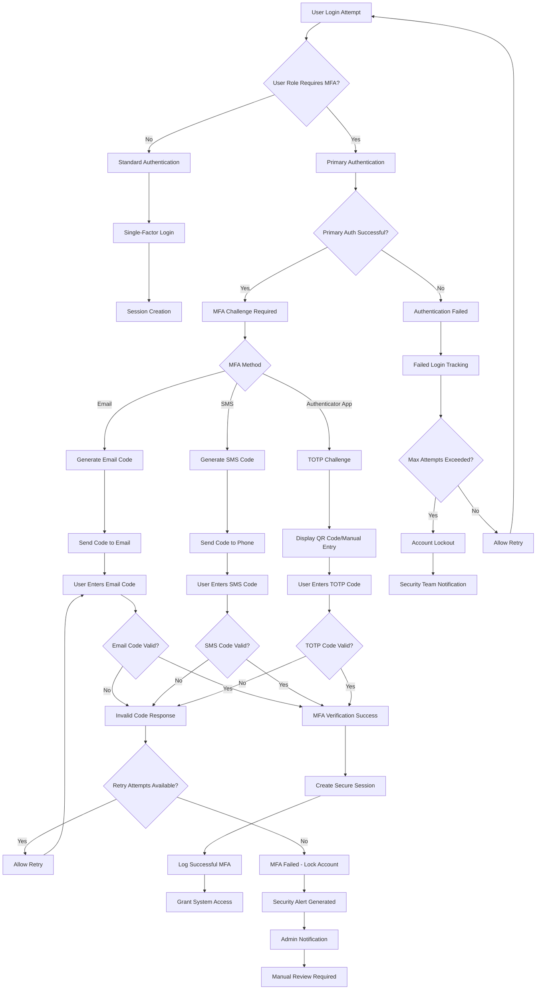
```mermaid
flowchart TD
    A[User Login Attempt] --> B{User Role Requires MFA?}
    B -->|No| C[Standard Authentication]
    B -->|Yes| D[Primary Authentication]
    
    C --> E[Single-Factor Login]
    E --> F[Session Creation]
    
    D --> G{Primary Auth Successful?}
    G -->|No| H[Authentication Failed]
    G -->|Yes| I[MFA Challenge Required]
    
    I --> J{MFA Method}
    J -->|Email| K[Generate Email Code]
    J -->|SMS| L[Generate SMS Code]
    J -->|Authenticator App| M[TOTP Challenge]
    
    K --> N[Send Code to Email]
    L --> O[Send Code to Phone]
    M --> P[Display QR Code/Manual Entry]
    
    N --> Q[User Enters Email Code]
    O --> R[User Enters SMS Code]
    P --> S[User Enters TOTP Code]
    
    Q --> T{Email Code Valid?}
    R --> U{SMS Code Valid?}
    S --> V{TOTP Code Valid?}
    
    T -->|No| W[Invalid Code Response]
    U -->|No| W
    V -->|No| W
    T -->|Yes| X[MFA Verification Success]
    U -->|Yes| X
    V -->|Yes| X
    
    W --> Y{Retry Attempts Available?}
    Y -->|Yes| Z[Allow Retry]
    Y -->|No| AA[MFA Failed - Lock Account]
    Z --> Q
    
    X --> BB[Create Secure Session]
    BB --> CC[Log Successful MFA]
    CC --> DD[Grant System Access]
    
    AA --> EE[Security Alert Generated]
    EE --> FF[Admin Notification]
    FF --> GG[Manual Review Required]
    
    H --> HH[Failed Login Tracking]
    HH --> II{Max Attempts Exceeded?}
    II -->|Yes| JJ[Account Lockout]
    II -->|No| KK[Allow Retry]
    JJ --> LL[Security Team Notification]
    KK --> A
```

---

## User Role State Diagrams

### User Account Lifecycle States
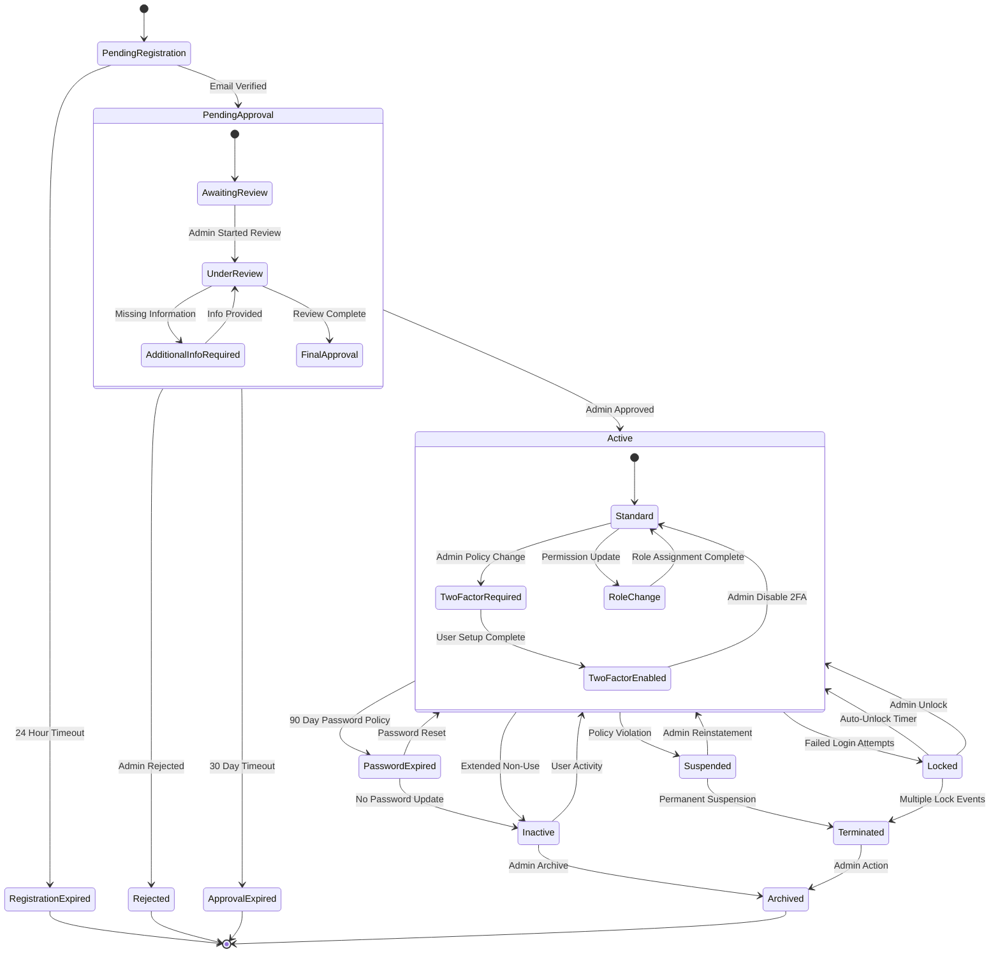
```mermaid
stateDiagram-v2
    [*] --> PendingRegistration
    PendingRegistration --> PendingApproval : Email Verified
    PendingRegistration --> RegistrationExpired : 24 Hour Timeout
    RegistrationExpired --> [*]
    
    PendingApproval --> Active : Admin Approved
    PendingApproval --> Rejected : Admin Rejected
    PendingApproval --> ApprovalExpired : 30 Day Timeout
    
    Rejected --> [*]
    ApprovalExpired --> [*]
    
    Active --> Suspended : Policy Violation
    Active --> Locked : Failed Login Attempts
    Active --> PasswordExpired : 90 Day Password Policy
    Active --> Inactive : Extended Non-Use
    
    Suspended --> Active : Admin Reinstatement
    Suspended --> Terminated : Permanent Suspension
    
    Locked --> Active : Auto-Unlock Timer
    Locked --> Active : Admin Unlock
    Locked --> Terminated : Multiple Lock Events
    
    PasswordExpired --> Active : Password Reset
    PasswordExpired --> Inactive : No Password Update
    
    Inactive --> Active : User Activity
    Inactive --> Archived : Admin Archive
    
    Terminated --> Archived : Admin Action
    Archived --> [*]
    
    state Active {
        [*] --> Standard
        Standard --> TwoFactorRequired : Admin Policy Change
        TwoFactorRequired --> TwoFactorEnabled : User Setup Complete
        TwoFactorEnabled --> Standard : Admin Disable 2FA
        
        Standard --> RoleChange : Permission Update
        RoleChange --> Standard : Role Assignment Complete
    }
    
    state PendingApproval {
        [*] --> AwaitingReview
        AwaitingReview --> UnderReview : Admin Started Review
        UnderReview --> AdditionalInfoRequired : Missing Information
        AdditionalInfoRequired --> UnderReview : Info Provided
        UnderReview --> FinalApproval : Review Complete
    }
```

### Certificate Status Lifecycle
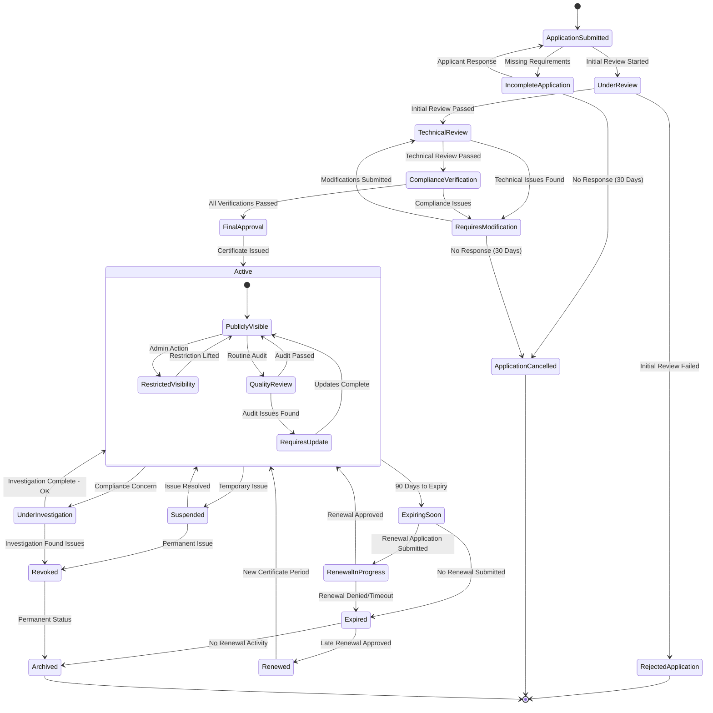
```mermaid
stateDiagram-v2
    [*] --> ApplicationSubmitted
    ApplicationSubmitted --> UnderReview : Initial Review Started
    ApplicationSubmitted --> IncompleteApplication : Missing Requirements
    
    IncompleteApplication --> ApplicationSubmitted : Applicant Response
    IncompleteApplication --> ApplicationCancelled : No Response (30 Days)
    
    UnderReview --> TechnicalReview : Initial Review Passed
    UnderReview --> RejectedApplication : Initial Review Failed
    
    TechnicalReview --> ComplianceVerification : Technical Review Passed
    TechnicalReview --> RequiresModification : Technical Issues Found
    
    RequiresModification --> TechnicalReview : Modifications Submitted
    RequiresModification --> ApplicationCancelled : No Response (30 Days)
    
    ComplianceVerification --> FinalApproval : All Verifications Passed
    ComplianceVerification --> RequiresModification : Compliance Issues
    
    FinalApproval --> Active : Certificate Issued
    
    Active --> Suspended : Temporary Issue
    Active --> UnderInvestigation : Compliance Concern
    Active --> ExpiringSoon : 90 Days to Expiry
    
    Suspended --> Active : Issue Resolved
    Suspended --> Revoked : Permanent Issue
    
    UnderInvestigation --> Active : Investigation Complete - OK
    UnderInvestigation --> Revoked : Investigation Found Issues
    
    ExpiringSoon --> RenewalInProgress : Renewal Application Submitted
    ExpiringSoon --> Expired : No Renewal Submitted
    
    RenewalInProgress --> Active : Renewal Approved
    RenewalInProgress --> Expired : Renewal Denied/Timeout
    
    Expired --> Renewed : Late Renewal Approved
    Expired --> Archived : No Renewal Activity
    
    Renewed --> Active : New Certificate Period
    
    RejectedApplication --> [*]
    ApplicationCancelled --> [*]
    Revoked --> Archived : Permanent Status
    Archived --> [*]
    
    state Active {
        [*] --> PubliclyVisible
        PubliclyVisible --> RestrictedVisibility : Admin Action
        RestrictedVisibility --> PubliclyVisible : Restriction Lifted
        
        PubliclyVisible --> QualityReview : Routine Audit
        QualityReview --> PubliclyVisible : Audit Passed
        QualityReview --> RequiresUpdate : Audit Issues Found
        RequiresUpdate --> PubliclyVisible : Updates Complete
    }
```

### Partner Access State Management
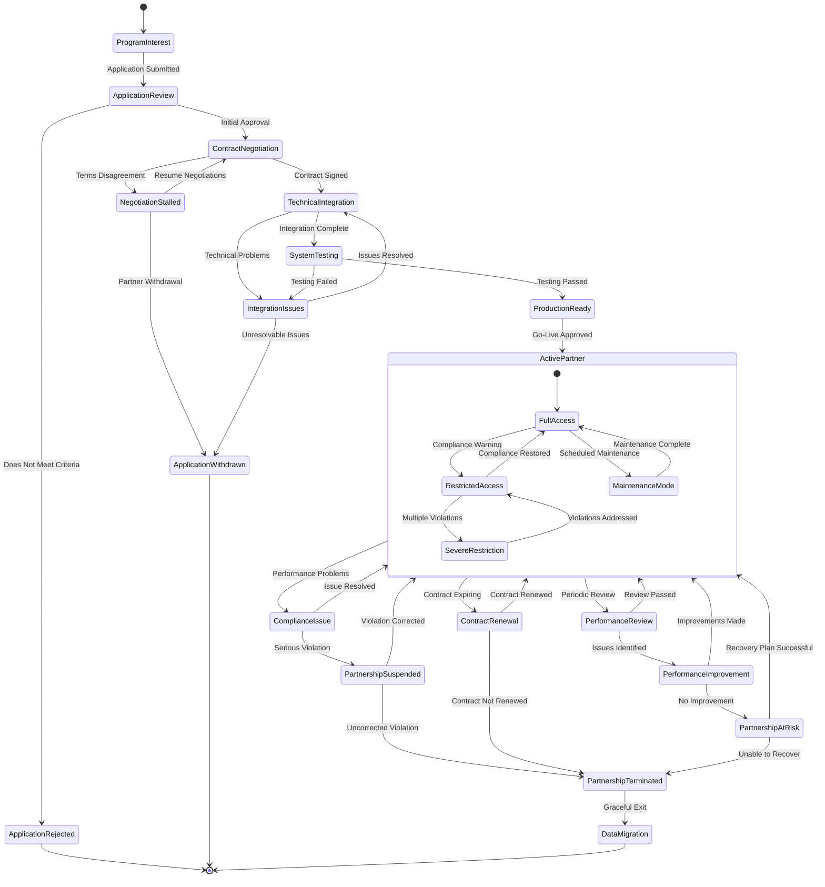
```mermaid
stateDiagram-v2
    [*] --> ProgramInterest
    ProgramInterest --> ApplicationReview : Application Submitted
    
    ApplicationReview --> ContractNegotiation : Initial Approval
    ApplicationReview --> ApplicationRejected : Does Not Meet Criteria
    
    ContractNegotiation --> TechnicalIntegration : Contract Signed
    ContractNegotiation --> NegotiationStalled : Terms Disagreement
    
    NegotiationStalled --> ContractNegotiation : Resume Negotiations
    NegotiationStalled --> ApplicationWithdrawn : Partner Withdrawal
    
    TechnicalIntegration --> SystemTesting : Integration Complete
    TechnicalIntegration --> IntegrationIssues : Technical Problems
    
    IntegrationIssues --> TechnicalIntegration : Issues Resolved
    IntegrationIssues --> ApplicationWithdrawn : Unresolvable Issues
    
    SystemTesting --> ProductionReady : Testing Passed
    SystemTesting --> IntegrationIssues : Testing Failed
    
    ProductionReady --> ActivePartner : Go-Live Approved
    
    ActivePartner --> PerformanceReview : Periodic Review
    ActivePartner --> ComplianceIssue : Performance Problems
    ActivePartner --> ContractRenewal : Contract Expiring
    
    PerformanceReview --> ActivePartner : Review Passed
    PerformanceReview --> PerformanceImprovement : Issues Identified
    
    PerformanceImprovement --> ActivePartner : Improvements Made
    PerformanceImprovement --> PartnershipAtRisk : No Improvement
    
    ComplianceIssue --> ActivePartner : Issue Resolved
    ComplianceIssue --> PartnershipSuspended : Serious Violation
    
    PartnershipSuspended --> ActivePartner : Violation Corrected
    PartnershipSuspended --> PartnershipTerminated : Uncorrected Violation
    
    ContractRenewal --> ActivePartner : Contract Renewed
    ContractRenewal --> PartnershipTerminated : Contract Not Renewed
    
    PartnershipAtRisk --> ActivePartner : Recovery Plan Successful
    PartnershipAtRisk --> PartnershipTerminated : Unable to Recover
    
    ApplicationRejected --> [*]
    ApplicationWithdrawn --> [*]
    PartnershipTerminated --> DataMigration : Graceful Exit
    DataMigration --> [*]
    
    state ActivePartner {
        [*] --> FullAccess
        FullAccess --> RestrictedAccess : Compliance Warning
        RestrictedAccess --> FullAccess : Compliance Restored
        
        FullAccess --> MaintenanceMode : Scheduled Maintenance
        MaintenanceMode --> FullAccess : Maintenance Complete
        
        RestrictedAccess --> SevereRestriction : Multiple Violations
        SevereRestriction --> RestrictedAccess : Violations Addressed
    }
```

---

## Business Entity Relationships

### GCC Business Domain Model
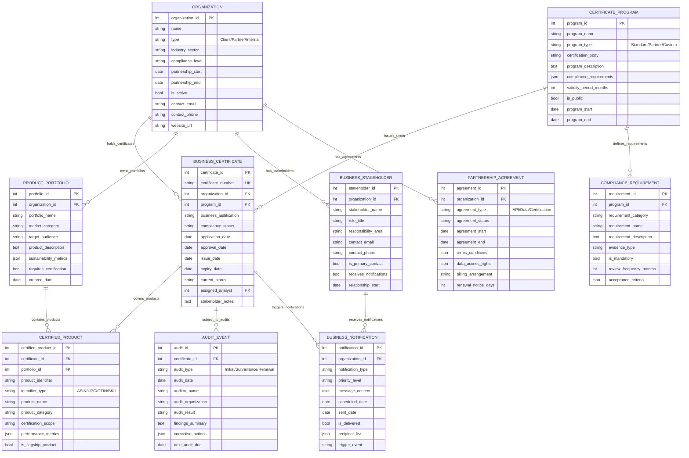
```mermaid
erDiagram
    ORGANIZATION {
        int organization_id PK
        string name
        string type "Client/Partner/Internal"
        string industry_sector
        string compliance_level
        date partnership_start
        date partnership_end
        bool is_active
        string contact_email
        string contact_phone
        string website_url
    }
    
    CERTIFICATE_PROGRAM {
        int program_id PK
        string program_name
        string program_type "Standard/Partner/Custom"
        string certification_body
        text program_description
        json compliance_requirements
        int validity_period_months
        bool is_public
        date program_start
        date program_end
    }
    
    BUSINESS_CERTIFICATE {
        int certificate_id PK
        string certificate_number UK
        int organization_id FK
        int program_id FK
        string business_justification
        string compliance_status
        date application_date
        date approval_date
        date issue_date
        date expiry_date
        string current_status
        int assigned_analyst FK
        text stakeholder_notes
    }
    
    PRODUCT_PORTFOLIO {
        int portfolio_id PK
        int organization_id FK
        string portfolio_name
        string market_category
        string target_audience
        text product_description
        json sustainability_metrics
        bool requires_certification
        date created_date
    }
    
    CERTIFIED_PRODUCT {
        int certified_product_id PK
        int certificate_id FK
        int portfolio_id FK
        string product_identifier
        string identifier_type "ASIN/UPC/GTIN/SKU"
        string product_name
        string product_category
        string certification_scope
        json performance_metrics
        bool is_flagship_product
    }
    
    BUSINESS_STAKEHOLDER {
        int stakeholder_id PK
        int organization_id FK
        string stakeholder_name
        string role_title
        string responsibility_area
        string contact_email
        string contact_phone
        bool is_primary_contact
        bool receives_notifications
        date relationship_start
    }
    
    COMPLIANCE_REQUIREMENT {
        int requirement_id PK
        int program_id FK
        string requirement_category
        string requirement_name
        text requirement_description
        string evidence_type
        bool is_mandatory
        int review_frequency_months
        json acceptance_criteria
    }
    
    AUDIT_EVENT {
        int audit_id PK
        int certificate_id FK
        string audit_type "Initial/Surveillance/Renewal"
        date audit_date
        string auditor_name
        string audit_organization
        string audit_result
        text findings_summary
        json corrective_actions
        date next_audit_due
    }
    
    BUSINESS_NOTIFICATION {
        int notification_id PK
        int organization_id FK
        string notification_type
        string priority_level
        text message_content
        date scheduled_date
        date sent_date
        bool is_delivered
        json recipient_list
        string trigger_event
    }
    
    PARTNERSHIP_AGREEMENT {
        int agreement_id PK
        int organization_id FK
        string agreement_type "API/Data/Certification"
        string agreement_status
        date agreement_start
        date agreement_end
        json terms_conditions
        json data_access_rights
        string billing_arrangement
        int renewal_notice_days
    }
    
    %% Core Business Relationships
    ORGANIZATION ||--o{ BUSINESS_CERTIFICATE : "holds_certificates"
    ORGANIZATION ||--o{ PRODUCT_PORTFOLIO : "owns_portfolios"
    ORGANIZATION ||--o{ BUSINESS_STAKEHOLDER : "has_stakeholders"
    ORGANIZATION ||--o{ PARTNERSHIP_AGREEMENT : "has_agreements"
    
    CERTIFICATE_PROGRAM ||--o{ BUSINESS_CERTIFICATE : "issues_under"
    CERTIFICATE_PROGRAM ||--o{ COMPLIANCE_REQUIREMENT : "defines_requirements"
    
    BUSINESS_CERTIFICATE ||--o{ CERTIFIED_PRODUCT : "covers_products"
    BUSINESS_CERTIFICATE ||--o{ AUDIT_EVENT : "subject_to_audits"
    BUSINESS_CERTIFICATE ||--o{ BUSINESS_NOTIFICATION : "triggers_notifications"
    
    PRODUCT_PORTFOLIO ||--o{ CERTIFIED_PRODUCT : "contains_products"
    
    BUSINESS_STAKEHOLDER ||--o{ BUSINESS_NOTIFICATION : "receives_notifications"
```

### Partner Program Business Model
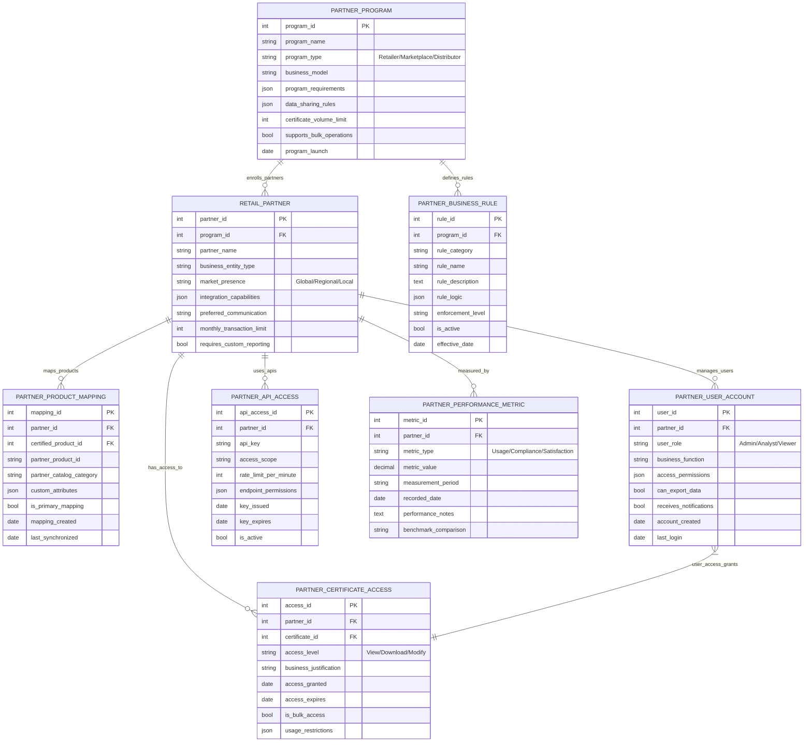
```mermaid
erDiagram
    PARTNER_PROGRAM {
        int program_id PK
        string program_name
        string program_type "Retailer/Marketplace/Distributor"
        string business_model
        json program_requirements
        json data_sharing_rules
        int certificate_volume_limit
        bool supports_bulk_operations
        date program_launch
    }
    
    RETAIL_PARTNER {
        int partner_id PK
        int program_id FK
        string partner_name
        string business_entity_type
        string market_presence "Global/Regional/Local"
        json integration_capabilities
        string preferred_communication
        int monthly_transaction_limit
        bool requires_custom_reporting
    }
    
    PARTNER_CERTIFICATE_ACCESS {
        int access_id PK
        int partner_id FK
        int certificate_id FK
        string access_level "View/Download/Modify"
        string business_justification
        date access_granted
        date access_expires
        bool is_bulk_access
        json usage_restrictions
    }
    
    PARTNER_PRODUCT_MAPPING {
        int mapping_id PK
        int partner_id FK
        int certified_product_id FK
        string partner_product_id
        string partner_catalog_category
        json custom_attributes
        bool is_primary_mapping
        date mapping_created
        date last_synchronized
    }
    
    PARTNER_USER_ACCOUNT {
        int user_id PK
        int partner_id FK
        string user_role "Admin/Analyst/Viewer"
        string business_function
        json access_permissions
        bool can_export_data
        bool receives_notifications
        date account_created
        date last_login
    }
    
    PARTNER_API_ACCESS {
        int api_access_id PK
        int partner_id FK
        string api_key
        string access_scope
        int rate_limit_per_minute
        json endpoint_permissions
        date key_issued
        date key_expires
        bool is_active
    }
    
    PARTNER_BUSINESS_RULE {
        int rule_id PK
        int program_id FK
        string rule_category
        string rule_name
        text rule_description
        json rule_logic
        string enforcement_level
        bool is_active
        date effective_date
    }
    
    PARTNER_PERFORMANCE_METRIC {
        int metric_id PK
        int partner_id FK
        string metric_type "Usage/Compliance/Satisfaction"
        decimal metric_value
        string measurement_period
        date recorded_date
        text performance_notes
        string benchmark_comparison
    }
    
    %% Partner Program Relationships
    PARTNER_PROGRAM ||--o{ RETAIL_PARTNER : "enrolls_partners"
    PARTNER_PROGRAM ||--o{ PARTNER_BUSINESS_RULE : "defines_rules"
    
    RETAIL_PARTNER ||--o{ PARTNER_CERTIFICATE_ACCESS : "has_access_to"
    RETAIL_PARTNER ||--o{ PARTNER_PRODUCT_MAPPING : "maps_products"
    RETAIL_PARTNER ||--o{ PARTNER_USER_ACCOUNT : "manages_users"
    RETAIL_PARTNER ||--o{ PARTNER_API_ACCESS : "uses_apis"
    RETAIL_PARTNER ||--o{ PARTNER_PERFORMANCE_METRIC : "measured_by"
    
    PARTNER_USER_ACCOUNT }|--|| PARTNER_CERTIFICATE_ACCESS : "user_access_grants"
```

---

## Project Roadmap Gantt

### GCC Implementation Roadmap Based on Requirements
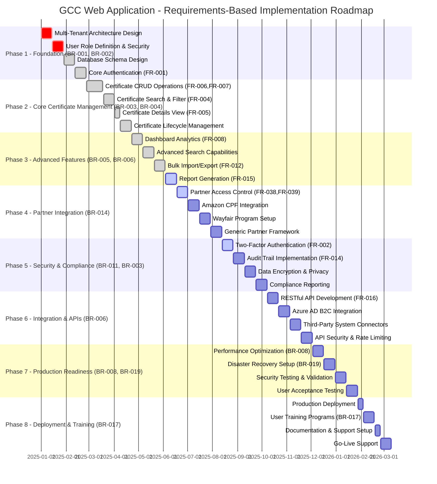
```mermaid
gantt
    title GCC Web Application - Requirements-Based Implementation Roadmap
    dateFormat YYYY-MM-DD
    section Phase 1 - Foundation (BR-001, BR-002)
    Multi-Tenant Architecture Design    :crit, foundation1, 2025-01-01, 2025-01-14
    User Role Definition & Security     :crit, foundation2, 2025-01-15, 2025-01-28
    Database Schema Design             :done, foundation3, 2025-01-29, 2025-02-11
    Core Authentication (FR-001)       :done, foundation4, 2025-02-12, 2025-02-25
    
    section Phase 2 - Core Certificate Management (BR-003, BR-004)
    Certificate CRUD Operations (FR-006,FR-007) :done, cert1, 2025-02-26, 2025-03-18
    Certificate Search & Filter (FR-004)        :done, cert2, 2025-03-19, 2025-04-01
    Certificate Details View (FR-005)           :done, cert3, 2025-04-02, 2025-04-08
    Certificate Lifecycle Management            :done, cert4, 2025-04-09, 2025-04-22
    
    section Phase 3 - Advanced Features (BR-005, BR-006)
    Dashboard Analytics (FR-008)        :done, advanced1, 2025-04-23, 2025-05-06
    Advanced Search Capabilities        :done, advanced2, 2025-05-07, 2025-05-20
    Bulk Import/Export (FR-012)        :done, advanced3, 2025-05-21, 2025-06-03
    Report Generation (FR-015)         :active, advanced4, 2025-06-04, 2025-06-17
    
    section Phase 4 - Partner Integration (BR-014)
    Partner Access Control (FR-038,FR-039) :active, partner1, 2025-06-18, 2025-07-01
    Amazon CPF Integration                  :partner2, 2025-07-02, 2025-07-15
    Wayfair Program Setup                  :partner3, 2025-07-16, 2025-07-29
    Generic Partner Framework             :partner4, 2025-07-30, 2025-08-12
    
    section Phase 5 - Security & Compliance (BR-011, BR-003)
    Two-Factor Authentication (FR-002)    :active, security1, 2025-08-13, 2025-08-26
    Audit Trail Implementation (FR-014)   :security2, 2025-08-27, 2025-09-09
    Data Encryption & Privacy             :security3, 2025-09-10, 2025-09-23
    Compliance Reporting                  :security4, 2025-09-24, 2025-10-07
    
    section Phase 6 - Integration & APIs (BR-006)
    RESTful API Development (FR-016)      :api1, 2025-10-08, 2025-10-21
    Azure AD B2C Integration             :api2, 2025-10-22, 2025-11-04
    Third-Party System Connectors       :api3, 2025-11-05, 2025-11-18
    API Security & Rate Limiting        :api4, 2025-11-19, 2025-12-02
    
    section Phase 7 - Production Readiness (BR-008, BR-019)
    Performance Optimization (BR-008)    :prod1, 2025-12-03, 2025-12-16
    Disaster Recovery Setup (BR-019)     :prod2, 2025-12-17, 2025-12-30
    Security Testing & Validation        :prod3, 2025-12-31, 2026-01-13
    User Acceptance Testing              :prod4, 2026-01-14, 2026-01-27
    
    section Phase 8 - Deployment & Training (BR-017)
    Production Deployment                :deploy1, 2026-01-28, 2026-02-03
    User Training Programs (BR-017)      :deploy2, 2026-02-04, 2026-02-17
    Documentation & Support Setup       :deploy3, 2026-02-18, 2026-02-24
    Go-Live Support                      :deploy4, 2026-02-25, 2026-03-10
```

### Current Sprint Implementation Status
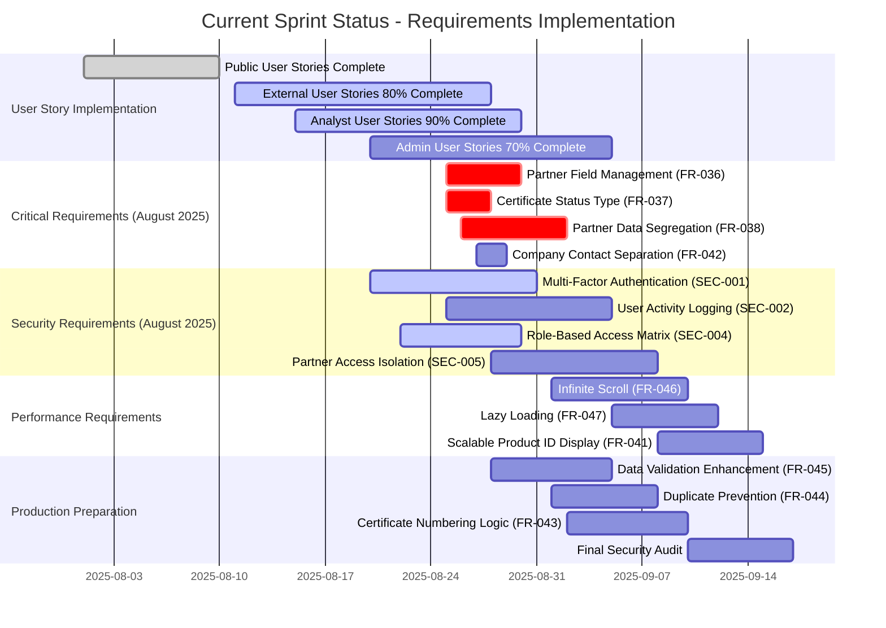
```mermaid
gantt
    title Current Sprint Status - Requirements Implementation
    dateFormat YYYY-MM-DD
    section User Story Implementation
    Public User Stories Complete         :done, public, 2025-08-01, 2025-08-10
    External User Stories 80% Complete   :active, external, 2025-08-11, 2025-08-28
    Analyst User Stories 90% Complete    :active, analyst, 2025-08-15, 2025-08-30
    Admin User Stories 70% Complete      :admin, 2025-08-20, 2025-09-05
    
    section Critical Requirements (August 2025)
    Partner Field Management (FR-036)    :crit, req1, 2025-08-25, 2025-08-30
    Certificate Status Type (FR-037)     :crit, req2, 2025-08-25, 2025-08-28
    Partner Data Segregation (FR-038)    :crit, req3, 2025-08-26, 2025-09-02
    Company Contact Separation (FR-042)  :req4, 2025-08-27, 2025-08-29
    
    section Security Requirements (August 2025)
    Multi-Factor Authentication (SEC-001) :active, sec1, 2025-08-20, 2025-08-31
    User Activity Logging (SEC-002)       :sec2, 2025-08-25, 2025-09-05
    Role-Based Access Matrix (SEC-004)    :active, sec3, 2025-08-22, 2025-08-30
    Partner Access Isolation (SEC-005)    :sec4, 2025-08-28, 2025-09-08
    
    section Performance Requirements
    Infinite Scroll (FR-046)             :perf1, 2025-09-01, 2025-09-10
    Lazy Loading (FR-047)                :perf2, 2025-09-05, 2025-09-12
    Scalable Product ID Display (FR-041) :perf3, 2025-09-08, 2025-09-15
    
    section Production Preparation
    Data Validation Enhancement (FR-045)  :prod1, 2025-08-28, 2025-09-05
    Duplicate Prevention (FR-044)         :prod2, 2025-09-01, 2025-09-08
    Certificate Numbering Logic (FR-043)  :prod3, 2025-09-02, 2025-09-10
    Final Security Audit                  :prod4, 2025-09-10, 2025-09-17
```

---

## Business Metrics Pie Charts

### Business Value Distribution by Requirement Category
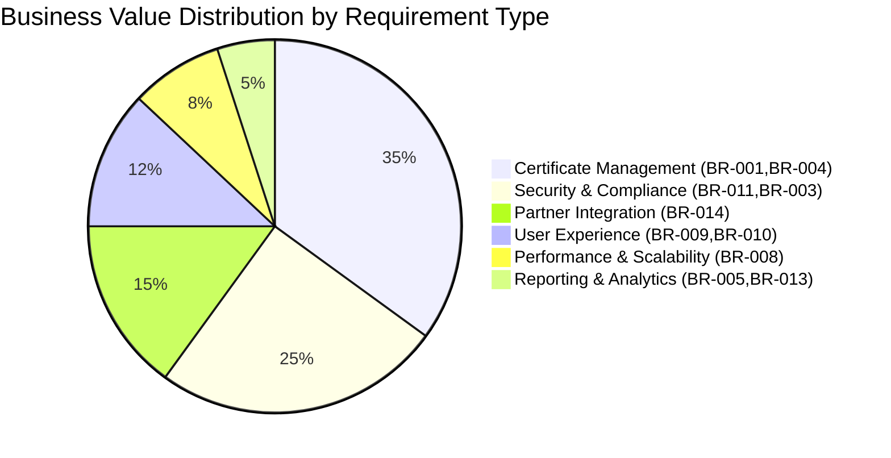
```mermaid
pie title Business Value Distribution by Requirement Type
    "Certificate Management (BR-001,BR-004)" : 35
    "Security & Compliance (BR-011,BR-003)" : 25
    "Partner Integration (BR-014)" : 15
    "User Experience (BR-009,BR-010)" : 12
    "Performance & Scalability (BR-008)" : 8
    "Reporting & Analytics (BR-005,BR-013)" : 5
```

### User Story Priority Distribution
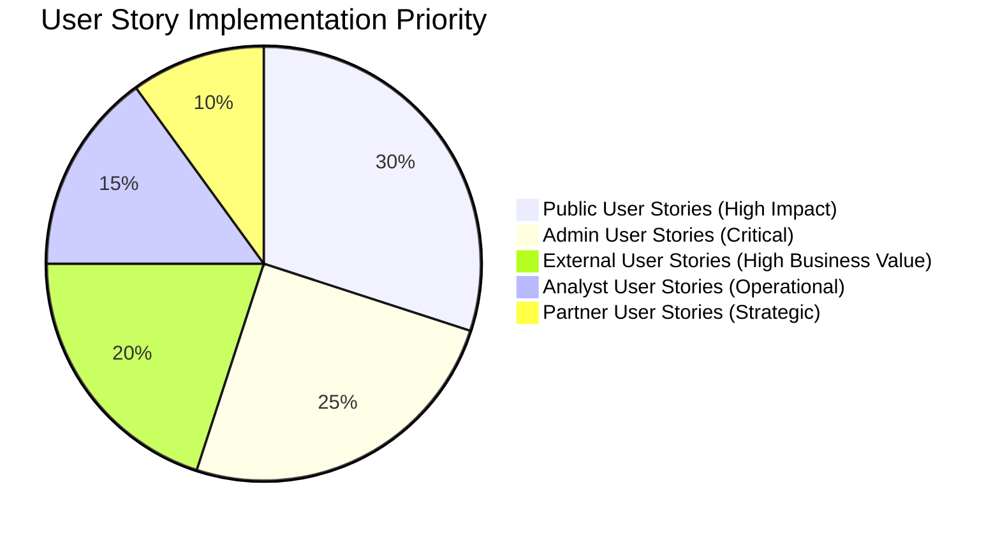
```mermaid
pie title User Story Implementation Priority
    "Public User Stories (High Impact)" : 30
    "Admin User Stories (Critical)" : 25
    "External User Stories (High Business Value)" : 20
    "Analyst User Stories (Operational)" : 15
    "Partner User Stories (Strategic)" : 10
```

### Requirements Status Distribution (August 2025)
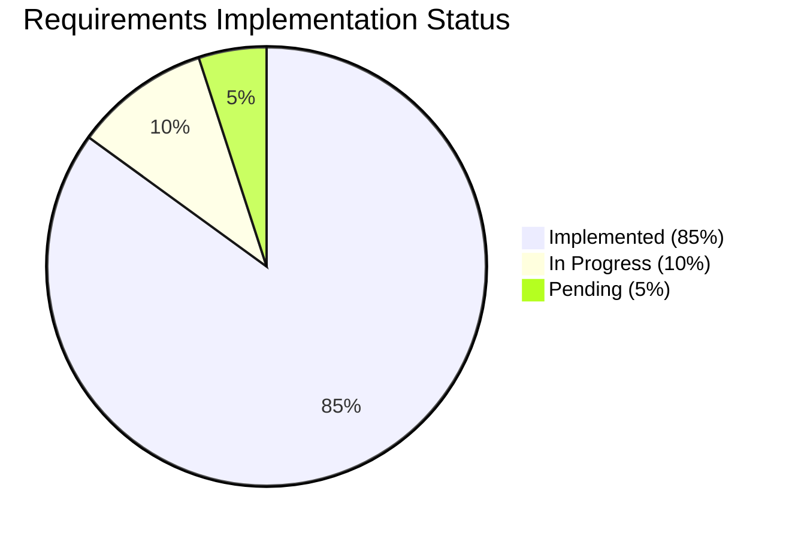
```mermaid
pie title Requirements Implementation Status
    "Implemented (85%)" : 85
    "In Progress (10%)" : 10
    "Pending (5%)" : 5
```

### Business Impact by Functional Area
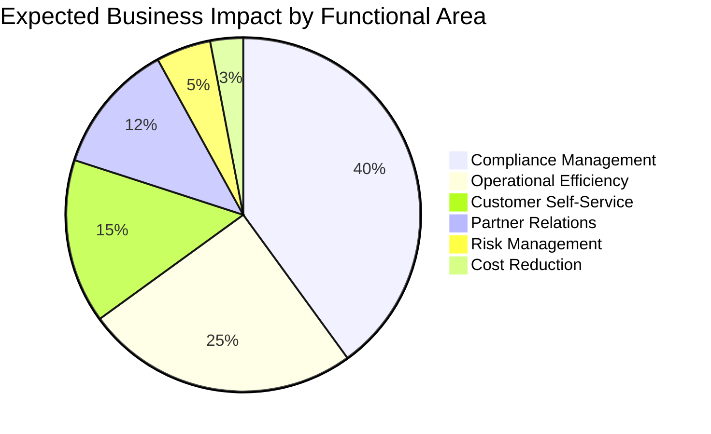
```mermaid
pie title Expected Business Impact by Functional Area
    "Compliance Management" : 40
    "Operational Efficiency" : 25
    "Customer Self-Service" : 15
    "Partner Relations" : 12
    "Risk Management" : 5
    "Cost Reduction" : 3
```

### Success Metrics Achievement Targets
```mermaid
pie title Success Metrics Achievement Targets (BR Requirements)
    "80% Reduction in Search Time (BR-001)" : 20
    "90% User Adoption (BR-017)" : 18
    "99.9% System Availability (BR-008)" : 15
    "60% Support Ticket Reduction (BR-010)" : 12
    "70% Process Automation (BR-012)" : 10
    "50% Compliance Audit Time Reduction (BR-003)" : 12
    "Zero Security Breaches (BR-011)" : 8
    "ROI Within 18 Months (BR-015)" : 5
```

---

## Feature Development Git Flow

### Requirements-Driven Development Flow
```mermaid
gitgraph
    commit id: "Project Initiation"
    commit id: "Requirements Analysis Complete"
    
    branch feature/user-authentication-FR001-FR002
    checkout feature/user-authentication-FR001-FR002
    commit id: "FR-001: Basic Auth"
    commit id: "FR-002: 2FA Implementation"
    commit id: "FR-003: User Registration"
    
    checkout main
    merge feature/user-authentication-FR001-FR002
    commit id: "Authentication Module Complete"
    
    branch feature/certificate-management-FR004-FR008
    checkout feature/certificate-management-FR004-FR008
    commit id: "FR-004: Search & Filter"
    commit id: "FR-005: Details View"
    commit id: "FR-006: Certificate Creation"
    commit id: "FR-007: Certificate Editing"
    commit id: "FR-008: Dashboard Analytics"
    
    branch feature/partner-integration-FR036-FR039
    checkout feature/partner-integration-FR036-FR039
    commit id: "FR-036: Partner Fields"
    commit id: "FR-037: Status Types"
    commit id: "FR-038: Data Segregation"
    commit id: "FR-039: Cross-Company Access"
    
    checkout main
    merge feature/certificate-management-FR004-FR008
    commit id: "Certificate Management Complete"
    
    branch feature/security-enhancements-SEC001-SEC005
    checkout feature/security-enhancements-SEC001-SEC005
    commit id: "SEC-001: MFA Implementation"
    commit id: "SEC-002: Activity Logging"
    commit id: "SEC-004: RBAC Matrix"
    commit id: "SEC-005: Partner Isolation"
    
    checkout main
    merge feature/partner-integration-FR036-FR039
    commit id: "Partner Integration Ready"
    
    merge feature/security-enhancements-SEC001-SEC005
    commit id: "Security Enhancements Complete"
    
    branch release/v1.0-production-ready
    checkout release/v1.0-production-ready
    commit id: "Production Configuration"
    commit id: "Performance Optimization"
    commit id: "Security Hardening"
    
    checkout main
    merge release/v1.0-production-ready
    commit id: "v1.0 Production Release"
```

### User Story Development Workflow
```mermaid
gitgraph
    commit id: "Sprint Planning"
    
    branch story/public-user-certificate-verification
    checkout story/public-user-certificate-verification
    commit id: "Public search capability"
    commit id: "Certificate verification"
    commit id: "Download functionality"
    
    branch story/external-user-company-management
    checkout story/external-user-company-management
    commit id: "Company-specific access"
    commit id: "Multi-select downloads"
    commit id: "Excel export features"
    
    checkout main
    branch story/analyst-certificate-processing
    checkout story/analyst-certificate-processing
    commit id: "Certificate CRUD operations"
    commit id: "Bulk processing capabilities"
    commit id: "Audit trail implementation"
    
    branch story/admin-user-management
    checkout story/admin-user-management
    commit id: "User role management"
    commit id: "Permission assignment"
    commit id: "Activity monitoring"
    
    checkout main
    merge story/public-user-certificate-verification
    commit id: "Public User Stories Complete"
    
    merge story/external-user-company-management
    commit id: "External User Stories Complete"
    
    merge story/analyst-certificate-processing
    commit id: "Analyst User Stories Complete"
    
    merge story/admin-user-management
    commit id: "Admin User Stories Complete"
    
    commit id: "Sprint Review & Demo"
```

---

## Business Capability Mind Map

### GCC Business Capabilities Map
```mermaid
mindmap
  root((GCC Business Platform))
    Certificate Management
      Certificate Lifecycle
        Application Processing
        Review & Approval
        Issuance & Publishing
        Renewal Management
        Status Tracking
      Certificate Repository
        Secure Storage
        Version Control
        Digital Signatures
        Archive Management
      Certificate Validation
        Authenticity Verification
        Status Checking
        Compliance Validation
        Expiration Monitoring
    Stakeholder Management
      Public Access
        Certificate Search
        Verification Portal
        Download Services
        Mobile Access
      Partner Programs
        Amazon CPF
        Wayfair Integration
        Custom Programs
        API Access
        Data Segregation
      Internal Users
        Admin Functions
        Analyst Tools
        User Management
        System Configuration
      External Clients
        Company Portals
        Renewal Tracking
        Report Generation
        Notification Services
    Compliance & Governance
      Audit Management
        Activity Logging
        Change Tracking
        Compliance Reports
        Audit Trails
      Security Controls
        Multi-Factor Auth
        Role-Based Access
        Data Encryption
        Privacy Protection
      Quality Assurance
        Data Validation
        Process Controls
        Performance Monitoring
        Error Management
    Business Intelligence
      Analytics Dashboard
        Usage Metrics
        Performance KPIs
        Trend Analysis
        Predictive Insights
      Reporting Services
        Standard Reports
        Custom Reports
        Scheduled Delivery
        Export Capabilities
      Data Management
        ETL Processes
        Data Quality
        Master Data
        Archive Policies
    Integration Platform
      API Services
        RESTful APIs
        Authentication
        Rate Limiting
        Documentation
      External Systems
        Azure AD B2C
        Email Services
        File Storage
        Notification Systems
      Partner Integrations
        Retailer APIs
        Data Exchange
        Synchronization
        Error Handling
```

### Requirements Traceability Map
```mermaid
mindmap
  root((Requirements Coverage))
    Functional Requirements
      Authentication
        FR-001 Email/Password
        FR-002 Two-Factor Auth
        FR-003 User Registration
        FR-017 Password Management
      Certificate Management
        FR-004 Search & Filter
        FR-005 Details View
        FR-006 Certificate Creation
        FR-007 Certificate Editing
        FR-008 Dashboard Analytics
      Data Management
        FR-012 Bulk Import
        FR-018 Data Export
        FR-019 Custom Fields
        FR-020 System Settings
      User Management
        FR-009 Admin Functions
        FR-010 Company Management
        FR-011 Product Categories
      Notifications & Reporting
        FR-013 Expiry Notifications
        FR-014 Audit Trail
        FR-015 Report Generation
        FR-016 API Access
    Business Requirements
      Digital Platform (BR-001)
        Centralized Management
        Stakeholder Access
        Real-time Monitoring
        Search Optimization
      Multi-Tenant Access (BR-002)
        Role-Based Security
        Data Isolation
        Partner Programs
        Public Access
      Compliance Management (BR-003)
        Audit Trails
        Regulatory Compliance
        Report Generation
        External Audits
      Lifecycle Management (BR-004)
        Automated Notifications
        Renewal Tracking
        Status Management
        History Maintenance
    Security Requirements
      Authentication & Authorization
        SEC-001 Multi-Factor Auth
        SEC-004 RBAC Matrix
        SEC-005 Partner Isolation
      Data Protection
        SEC-002 Activity Logging
        SEC-003 Encryption Standards
        Data Privacy Compliance
        Secure Configuration
    Integration Requirements
      API Platform
        API-001 Multiple Partners
        API-002 Error Handling
        API-003 Product ID Standards
        API-004 Validation Services
      External Systems
        Azure AD Integration
        Email Services
        File Management
        Third-Party APIs
```

---

## Implementation Timeline

### Requirements Implementation Timeline
```mermaid
timeline
    title GCC Requirements Implementation Timeline
    
    2025-Q1 : Foundation Phase
            : BR-001 Digital Platform Setup
            : BR-002 Multi-Tenant Architecture
            : FR-001 Basic Authentication
            : FR-003 User Registration
            
    2025-Q2 : Core Features Phase  
            : FR-004 Search & Filter Implementation
            : FR-005 Certificate Details View
            : FR-006 Certificate Creation
            : FR-007 Certificate Editing
            : BR-004 Lifecycle Management
            
    2025-Q3 : Advanced Features Phase
            : FR-008 Dashboard Analytics
            : FR-012 Bulk Import/Export
            : FR-015 Report Generation
            : BR-005 Advanced Search
            : BR-013 Business Intelligence
            
    2025-Q4 : Integration Phase
            : BR-014 Partner Programs
            : FR-036 Partner Field Management
            : FR-038 Data Segregation  
            : API-001 Multiple Partner APIs
            : BR-006 System Integration
            
    2026-Q1 : Security & Compliance
            : FR-002 Two-Factor Authentication
            : SEC-001 MFA Implementation
            : FR-014 Audit Trail
            : BR-011 Data Security
            : BR-003 Compliance Management
            
    2026-Q2 : Production Readiness
            : BR-008 Cloud Infrastructure
            : BR-019 Disaster Recovery
            : Performance Optimization
            : Security Hardening
            : User Acceptance Testing
            
    2026-Q3 : Deployment & Training
            : BR-017 Change Management
            : Production Deployment
            : User Training Programs
            : Go-Live Support
            : Post-Launch Monitoring
```

### User Story Development Timeline
```mermaid
timeline
    title User Story Implementation Progress
    
    2025-01-01 : Requirements Gathering
               : User Story Documentation
               : Stakeholder Interviews
               : Journey Mapping Complete
    
    2025-02-01 : Public User Stories
               : Certificate Search Capability
               : Public Verification Portal
               : Download Functionality
               : Mobile-Responsive Design
    
    2025-03-01 : External User Stories
               : Secure Login Implementation
               : Company-Specific Access
               : Certificate Management Tools
               : Multi-Select Operations
    
    2025-04-01 : Analyst User Stories  
               : Certificate CRUD Operations
               : Bulk Processing Tools
               : Tag Management System
               : Modification Tracking
    
    2025-05-01 : Admin User Stories
               : User Role Management
               : Permission Assignment
               : System Configuration
               : Activity Monitoring
    
    2025-06-01 : Partner User Stories
               : Amazon CPF Integration
               : Wayfair Program Setup
               : Generic Partner Framework
               : Cross-Company Access
    
    2025-07-01 : Integration Testing
               : End-to-End User Journeys
               : Performance Validation
               : Security Testing
               : User Acceptance Testing
    
    2025-08-01 : Current Status
               : 85% User Stories Complete
               : Security Enhancements Active
               : Production Preparation
               : Final Testing Phase
```

---

## Functional Requirement Diagrams

### Authentication Requirements Flow
```mermaid
requirementDiagram
    requirement user_authentication {
        id: FR-001
        text: Users SHALL authenticate via email/password within 3 seconds
        risk: high
        verifymethod: performance_test
    }

    requirement two_factor_auth {
        id: FR-002  
        text: System SHALL support 2FA with email verification codes
        risk: high
        verifymethod: security_test
    }

    requirement user_registration {
        id: FR-003
        text: System SHALL allow new user registration with admin approval
        risk: medium
        verifymethod: functional_test
    }

    requirement password_management {
        id: FR-017
        text: System SHALL provide self-service password reset
        risk: medium
        verifymethod: functional_test
    }

    element authentication_service {
        type: service
    }

    element user_database {
        type: database
    }

    element email_service {
        type: service
    }

    element session_manager {
        type: service
    }

    element security_audit {
        type: service
    }

    user_authentication - satisfies -> authentication_service
    two_factor_auth - satisfies -> email_service
    user_registration - satisfies -> user_database
    password_management - satisfies -> email_service

    authentication_service - traces -> security_audit
    user_registration - refines -> user_authentication
    two_factor_auth - refines -> user_authentication
    password_management - refines -> user_authentication
```

### Certificate Management Requirements
```mermaid
requirementDiagram
    requirement certificate_search {
        id: FR-004
        text: System SHALL provide certificate search with <2 second response
        risk: high
        verifymethod: performance_test
    }

    requirement certificate_details {
        id: FR-005
        text: System SHALL display comprehensive certificate information
        risk: medium
        verifymethod: functional_test
    }

    requirement certificate_creation {
        id: FR-006
        text: System SHALL allow authorized certificate creation
        risk: high
        verifymethod: security_test
    }

    requirement certificate_editing {
        id: FR-007
        text: System SHALL support certificate editing with audit trail
        risk: high
        verifymethod: audit_test
    }

    requirement dashboard_analytics {
        id: FR-008
        text: System SHALL provide real-time analytics dashboard
        risk: medium
        verifymethod: functional_test
    }

    element certificate_service {
        type: service
    }

    element search_engine {
        type: service
    }

    element certificate_database {
        type: database
    }

    element analytics_engine {
        type: service
    }

    element audit_logger {
        type: service
    }

    certificate_search - satisfies -> search_engine
    certificate_details - satisfies -> certificate_service
    certificate_creation - satisfies -> certificate_service
    certificate_editing - satisfies -> certificate_service
    dashboard_analytics - satisfies -> analytics_engine

    certificate_service - traces -> audit_logger
    search_engine - traces -> certificate_database
    certificate_editing - refines -> certificate_creation
    dashboard_analytics - derives -> certificate_search
```

### Partner Integration Requirements
```mermaid
requirementDiagram
    requirement partner_field_management {
        id: FR-036
        text: System SHALL support partner field with multi-select capability
        risk: high
        verifymethod: integration_test
    }

    requirement partner_data_segregation {
        id: FR-038
        text: System SHALL implement partner-specific data access controls
        risk: high
        verifymethod: security_test
    }

    requirement cross_company_access {
        id: FR-039
        text: Partners SHALL access multiple companies under their program
        risk: medium
        verifymethod: functional_test
    }

    requirement internal_tags_visibility {
        id: FR-040
        text: System SHALL control external user visibility of internal tags
        risk: medium
        verifymethod: security_test
    }

    element partner_service {
        type: service
    }

    element access_control_service {
        type: service
    }

    element data_segregation_engine {
        type: service
    }

    element tag_management_service {
        type: service
    }

    element partner_database {
        type: database
    }

    partner_field_management - satisfies -> partner_service
    partner_data_segregation - satisfies -> data_segregation_engine
    cross_company_access - satisfies -> access_control_service
    internal_tags_visibility - satisfies -> tag_management_service

    partner_service - traces -> partner_database
    access_control_service - refines -> partner_data_segregation
    tag_management_service - derives -> internal_tags_visibility
```

---

## Business Value Quadrants

### Feature Priority vs Business Value Matrix
```mermaid
quadrantChart
    title Feature Priority vs Business Value Assessment
    x-axis Low Implementation Effort --> High Implementation Effort
    y-axis Low Business Value --> High Business Value
    
    quadrant-1 Quick Wins
    quadrant-2 Major Projects
    quadrant-3 Fill-ins
    quadrant-4 Questionable
    
    Certificate Search (FR-004): [0.2, 0.95]
    User Authentication (FR-001): [0.15, 0.9]
    Dashboard Analytics (FR-008): [0.3, 0.85]
    Two-Factor Auth (FR-002): [0.35, 0.8]
    Partner Integration (FR-038): [0.7, 0.9]
    Audit Trail (FR-014): [0.25, 0.75]
    Bulk Import (FR-012): [0.4, 0.7]
    Certificate Creation (FR-006): [0.45, 0.8]
    Report Generation (FR-015): [0.5, 0.65]
    API Access (FR-016): [0.6, 0.6]
    Custom Fields (FR-019): [0.75, 0.4]
    Mobile Access (BR-009): [0.65, 0.7]
    Password Management (FR-017): [0.2, 0.5]
    Data Export (FR-018): [0.35, 0.55]
    System Settings (FR-020): [0.8, 0.3]
    Company Management (FR-010): [0.4, 0.6]
```

### Requirements Risk vs Impact Assessment
```mermaid
quadrantChart
    title Requirements Risk vs Business Impact
    x-axis Low Implementation Risk --> High Implementation Risk
    y-axis Low Business Impact --> High Business Impact
    
    quadrant-1 Low Risk, High Impact
    quadrant-2 High Risk, High Impact
    quadrant-3 Low Risk, Low Impact
    quadrant-4 High Risk, Low Impact
    
    Multi-Tenant Access (BR-002): [0.3, 0.95]
    Digital Platform (BR-001): [0.25, 0.9]
    Certificate Lifecycle (BR-004): [0.35, 0.85]
    Security & Privacy (BR-011): [0.7, 0.9]
    Partner Programs (BR-014): [0.8, 0.8]
    Cloud Infrastructure (BR-008): [0.6, 0.75]
    Compliance Management (BR-003): [0.4, 0.8]
    Business Intelligence (BR-013): [0.5, 0.7]
    API Integration (BR-006): [0.65, 0.65]
    Mobile Access (BR-009): [0.45, 0.6]
    Self-Service Portal (BR-010): [0.3, 0.7]
    Change Management (BR-017): [0.2, 0.5]
    Disaster Recovery (BR-019): [0.75, 0.6]
    Cost Optimization (BR-015): [0.4, 0.55]
    Quality Assurance (BR-016): [0.5, 0.45]
    Workflow Automation (BR-012): [0.55, 0.5]
```

### User Story Value vs Complexity Matrix
```mermaid
quadrantChart
    title User Story Value vs Implementation Complexity
    x-axis Low Complexity --> High Complexity
    y-axis Low Business Value --> High Business Value
    
    quadrant-1 High Value, Low Complexity
    quadrant-2 High Value, High Complexity
    quadrant-3 Low Value, Low Complexity
    quadrant-4 Low Value, High Complexity
    
    Public Certificate Search: [0.2, 0.9]
    Admin User Management: [0.4, 0.85]
    External Company Access: [0.3, 0.8]
    Analyst Certificate Processing: [0.35, 0.75]
    Partner Amazon Integration: [0.8, 0.85]
    Certificate Download: [0.15, 0.7]
    Multi-Select Operations: [0.25, 0.65]
    Tag Management: [0.3, 0.6]
    Export Functionality: [0.4, 0.55]
    Status Filtering: [0.2, 0.5]
    Email Notifications: [0.35, 0.45]
    Audit Logging: [0.5, 0.7]
    Custom Field Support: [0.7, 0.4]
    Bulk Product Display: [0.6, 0.5]
    Permission Matrix: [0.45, 0.6]
    Cross-Company Access: [0.65, 0.75]
```

---

## User Persona Journeys

### Public User - Environmental Compliance Officer Journey
```mermaid
journey
    title Public User: Certificate Verification Journey
    section Discovery Phase
      Receives compliance request: 3: User
      Searches for GCC database: 4: User
      Lands on certification portal: 5: User
    section Search & Verification
      Enters product/company search: 4: User
      Applies certification filters: 4: User
      Reviews search results: 5: User
      Validates certificate status: 5: User, System
      Checks expiration dates: 4: User
    section Information Gathering  
      Views certificate details: 5: User
      Reviews compliance scope: 4: User
      Checks associated products: 4: User
      Validates certification body: 5: User
    section Documentation
      Downloads certificate PDF: 5: User
      Saves for compliance records: 5: User
      Shares with stakeholders: 4: User
      Updates compliance tracker: 4: User
    section Follow-up
      Bookmarks for future reference: 4: User
      Sets up monitoring alerts: 3: User
      Verifies with issuing body: 4: User
      Files compliance report: 5: User
```

### Analyst - Certificate Manager Journey  
```mermaid
journey
    title Analyst: Certificate Processing Journey
    section Daily Workflow Start
      Login to system dashboard: 5: User
      Review pending applications: 4: User
      Prioritize work queue: 4: User
      Check system notifications: 3: User
    section Application Review
      Open new certificate application: 4: User
      Verify company information: 3: User
      Review product specifications: 3: User
      Check compliance documentation: 2: User
      Validate testing reports: 2: User
    section Technical Validation
      Cross-reference standards: 3: User
      Verify product categories: 4: User
      Check existing certificates: 4: User
      Validate scope of certification: 3: User
      Review custom field requirements: 2: User
    section Decision Making
      Document review findings: 4: User
      Consult with technical team: 3: User
      Make approval decision: 4: User
      Update certificate status: 5: User
      Generate approval/rejection notice: 4: User, System
    section Quality Assurance
      Audit trail documentation: 4: User
      Review for completeness: 4: User
      Final quality check: 4: User
      Publish approved certificate: 5: User, System
      Notify relevant stakeholders: 5: System
```

### External Partner - Amazon CPF Program Journey
```mermaid
journey
    title Amazon Partner: CPF Program Management Journey
    section Program Onboarding
      Receive partnership invitation: 5: User
      Complete program application: 3: User
      System integration setup: 2: User, System
      Access credentials received: 4: User, System
      Initial training completion: 3: User
    section Regular Certificate Management
      Login to partner portal: 5: User
      Review certificate dashboard: 4: User
      Filter Amazon CPF certificates: 5: User
      Check upcoming expirations: 4: User
      Review product coverage: 4: User
    section Renewal Processing
      Identify expiring certificates: 4: User
      Prepare renewal documentation: 2: User
      Submit renewal applications: 3: User
      Track application progress: 4: User, System
      Respond to additional requests: 3: User
    section Business Operations
      Export certificate data: 4: User
      Generate compliance reports: 4: User
      Update marketing materials: 5: User
      Share with Amazon team: 5: User
      Monitor certificate usage: 4: User, System
    section Issue Resolution
      Report system issues: 2: User
      Contact support team: 3: User, Support
      Escalate critical problems: 2: User, Support
      Receive resolution updates: 4: Support
      Verify issue resolution: 4: User
```

### Administrator - System Admin Journey
```mermaid
journey
    title Admin: System Management Journey
    section System Monitoring
      Check system health dashboard: 4: User
      Review overnight batch jobs: 3: User
      Monitor system performance: 4: User, System
      Check security alerts: 2: User
      Review error logs: 2: User
    section User Management Tasks
      Process new user requests: 3: User
      Review pending approvals: 4: User
      Assign user roles: 4: User
      Configure permissions: 3: User
      Deactivate inactive accounts: 4: User
    section Partner Administration
      Review partner applications: 3: User
      Configure partner access: 2: User
      Monitor partner usage: 4: User, System
      Resolve access issues: 2: User
      Update partner agreements: 3: User
    section System Configuration
      Update system settings: 3: User
      Configure notification rules: 4: User
      Manage certificate templates: 3: User
      Update validation rules: 2: User
      Test system integrations: 2: User, System
    section Security & Compliance
      Review audit logs: 3: User
      Generate compliance reports: 4: User
      Conduct security assessments: 2: User
      Update security policies: 3: User
      Coordinate penetration testing: 2: User, Security Team
```

### External User - Company Representative Journey
```mermaid
journey
    title External User: Company Certificate Management
    section Monthly Review Process
      Schedule certificate review: 4: User
      Login to company portal: 5: User
      Access company dashboard: 5: User
      Review certificate portfolio: 4: User
      Check expiration timeline: 4: User
    section Renewal Planning
      Identify certificates needing renewal: 4: User
      Review renewal requirements: 3: User
      Prepare required documentation: 2: User
      Contact certification bodies: 2: User
      Plan renewal timeline: 3: User
    section Application Submission
      Submit renewal applications: 3: User
      Upload supporting documents: 3: User
      Track application status: 4: User, System
      Respond to clarification requests: 2: User
      Monitor approval progress: 4: System
    section Business Integration
      Download approved certificates: 5: User
      Update product documentation: 4: User
      Share with sales team: 5: User
      Update compliance database: 4: User
      Notify key stakeholders: 4: User, System
    section Ongoing Monitoring
      Set up expiration alerts: 4: User
      Monitor compliance status: 4: User, System
      Track business impact: 5: User
      Plan future certifications: 4: User
      Review ROI metrics: 5: User
```

---

## Summary

This comprehensive collection of requirements and user story-based Mermaid diagrams provides detailed visualization of the GCC Web Application from a business and user perspective. The diagrams are derived directly from:

- **39+ Functional Requirements** documented in the requirements analysis
- **20+ Business Requirements** defining organizational objectives  
- **Detailed User Stories** for 5 distinct user personas
- **User Journey Maps** showing end-to-end experiences
- **Business Process Requirements** for certificate lifecycle management
- **Partner Program Requirements** including Amazon CPF and Wayfair integration
- **Security & Compliance Requirements** for enterprise-grade operation

### Key Coverage Areas:

**Business Alignment:**
- Requirements traceability from business objectives to technical implementation
- User story fulfillment tracking through development phases  
- Business value quantification and prioritization
- Success criteria mapping to measurable outcomes

**User Experience Design:**
- Journey maps for all 5 user personas (Public, External, Analyst, Admin, Partner)
- Pain point identification and resolution planning
- Touchpoint optimization across user workflows
- Emotional journey considerations

**Implementation Roadmap:**
- Phase-based delivery aligned with business priorities
- Risk assessment and mitigation strategies  
- Resource allocation and timeline management
- Integration complexity and dependency management

These diagrams serve as the bridge between business requirements and technical implementation, ensuring that all development activities align with documented user needs and organizational objectives.